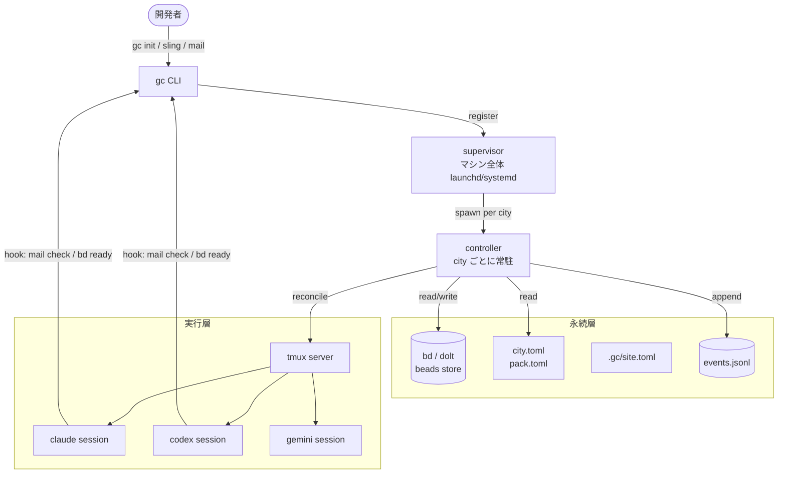
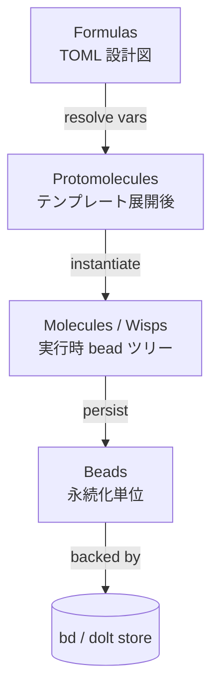
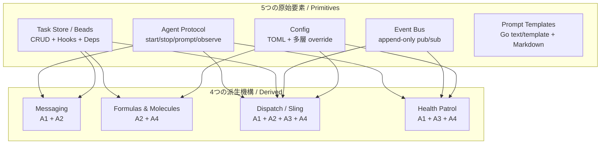

# Gas City — システム概要

**生成日:** 2026-04-29
**対象バージョン:** gascity v1.0.0+
**所要時間:** 約 30 分（社内勉強会想定）
**生成者:** Claude Code

---

## 1. Gas City とは何か

Gas City はマルチエージェント・コーディングワークフローを構成するための「オーケストレーション・ビルダー SDK」である。Go 製の単一バイナリ `gc` を CLI フロントエンドとし、tmux / dolt / bd（beads）をランタイム基盤として、複数の AI コーディング CLI を束ねる。

価値命題は一つ。**20〜30 個もの AI コーディングエージェントを「短時間使ってすぐ捨てる」のではなく「常時走らせて、bead（永続化された work item）を介して協調させる」**。タスクもメッセージもセッションも convoy も formula 実行体も、すべては bead store に永続化される work item として表現される。エージェントどうしは直接呼び出しではなく bead を介してやり取りする。

既存の AI コーディングツールの多くは、1 セッション単位で仕事を完結させる前提で設計されている。別エージェントへ仕事を引き継ぐには人間が手動でコンテキストを再構築する必要がある。Gas City は bead が永続するため、エージェントが落ちても仕事の identity は store に残り、別エージェントが bead を hook 経由で受け取って継続できる。10 分で終わる小タスクではなく、数日〜数週間にわたる開発を複数エージェントで分担する用途を狙う。

Gas City は Claude Code・Codex・Gemini・Cursor・Amp・OpenCode・Auggie・Pi・Omp といった既存の CLI コーディングエージェントを束ねる。Gas City はこれらを **provider** と呼ぶ。一つの作業空間（**city**）の下に外部プロジェクトを **rig** として登録し、**agent**（provider + プロンプトテンプレート + scope の組み合わせ）が **pack**（再利用可能な定義レイヤ）で定義された役割に従って協調する。

> **重要**: 本資料の `mail` は外部の電子メール（SMTP / IMAP / Gmail 等）ではない。bead store に `type = "message"` の bead を作る**内部メッセージング機構**である。受信側は次のターンで hook 経由で自身の context に注入される。

> **重要**: 本資料に出てくる `mayor` `polecat` `refinery` `deacon` `witness` などは **Gas City SDK の概念ではない**。`examples/gastown/` という pack 流儀の役割名にすぎず、SDK 自体は役割を一切ハードコードしない（**ZERO hardcoded roles**）。詳細は [§9. パック流儀の例](#9-パック流儀の例) で扱う。

> **本資料で頻出する用語の先取り定義**（詳しくは [§10. 中核 Vocabulary](#10-中核-vocabulary)）
> - **provider**: Claude Code・Codex・Gemini などの AI コーディング CLI の総称
> - **agent**: provider + プロンプトテンプレート + scope の組み合わせ
> - **rig**: city に登録した外部プロジェクトディレクトリ
> - **bead**: 永続化される work item の最小単位（タスク / メッセージ / セッションなど全部）
> - **formula / molecule / wisp**: 多段ワークフロー定義 → 永続実行体 / 一時実行体
> - **convoy**: 関連 bead をまとめる親 bead
> - **hook**: エージェントの起動・ターンに差し込む仕掛け
> - **sling**: 仕事をエージェントへ投げる動作（コマンドは `gc sling`）
> - **nudge**: live セッションのターミナルに直接テキストを流す

---

## 2. 物理構成 — 全体図を最初に見せる

Gas City がどう動いているのかを、まずプロセスのレイアウトで掴む。MEOW stack や Nine Concepts といった抽象モデルは、すべてこの物理構成の上に乗っている。



- **supervisor** は launchd（macOS）または systemd（Linux）に登録されるマシン全体のデーモンで、登録された city ごとに **controller** プロセスを起動する。`gc service` および `gc supervisor` がこの層を制御する。
- **controller** は単一 city の常駐プロセスで、30 秒ごとの「tick」で desired state（config）と running state（tmux + bd）を比較し、足りないセッションを作り、order を発火し、health patrol を回す。Nine Concepts のうち Dispatch と Health Patrol を駆動するのがここ。
- **tmux** はすべての live セッションのコンテナ。Claude Code・Codex・Gemini といった provider の CLI は tmux 内で動かされ、デタッチしてもバックグラウンドで生き続ける。Agent Protocol の物理的な実装層。
- **bd（beads）** は dolt 上に構築された分散 Git ライクな永続ストアへの CLI で、すべての bead は最終的に dolt のテーブル行として保存される。`GC_BEADS=file` でファイルベースの簡易ストアに切り替えられる。
- **hook** は provider 固有の機構（Claude Code の `settings.json` など）を介して、毎ターン `gc mail check`・`gc hook` を呼び出すよう仕込まれる。これによりエージェントは Gas City の mail や bead に常に気付ける。
- **.gc/site.toml** はマシン固有の rig path bindings（rig 名 → ローカル実パス）を保持する。AGENTS.md の「No status files — query live state」原則に従い、PID は status file に書かず process table から query する設計。

> **Q: ローカルで遊ぶときも supervisor は必要か？**
> A: Yes。city は supervisor で起動・常駐される。`gc init` が自動で supervisor 登録まで行うので、開発者が個別に launchd/systemd を触る必要はない。

> **Q: 複数 city を 1 台で動かせるか？**
> A: Yes。city ごとに controller プロセスが立つ。リソース上の制約は CPU / メモリのみで、論理的な上限はない。

---

## 3. すべては bead — 世界観の核

> "An agent is not a session — an agent _is_ a Bead, an identity with a singleton global address."
> — Steve Yegge, *Welcome to Gas Town*

Gas City で最も大事な世界観は「すべては bead」である。タスク、メッセージ、セッション、convoy、molecule、wisp、order は、すべて bead store に永続化される **bead** として表現される。エージェントどうしは bead を介してやり取りし、CLI コマンドは bead を作ったり読んだりするだけの薄いラッパーに過ぎない。

bead の最小定義は ID + state + type + 任意の label / dependency。bd CLI で CRUD でき、`bd ready` で実行可能なものを取得し、`bd show` で詳細を見る。すべての bead は dolt（既定）または file ベースの store に永続化される。

なぜ bead を中心に置くのか。**プロセスが落ちても仕事の identity は失われない**からだ。session が crash しても、agent が再起動しても、その仕事を表す bead は store に残り続ける。複数の独立した観察者が同じ state を idempotent に check できる。これが Gas City が背負う **Nondeterministic Idempotence (NDI)** の根拠であり、[§6. Nine Concepts](#6-中核モデル-nine-concepts) で扱う primitives と派生機構はすべてこの世界観の上に乗っている。

なお、§3 では bead の**概念**を導入するに留め、bead 自体の type 別カタログ（task / message / session / molecule / wisp / convoy など）は [§7. bead カタログ](#7-bead-カタログ--type-と-label-の二軸) で扱う。

---

## 4. 起源 — Gas Town プロジェクトからの分離

Gas City は Steve Yegge の Gas Town プロジェクトから抽出された SDK である。Gas Town は複数の AI コーディングエージェントを協調させる先行実装で、当初は `mayor` / `deacon` / `polecat` といった役割が Go コードに直接クラスとして書かれていた。

Steve Yegge は実装の中で、それらの役割が **MEOW stack（Molecular Expression of Work）** と呼ばれる work 表現の抽象と、Markdown で書かれた prompt template だけで表現できることに気付いた。これが転機となった。役割を Go コードから TOML 設定 + Markdown プロンプトへ追い出した結果、SDK 部分（infrastructure）と pack 部分（役割定義の集合）を分離できるようになった。Gas City はその SDK 部分である。Gas Town 自体は pack の一例として `examples/gastown/` に残っている。

AGENTS.md は次のように述べている:

> You can build Gas Town in Gas City, or Ralph, or Claude Code Agent Teams, or any other orchestration pack — via specific configurations.

つまり Gas City は「特定のオーケストレーション流儀を提供しない SDK」であって、流儀そのものは pack で表現する。

> 出典: Steve Yegge "Welcome to Gas Town" — `https://steve-yegge.medium.com/welcome-to-gas-town-4f25ee16dd04`

---

## 5. 中核モデル: MEOW stack（4層で work を表現）

MEOW = **Molecular Expression of Work**。Gas City はあらゆる仕事を 4 つの層で表現する。日常の動きをストーリー仕立てで追うとこうなる: **formula を TOML で書く → 変数を埋めて protomolecule になる → cook で molecule に具体化（または sling で wisp 化）→ 走らせて bead として残る**。下に行くほど永続的、上に行くほど抽象的になる。

| レイヤ | 何か | 永続性 | 代表ファイル / 操作 |
|------|------|------|------|
| **Formulas** | TOML で書く workflow 定義（設計図） | ファイル | `formulas/<name>.toml` |
| **Protomolecules** | 変数を解決してインスタンス化したテンプレート | コンパイル時 | `gc formula show --var name=Alice` |
| **Molecules / Wisps** | 実行時の bead ツリー（永続版 / 一時版） | bead store / TTL で蒸発 | `gc formula cook` / `gc sling --formula` |
| **Beads** | 永続化単位。すべての work item の物理表現 | bead store | `bd create`, `bd show` |

各層の責務:

- **Formulas** は TOML で書く設計図。`[[steps]]` を並べ、`needs` で依存関係を、`[vars]` で変数を、`[steps.condition]` / `[steps.loop]` / `[steps.check]` で実行制御を表現する。`formulas/` ディレクトリに置いておけば、`gc formula list` で一覧できる。あくまで定義であって、実行体ではない。
- **Protomolecules** は formula の `{{var}}` プレースホルダを実値に置換した「コンパイル後の設計図」である。`gc formula show feature-work --var title="ログイン"` を打つとこの層が見える。永続化はされない（コンパイル時のみ存在）。late binding によって、同じ formula を複数の文脈で再利用できる。
- **Molecules** と **Wisps** は protomolecule をさらに具体化した「実行時の bead ツリー」である。両者の違いは永続化の度合い（次の対比表参照）。
- **Beads** は MEOW のすべての層の最終的な永続化先である。タスク・メッセージ・セッション・molecule・wisp・convoy のすべてが bead として bead store（既定では dolt）に保存される。bead の世界観については [§3. すべては bead](#3-すべては-bead--世界観の核) を参照。



**molecule と wisp の使い分け**は MEOW stack の中で読者が一番よく迷う点なので、対比表で押さえる。

| 観点 | molecule | wisp |
|------|----------|------|
| 永続性 | 全ステップが独立 bead として永続 | root のみ永続、ステップは inline で読まれる |
| 用途 | 複数エージェントで分担 | 単一エージェントへ一発投入 |
| GC | 明示的に close するまで残る | TTL で自動 GC |
| コマンド | `gc formula cook` | `gc sling --formula` / order 発火 |

MEOW のキーとなる洞察は、この 4 層がすべて「Config（formula 定義のレイヤ解決）+ Bead Store（永続化）+ Event Bus（trigger）」という 3 つの primitive だけで実装できることである。役割名は Go コードに一切現れず、すべて prompt template と TOML 設定で表現される。これが次節 [§6. Nine Concepts](#6-中核モデル-nine-concepts) への伏線となる。

---

## 6. 中核モデル: Nine Concepts（5 primitives + 4 derived mechanisms）

Gas City は MEOW stack を成立させるために、**5 つの不可分な原始要素（primitives）** と、それから合成される **4 つの派生機構（derived mechanisms）** を持つ。primitive は「これを欠くと Gas Town を再構築できない」最小要素、派生機構は「primitive の組み合わせで実装できる高水準の仕組み」である。



### 6.1 Agent Protocol（原始要素）

provider 抽象。Claude Code でも Codex でも Gemini でも同じインターフェースで起動・停止・プロンプト送信・観察ができる。Identity（agent の永続的な ID）、pool（使い捨ての worker 群）、sandbox（隔離された作業領域）、resume（中断からの再開）、crash adoption（crash したセッションの引き継ぎ）を扱う。代表的な接点: `gc session new`、`gc agent`。

### 6.2 Task Store / Beads（原始要素）

CRUD + Hook + Dependencies + Labels + Query を備えた work unit ストア。仕事・メール・セッション・convoy など、Gas City で永続化されるすべてのものは bead として保存される。Hook は state 変化のフックで、外部スクリプトを呼び出せる。代表的な接点: `bd create`、`bd ready`、`bd show`、`bd dep`。

### 6.3 Event Bus（原始要素）

システム内のすべての出来事を append-only ログとして集める pub/sub。critical（bounded queue で必ず届ける）と optional（fire-and-forget で速度優先）の二層構成になっている。order の condition trigger や reconciler の観察対象がここから流れる。代表的な接点: `gc events`、`gc event emit`。

### 6.4 Config（原始要素）

TOML を多層 override で解決し、活性化レベル 0〜8 を決める。`pack.toml`（pack 定義）、`city.toml`（deployment）、`agent.toml`（agent override）、`.gc/site.toml`（machine-local）の 4 層から最終的な config が組み立てられる。代表的な接点: `gc config show`、`gc config explain`。

### 6.5 Prompt Templates（原始要素）

エージェントの振る舞いそのもの。Go の `text/template` 構文を Markdown 内で使い、`agents/<name>/prompt.template.md` に書く。Gas City SDK は agent に役割を強要しないので、prompt の中身が役割そのものになる。代表的な接点: `agents/<name>/prompt.template.md`、`gc prime`。

### 6.6 Messaging（派生機構、A1 + A2）

`gc mail send` は内部的には `internal/mail/beadmail/` パッケージを介して `type = "message"` の bead を 1 件作る内部メッセージング機構である。Nudge は agent protocol の `SendPrompt` を直接呼ぶ。新しい primitive ではなく、Agent Protocol と Task Store の合成として実装されている。代表的な接点: `gc mail send/inbox/read`、`gc nudge`。

### 6.7 Formulas & Molecules（派生機構、A2 + A4）

formula は Config によって TOML から parse され、molecule は Task Store の中で root bead + child step beads のツリーとして表現される。MEOW stack の中段（[§5](#5-中核モデル-meow-stack4層で-work-を表現) 参照）。代表的な接点: `gc formula list/show/cook`、`gc sling --formula`。

### 6.8 Dispatch / Sling（派生機構、A1 + A2 + A3 + A4）

仕事を見つける/作る → エージェントに渡す → convoy を作る → event を log する、という一連の合成手続き。`gc sling` がこれを駆動する。Agent Protocol（spawn）+ Task Store（bead 作成）+ Event Bus（log）+ Config（formula select）の 4 つを使う。代表的な接点: `gc sling`。

### 6.9 Health Patrol（派生機構、A1 + A3 + A4）

controller が一定間隔でエージェントの生存と進捗を ping し（A1）、Config の閾値と比較し（A4）、stall を Event Bus に publish する（A3）。停止が続くと restart を試みる。代表的な接点: `daemon.patrol_interval` 設定。

### Layering invariant

「Layer N は Layer N+1 を import しない」という階層不変条件が CI で強制されている。コードを読むときも書くときもこの順序が手がかりになる。

### 活性化レベル 0〜8

Config の中身に応じて、Gas City は段階的に capability を活性化する。

| Level | Adds                    |
|-------|-------------------------|
| 0-1   | Agent + tasks           |
| 2     | Task loop               |
| 3     | Multiple agents + pool  |
| 4     | Messaging               |
| 5     | Formulas & molecules    |
| 6     | Health monitoring       |
| 7     | Orders                  |
| 8     | Full orchestration      |

「最初は agent と task だけで動かして、必要になったら messaging を足し、formula を足し、health monitoring を足す」という progressive な使い方ができる。

---

## 7. bead カタログ — type と label の二軸

[§3. すべては bead](#3-すべては-bead--世界観の核) で見たように、Gas City のすべての work は bead として表現される。だが、bead の中身を覗くと **type** と **label** でさらに分類されている。ユーザが日常的に触る 6 タイプは次のとおり。

| Type | 表すもの | 主な作成経路 | 親子関係 / 特徴 |
|------|---------|-----------|---------------|
| **task** | 仕事の単位 | `bd create` / formula step / dispatch | molecule や convoy の子になることも |
| **message** | エージェント間メール | `gc mail send` | `thread:<id>` label でスレッド化 |
| **session** | 実行中の tmux セッション | `gc session new` / 自動 | identity 用、ライフサイクル管理 |
| **molecule** | 永続的な formula 実行体 | `gc formula cook` | step bead を子に持つ |
| **wisp** | 一時的な formula 実行体 | `gc sling --formula`、order | TTL で GC される |
| **convoy** | 関連 bead をまとめる親 | `gc convoy create` / 自動 | `owned` label で auto-close を抑止 |

この 6 種以外にも、内部用には `gate`（speculative instantiation で待たせる中間 bead）、`convergence`（反復ループの root）、`agent` / `role` / `rig`（identity 用 static bead）、`merge-request`（VCS 統合）といった infrastructure type が存在する。`bd ready` の結果からはこれらが自動除外される（actionable な work ではないため）。日常的にユーザが意識する必要はないが、`bd list --type ...` の引数として現れることがある。

bead の分類は **type による分類**（infrastructure / workflow-container を `bd ready` から除外する仕組み）と **label による分類**（`gc:session`、`thread:<id>`、`read`、`owned`、`order-tracking` などで意味付け）の二軸で行われる。type は粗く、`bd create --type ...` で決定され不変である。label は細かく、状態遷移に応じて `bd label add/rm` で付け外しされる。両軸が必要なのは、「type=task」だけでは「未読メールか」「sprint 用 convoy のメンバーか」「スレッドの一部か」を表現できないからである。

`bd ready` は actionable な work のみを返す（infra type を除外、close 済みを除外、依存未解決を除外）。その挙動があるからこそ、type は粗くて済む。意味付けが細かく要るときは label を使う。

なお `task` type は内部的にサブタイプを持たない。`bd create --type feature` のように見える書き方は、`feature` という文字列が type フィールドにそのまま入るだけで、`task` を細分化しているわけではない。意味付けが必要なら label で行う。

---

## 8. tutorial で歩く Gas City

`docs/tutorials/01-07` を順に読むと、city → rig → agent → session → mail → formula → bead → order と進む。それぞれの章は具体的な操作中心に書かれているが、architecture 視点ではどのレイヤを触っているかで整理できる。次の地図がそれを示している。

| Tutorial | 主役要素 | learning outcome（読了後にできること） | 主に触る primitives | 主に触る derived |
|---------|---------|---------------------------------------|------------------|---------------|
| 01. cities and rigs | city, rig | city を作って rig を登録できる | Config | — |
| 02. agents | agent, prompt | カスタムエージェントを定義できる | Agent Protocol、Prompt Templates、Config | — |
| 03. sessions | session, polecat, crew | crew / polecat の使い分けを判断できる | Agent Protocol、Task Store | — |
| 04. communication | mail, hook, sling | エージェント間でメッセージを送れる | Task Store、Agent Protocol | Messaging、Dispatch |
| 05. formulas | formula, molecule, wisp | 多段 workflow を書ける | Config、Task Store | Formulas & Molecules、Dispatch |
| 06. beads | bead, convoy, dependency | bead の依存と convoy を扱える | Task Store | — |
| 07. orders | order, trigger | 定期 / 条件発火ジョブを仕込める | Task Store、Event Bus、Config | Dispatch、Health Patrol |

各章を architecture 視点で読み解くと:

**Tutorial 01: cities and rigs.** Config primitive の活性化を扱う章。`gc init` は `pack.toml` と `city.toml` を書き、`gc rig add` は `.gc/site.toml` に machine-local パスバインディングを追加する。rig は「外部プロジェクトを city に結びつけるための名前空間」であり、bead ID プレフィックス、独立 beads 並列空間、hook の installation がここに紐づく。

**Tutorial 02: agents.** Agent Protocol + Prompt Templates + Config の三つ巴。`gc agent add --name reviewer` でディレクトリをスキャフォールドし、`agents/reviewer/prompt.template.md` で振る舞いを定義し、`agents/reviewer/agent.toml` で provider・dir・option_defaults を上書きする。Gas City SDK は agent に役割を強要しないので、prompt の中身が役割そのものになる。

**Tutorial 03: sessions, polecat, crew.** Agent Protocol の **運用形態** を扱う章。同じ provider プロセスを 2 通りで使い分ける ── 仕事のたびに spin up + idle で消える *polecat* と、`[[named_session]] mode = "always"` で常駐する *crew*。これは SDK の概念ではなく Config による pattern であって、両者の境界は `pack.toml` の named_session の有無で決まる。

**Tutorial 04: communication.** Messaging + Dispatch の derived mechanism がテーマ。`gc mail send` は内部で beadmail パッケージを介して `type=message` の bead を作るだけ、`gc sling` は内部で「bead 作成 → session 確保 → wisp attach → convoy 作成 → nudge」の合成手続きを実行する。エージェントどうしは直接ではなく bead store を経由してやり取りするので、receiver が落ちていても message は残る。

**Tutorial 05: formulas.** MEOW stack の中段（Formulas & Molecules）を直接操作する章。`gc formula show` で protomolecule（変数解決後）を確認し、`gc formula cook` で molecule を bead store に persist し、`gc sling --formula` で wisp として一発投入する。`needs` による DAG、`[vars]` による parameterize、`[steps.loop]` による展開は、すべてコンパイル時に決定される。

**Tutorial 06: beads.** Task Store primitive を直接触る章。`bd ready` / `bd show` / `bd list` で実行状態を query し、`bd dep` で依存を張り、`bd label add` で意味付けする。convoy が「関連 bead をまとめる親 bead」であり、scoped な ID プレフィックス（`mc-`、`mp-` など）が rig からどう派生するかも触れる。

**Tutorial 07: orders.** Event Bus + Dispatch + Health Patrol が交わる章。controller の 30 秒ごとの tick で trigger（cooldown / cron / event / condition / manual）を評価し、due な order について formula を wisp 化して dispatch する。formula を持たない exec order は agent を介さず controller がスクリプトを直接走らせる。order ごとに tracking bead が作られ、duplicate prevention の根拠になる。

---

## 9. パック流儀の例

> **重要**: ここで紹介する役割名は **pack の慣習**であり、Gas City SDK が enforce するものではない（**ZERO hardcoded roles**）。同じ役割名で違う運用をしてもよいし、すべて捨てて自分で組んでもよい。

`examples/` 配下には、Gas City の上で書ける流儀の参考実装が二つ置かれている。SDK 自体は流儀を強制しないので、これらは「こういう pack を書くこともできる」という実例にすぎない。

### 9.1 Gas Town pack: 階層的オーケストレーション

`examples/gastown/packs/gastown/` にある参考 pack。Steve Yegge の元 Gas Town 設計を pack として再現したもの。階層的な役割構造を持つのが特徴。

| 役割 | scope | mode | 何をするか |
|------|------|------|-----------|
| **mayor** | city | always (crew) | ユーザ窓口、計画と委譲 |
| **deacon** | city | always (crew) | パトロール、health 監視の補助 |
| **boot** | city | always (crew) | 起動時のブート処理 |
| **witness** | rig | always (crew) | rig 内の状態見守り、polecat の補助 |
| **refinery** | rig | on_demand | merge queue 管理、複数 worker の統合 |
| **polecat** | rig | (pool) | 一時的 worker、PR 生成して廃棄 |
| **dog** | shared | (pool) | 共通 utility worker（maintenance pack 由来） |

引用元: `examples/gastown/packs/gastown/pack.toml`。

city-scoped agent は city 全体に 1 体ずつ存在する。rig-scoped agent は登録された rig ごとに stamp される（複数 rig があれば各 rig 用に複製）。crew は人間が attach して話す相手、polecat は仕事のたびに使い捨てる worker、というのが運用上の使い分けだが、これらは pack の慣習であって SDK が強制するものではない。

### 9.2 Swarm pack: フラットな peer 協調

`examples/swarm/packs/swarm/` にある対案。Gas Town の階層を簡素化し、rig 内では coder と committer がピアで協調する流儀。worktree 隔離をせず全 agent が同じ rig ディレクトリを共有するため、bead と mail だけで衝突を回避するミニマリズム設計。

| 役割 | scope | mode | 何をするか |
|------|------|------|-----------|
| **mayor** | city | on_demand | ユーザ窓口（Gas Town より軽量、必要時のみ） |
| **deacon** | city | always (crew) | パトロール、health 監視 |
| **coder** | rig | (pool) | コードを書く worker（複数体、pool で作られる） |
| **committer** | rig | on_demand | git コミット・統合役（必要時に起動） |

Gas Town の `witness` / `refinery` / `boot` が無く、`polecat` が `coder` + `committer` の組み合わせに置き換わっている。

### 9.3 Gas Town vs Swarm の対比

| 観点 | Gas Town | Swarm |
|------|----------|-------|
| 構造 | 階層型（mayor が常駐窓口） | フラット型（rig 内は peer） |
| city scope | mayor + deacon + boot（全 always） | mayor (on_demand) + deacon (always) |
| rig scope | witness + refinery + polecat | coder (pool) + committer |
| worktree 隔離 | あり（polecat ごとに） | なし（全 agent が同じディレクトリ） |
| 衝突回避 | worktree で物理隔離 | bead + mail で論理調停 |
| いつ向くか | 大規模・長期・複数 rig | 小規模・短期・単一 rig |

### 9.4 自前 pack の最小例

これらは出発点にすぎない。最小の pack.toml はこのくらいで動く:

```toml
# 最小 pack.toml の例
[pack]
name = "minimal"
schema = 2

[[agent]]
name = "worker"
prompt_template = "agents/worker/prompt.template.md"

[[named_session]]
template = "worker"
mode = "always"
```

### 9.5 自分の流儀を組む

これらは出発点にすぎない。自分の流儀に合った pack を `pack.toml` + `agents/<name>/prompt.template.md` + `formulas/<name>.toml` + `orders/<name>.toml` で組むのが Gas City の本来の使い方である。AGENTS.md の言葉を借りれば「ZERO hardcoded roles」── 役割は Go コードを書かずに TOML だけで表現できるのが SDK としての Gas City の最大の特徴である。

---

## 10. 中核 Vocabulary

用語を 5 カテゴリに分類して整理する。各語は本資料内の主たる定義場所への参照付き。

### 10.1 環境

| 用語 | 意味 | 参照 |
|------|------|------|
| **city** | 一つのオーケストレーション環境。`pack.toml` + `city.toml` + `.gc/` + `agents/` を含むディレクトリ | [§2](#2-物理構成--全体図を最初に見せる) |
| **pack** | 再利用可能な定義レイヤ。pack はそのまま city にもなれる | [§9](#9-パック流儀の例) |
| **rig** | city に登録された外部プロジェクトディレクトリ。エージェントが作業する場所 | [§2](#2-物理構成--全体図を最初に見せる)、[§8](#8-tutorial-で歩く-gas-city) Tutorial 01 |

### 10.2 エージェント

| 用語 | 意味 | 参照 |
|------|------|------|
| **agent** | provider + プロンプトテンプレート + scope の組み合わせ | [§6.1](#61-agent-protocol原始要素) |
| **session** | 実行中のエージェント終端（tmux 内のプロセス） | [§8](#8-tutorial-で歩く-gas-city) Tutorial 03 |
| **provider** | Claude / Codex / Gemini 等の AI コーディング CLI の総称 | [§1](#1-gas-city-とは何か) |

### 10.3 work（MEOW stack）

| 用語 | 意味 | 参照 |
|------|------|------|
| **bead** | 仕事・メール・セッション・convoy など、永続化されるすべての work item | [§3](#3-すべては-bead--世界観の核)、[§7](#7-bead-カタログ--type-と-label-の二軸) |
| **formula** | 宣言的マルチステップワークフロー。MEOW の最上層 | [§5](#5-中核モデル-meow-stack4層で-work-を表現) |
| **protomolecule** | 変数を解決した formula（コンパイル中間形） | [§5](#5-中核モデル-meow-stack4層で-work-を表現) |
| **molecule** | formula を cook して具体化した bead ツリー（永続的） | [§5](#5-中核モデル-meow-stack4層で-work-を表現) |
| **wisp** | formula を sling で発火した一時的 bead ツリー（GC される） | [§5](#5-中核モデル-meow-stack4層で-work-を表現) |
| **convoy** | 関連 bead をまとめる親 bead。スプリントや一連の PR をくくる | [§7](#7-bead-カタログ--type-と-label-の二軸) |
| **order** | trigger（cooldown / cron / event / condition / manual）+ 起動対象（formula / exec） | [§8](#8-tutorial-で歩く-gas-city) Tutorial 07 |

### 10.4 メッセージング・hook

| 用語 | 意味 | 参照 |
|------|------|------|
| **mail** | 永続的なエージェント間メッセージ（外部メールではなく bead store の `type=message`） | [§1](#1-gas-city-とは何か)、[§6.6](#66-messaging派生機構a1--a2) |
| **nudge** | live セッションのターミナルに直接テキストを流す | [§6.1](#61-agent-protocol原始要素) |
| **hook** | エージェントの起動・ターン・終了に Gas City 側のロジックを差し込む仕組み | [§6.5](#65-prompt-templates原始要素) |
| **sling** | 仕事をエージェントへ投げる動作（コマンド `gc sling`） | [§6.8](#68-dispatch--sling派生機構a1--a2--a3--a4) |

### 10.5 運用慣習（pack 由来、SDK 概念ではない）

| 用語 | 意味 | 参照 |
|------|------|------|
| **polecat** | 仕事のたびに作られて idle で消える transient session の運用呼称（Gas Town pack の慣習） | [§9.1](#91-gas-town-pack-階層的オーケストレーション) |
| **crew** | `[[named_session]] mode = "always"` で常駐する persistent session の運用呼称 | [§9.1](#91-gas-town-pack-階層的オーケストレーション) |
| **mayor** | 階層型 pack の窓口役（Gas Town / Swarm 両方の pack で名前が共通） | [§9](#9-パック流儀の例) |

---

## 11. 技術要件

| 要素 | 必要バージョン | 備考 |
|------|-------------|------|
| OS | macOS / Linux / WSL2 | Windows はネイティブ非対応 |
| Go | 1.25+ | ソースビルドのときのみ |
| tmux | 任意のモダン版 | セッション管理の基盤 |
| git | 任意 | rig の登録と一部スクリプトで使用 |
| jq | 任意 | JSON 処理 |
| pgrep / lsof | 任意 | プロセス・ポート探索 |
| dolt | 1.86.1+ | beads provider `bd` を使う場合（既定） |
| bd | 1.0.0+ | beads provider `bd` を使う場合（既定） |
| flock | 任意 | beads provider `bd` を使う場合（macOS は `brew install flock` 必須） |
| provider CLI | 任意 | `claude` / `codex` / `gemini` / `cursor` / `amp` / `opencode` / `auggie` / `pi` / `omp` のうち少なくとも 1 つ |

`bd` ベースの構成を回避したい場合、`GC_BEADS=file` を環境変数に設定するか `city.toml` に `[beads] provider = "file"` を追加すれば dolt / bd / flock をスキップできる。チュートリアル目的やお試しには十分実用になる。

---

## 12. 関連ドキュメント

- [クイックスタート](./QUICKSTART.md) — Homebrew インストールから初回 sling まで
- [コマンドリファレンス](./COMMANDS.md) — `gc` の全主要コマンド
- [ユースケース](./USE-CASES.md) — 7 つの代表的シナリオを手順付きで
- [設定ガイド](./CONFIGURATION.md) — `city.toml` / `pack.toml` / `agent.toml` / 環境変数
- [トラブルシューティング](./TROUBLESHOOTING.md) — よくある問題と `gc doctor`

公式ドキュメント（Mintlify）はリポジトリ内 `docs/` で `./mint.sh dev` してプレビューできる。深掘りには `engdocs/architecture/`（アーキテクチャ設計書）と `engdocs/contributors/`（コントリビュータ向け）が有用。
