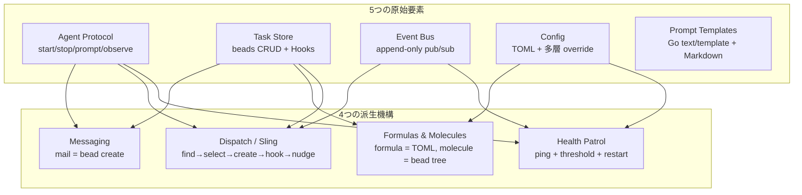

# Gas City — システム概要

**生成日:** 2026-04-29
**対象バージョン:** gascity v1.0.0+
**生成者:** Claude Code

---

## このシステムは何か

Gas City はマルチエージェント・コーディングワークフローを構成するための「オーケストレーション・ビルダー SDK」である。Go 製の単一バイナリ `gc` を CLI フロントエンドとし、tmux / dolt / bd（beads）をランタイム基盤として、Claude Code・Codex・Gemini・Cursor といった既存の CLI コーディングエージェント（Gas City はこれらを「provider」と呼ぶ）を束ね、ローカル PC 上で長時間稼働する複数エージェントの協調体制を組み立てる。

設計思想として徹底されているのは「ZERO hardcoded roles」である。`mayor`、`reviewer`、`polecat` といった役割名は SDK の Go コードには一切現れず、すべて TOML 設定とプロンプトテンプレートで表現される。同じ SDK の上に「Gas Town スタイルの階層型オーケストレーション」「Swarm スタイルのフラットなピア協調」「自分独自のオーケストレーションパック」を切り替えて載せられるのが Gas City の核心である。

対象ユーザーは、複数の AI コーディングエージェントを「短時間しか使わない」のではなく「常時走らせて、bead（永続化された work item）を介して協調させる」運用に踏み込みたい開発者と、再利用可能なオーケストレーションパックを設計したい SDK 構築者である。タスクもメッセージもセッションも、すべては bead store に永続化される work item として表現され、エージェントどうしは直接呼び出しではなく bead を介してやり取りする。Gas Town を使ってきた開発者にとっては、既存の役割を pack 化して持ち運ぶための受け皿となる。

---

## 主要機能

Gas City のすべての機能は、`city` というディレクトリ単位の作業環境を中心に組み立てられる。`gc init` で作成された city には `pack.toml`（再利用可能な定義レイヤ）と `city.toml`（このマシン固有のデプロイ設定）の二つの TOML ファイルが置かれ、その下に `agents/`・`formulas/`・`orders/`・`commands/` といったディレクトリが展開される。CLI コマンドはすべて、この city ディレクトリと、city に登録された外部プロジェクトディレクトリ（`rig`）に対する操作として表現される。

| 機能領域 | 概要 | 詳細 |
|---------|------|------|
| ライフサイクル管理 | city の作成・起動・停止・サスペンド、マシン全体を見渡す supervisor | [COMMANDS.md#ライフサイクル管理](./COMMANDS.md#ライフサイクル管理) |
| ワークルーティング | bead（仕事の単位）の作成、`gc sling` による割り当て、convoy グルーピング | [COMMANDS.md#ワークルーティング](./COMMANDS.md#ワークルーティング) |
| エージェント定義 | provider の選択、プロンプトテンプレート、rig スコープ、option_defaults | [COMMANDS.md#エージェント管理](./COMMANDS.md#エージェント管理) |
| フォーミュラ | TOML で書く宣言的マルチステップワークフロー、`needs` で並列実行と依存関係を表現、変数・条件・ループ・check に対応、wisp（一時）または molecule（永続）として発火 | [COMMANDS.md#フォーミュラ](./COMMANDS.md#フォーミュラ) |
| オーダー | フォーミュラやシェルスクリプトを cooldown / cron / event / condition で自動起動 | [COMMANDS.md#オーダー](./COMMANDS.md#オーダー) |
| セッション管理 | tmux で動く live セッションへの attach / peek / nudge / suspend | [COMMANDS.md#セッション管理](./COMMANDS.md#セッション管理) |
| エージェント間通信 | `gc mail` による永続メッセージ、`gc nudge` によるテキスト送信 | [COMMANDS.md#通信](./COMMANDS.md#通信) |
| パッケージング | `[imports.<name>]` による pack 取り込み、ローカル / GitHub URL / Git ref 指定 | [COMMANDS.md#パック管理](./COMMANDS.md#パック管理) |
| ランタイム選択 | tmux / subprocess / exec / ACP / Kubernetes の各 provider を切り替え可能 | [CONFIGURATION.md#workspace](./CONFIGURATION.md#workspace) |
| 健全性監視 | `gc doctor`、`gc dashboard`、controller による health patrol、自動 restart | [COMMANDS.md#診断と運用](./COMMANDS.md#診断と運用) |

`gc sling`、`gc mail`、`gc session attach`、`gc formula cook`、`gc order run` を覚えるだけで、日常的なオーケストレーション作業のほぼすべてはカバーできる。

---

## 9つの中核概念（Nine Concepts）

Gas City は「5つの不可分な原始要素（primitives）」と「それから合成される4つの派生機構（derived mechanisms）」で全体を記述している。アーキテクチャを理解するうえでこの分解は決定的に重要なので、最初に押さえておく。

5つの原始要素のうちひとつでも欠けると、Gas Town を Gas City で再構築することは不可能になる。逆にこの5つさえあれば、4つの派生機構と Gas Town 級のオーケストレーションパックを構築できることが、設計上証明されている。

| # | 概念 | 役割 | 代表的な接点 |
|---|------|------|-------------|
| 1 | Agent Protocol | provider 抽象。Claude Code でも Codex でも同じインターフェースで起動・停止 | `gc session new`、`gc agent` |
| 2 | Task Store (Beads) | 仕事・メール・セッション・convoy すべてが「bead」として永続化される | `bd create`、`bd ready`、`bd show` |
| 3 | Event Bus | システム内のすべての出来事の append-only ログ | `gc events`、`gc event emit` |
| 4 | Config | TOML を多層解決して活性化レベル 0〜8 を決める | `gc config show`、`gc config explain` |
| 5 | Prompt Templates | エージェントの振る舞いそのもの。Go の text/template 構文で書く | `agents/<name>/prompt.template.md`、`gc prime` |
| 6 | Messaging | `gc mail` は task store に bead を作るだけ。新しい primitive ではない | `gc mail send/inbox/read` |
| 7 | Formulas & Molecules | formula は TOML、molecule は config からインスタンス化された bead ツリー | `gc formula list/show/cook` |
| 8 | Dispatch (Sling) | 仕事を見つける/作る/エージェントに渡す/convoy を作る一連の合成手続き | `gc sling` |
| 9 | Health Patrol | controller が一定間隔でエージェントの生存と進捗をチェック | `daemon.patrol_interval` 設定 |

「Layer 0/1 が原始要素、Layer 2-4 が派生機構、上位レイヤは下位を呼ばない」という階層不変条件が CI で強制されており、コードを読むときも書くときもこの順序が手がかりになる。

---

## 中核 Vocabulary（最低限の用語）

| 用語 | 意味 | どこで触るか |
|------|------|------------|
| **city** | 一つのオーケストレーション環境。`pack.toml` + `city.toml` + `.gc/` + `agents/` を含むディレクトリ | `gc init`、`gc cities` |
| **pack** | 再利用可能な定義レイヤ。pack はそのまま city にもなれる | `pack.toml`、`[imports.<name>]` |
| **rig** | city に登録された外部プロジェクトディレクトリ。エージェントが作業する場所 | `gc rig add`、`gc rig list` |
| **agent** | provider + プロンプトテンプレート + scope の組み合わせ | `agents/<name>/`、`gc agent add` |
| **session** | 実行中のエージェント終端（tmux 内のプロセス）| `gc session attach`、`gc session peek` |
| **bead** | 仕事・メール・セッション・convoy など、永続化されるすべての work item | `bd create`、`bd ready` |
| **formula** | 宣言的マルチステップワークフロー。TOML で `[[steps]]` を並べる | `formulas/<name>.toml` |
| **molecule** | formula を cook して具体化した bead ツリー（永続的） | `gc formula cook` |
| **wisp** | formula を sling で発火した一時的 bead ツリー（GC される） | `gc sling --formula` |
| **convoy** | 関連 bead をまとめる親 bead。スプリントや一連の PR をくくる | `gc convoy create/status` |
| **order** | trigger（cooldown / cron / event / condition / manual）+ 起動対象（formula / exec）| `orders/<name>.toml` |
| **mail** | 永続的なエージェント間メッセージ。次のターンで自動配達される | `gc mail send/inbox/read` |
| **nudge** | live セッションのターミナルに直接テキストを流す | `gc session nudge`、`gc nudge` |
| **hook** | エージェントの起動・ターン・終了に Gas City 側のロジックを差し込む仕組み | `install_agent_hooks` 設定 |
| **polecat** | 仕事のたびに作られて idle で消える transient session の運用呼称 | （pack の慣習） |
| **crew** | `[[named_session]] mode = "always"` で常駐する persistent session の運用呼称 | （pack の慣習） |

「polecat」「crew」「mayor」「deacon」は Gas City SDK の概念ではなく、`examples/gastown/` で示される一つのパック流儀の呼び名にすぎない点に注意する。

---

## システム構成

- **supervisor** は launchd（macOS）または systemd（Linux）に登録されるマシン全体のデーモンで、登録された city ごとに **controller** プロセスを起動する。`gc service` および `gc supervisor` がこの層を制御する。
- **controller** は単一 city の常駐プロセスで、30秒ごとの「tick」で desired state（config）と running state（tmux + bd）を比較し、足りないセッションを作り、order を発火し、health patrol を回す。
- **bd** は beads（dolt 上に構築された分散 Git ライクな永続ストア）への CLI で、すべての bead は最終的に dolt のテーブル行として保存される。`GC_BEADS=file` でファイルベースの簡易ストアにも切り替えられる。
- **tmux** はすべての live セッションのコンテナ。Claude Code・Codex・Gemini といった provider の CLI は tmux 内で動かされ、デタッチしてもバックグラウンドで生き続ける。
- **hook** は provider 固有の機構（Claude Code の `settings.json` など）を介して、毎ターン `gc mail check`・`gc hook` を呼び出すよう仕込まれる。これによりエージェントは Gas City のメールや bead に常に気付く。

---

## 技術要件

| 要素 | 必要バージョン | 備考 |
|------|-------------|------|
| OS | macOS / Linux / WSL2 | Windows はネイティブ非対応 |
| Go | 1.25+ | ソースビルドのときのみ |
| tmux | 任意のモダン版 | セッション管理の基盤 |
| git | 任意 | rig の登録と一部スクリプトで使用 |
| jq | 任意 | JSON 処理 |
| pgrep / lsof | 任意 | プロセス・ポート探索 |
| dolt | 1.86.1+ | beads provider `bd` を使う場合（既定） |
| bd | 1.0.0+ | beads provider `bd` を使う場合（既定） |
| flock | 任意 | beads provider `bd` を使う場合（macOS は `brew install flock` 必須） |
| provider CLI | 任意 | `claude` / `codex` / `gemini` / `cursor` / `amp` / `opencode` / `auggie` / `pi` / `omp` のうち少なくとも1つ |

`bd` ベースの構成を回避したい場合、`GC_BEADS=file` を環境変数に設定するか `city.toml` に `[beads] provider = "file"` を追加すれば dolt / bd / flock をスキップできる。チュートリアル目的やお試しには十分実用になる。

---

## 関連ドキュメント

- [クイックスタート](./QUICKSTART.md) — Homebrew インストールから初回 sling まで
- [コマンドリファレンス](./COMMANDS.md) — `gc` の全主要コマンド
- [ユースケース](./USE-CASES.md) — 7つの代表的シナリオを手順付きで
- [設定ガイド](./CONFIGURATION.md) — `city.toml` / `pack.toml` / `agent.toml` / 環境変数
- [トラブルシューティング](./TROUBLESHOOTING.md) — よくある問題と `gc doctor`

公式ドキュメント（Mintlify）はリポジトリ内 `docs/` で `./mint.sh dev` してプレビューできる。深掘りには `engdocs/architecture/`（アーキテクチャ設計書）と `engdocs/contributors/`（コントリビュータ向け）が有用。
