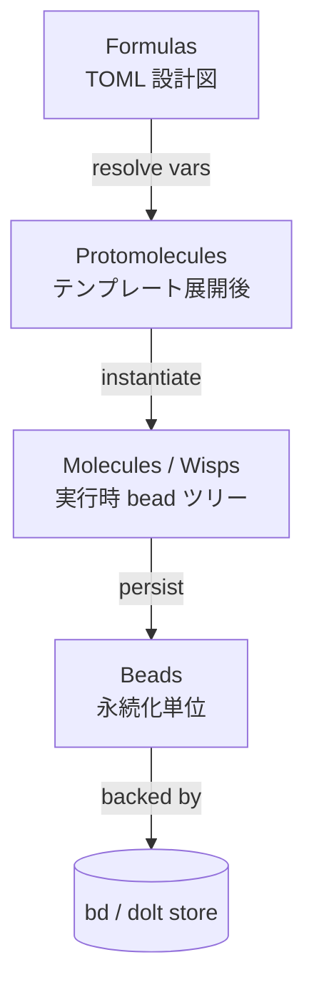
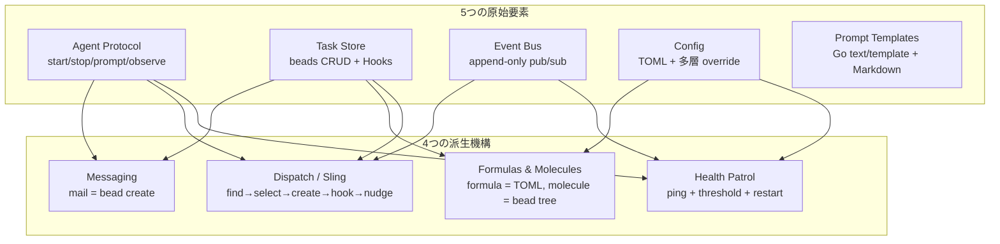

# Gas City — システム概要

**生成日:** 2026-04-29
**対象バージョン:** gascity v1.0.0+
**生成者:** Claude Code

---

## Gas City とは

Gas City はマルチエージェント・コーディングワークフローを構成するための「オーケストレーション・ビルダー SDK」である。Go 製の単一バイナリ `gc` を CLI フロントエンドとし、tmux / dolt / bd（beads）をランタイム基盤として、Claude Code・Codex・Gemini・Cursor といった既存の CLI コーディングエージェント（Gas City はこれらを「provider」と呼ぶ）を束ねる。一つの作業空間（city）の下に外部プロジェクトを rig として登録し、agent が pack で定義された役割に従って協調する。

20〜30 個もの AI コーディングエージェントを「短時間使ってすぐ捨てる」のではなく「常時走らせて、bead（永続化された work item）を介して協調させる」運用を狙うシステムである。タスクもメッセージもセッションも convoy も、すべては bead store に永続化される work item として表現され、エージェントどうしは直接呼び出しではなく bead を介してやり取りする。プロセスが落ちても、bead が生きていれば仕事は失われない。なお、本ドキュメントで頻出する "mail"（`gc mail send` など）は外部の電子メール（SMTP / IMAP / Gmail 等）ではなく、bead store に `type = "message"` の bead を 1 件作るだけの内部メッセージング機構である。受信側は次のターンで hook 経由で自身の context に注入される。

本文中に `mayor` / `polecat` / `refinery` / `deacon` / `witness` のような馴染みのない単語が出てきたら、それらは **Gas City SDK の概念ではない**。`examples/gastown/` で示される一つの pack 流儀の役割名にすぎず、SDK 自体は役割を一切ハードコードしない（ZERO hardcoded roles）。これは Gas City の設計哲学の中心にある原則で、§5.1 で具体的に見る。

このドキュメントは、§2 で起源を軽く、§3 で中核モデル（MEOW stack / Nine Concepts / Bead 種別）を、§4 で tutorial 各章を architecture 視点で、§5 で実例パックを、それから語彙・物理構成・要件と順に深掘りする。

---

## 起源の補足 — Gas Town と MEOW stack

Gas City は Steve Yegge の Gas Town プロジェクトから抽出された SDK である。Gas Town は複数の AI コーディングエージェントを協調させる先行実装で、当初は `mayor` / `deacon` / `polecat` といった役割が Go コードに直接クラスとして書かれていた。Steve Yegge はその実装の中で、それらの役割が **MEOW stack（Molecular Expression of Work）** と呼ばれる work 表現の抽象と、Markdown で書かれた prompt template だけで表現できることに気付いた。これが転機となった。

役割を Go コードから TOML 設定 + Markdown プロンプトへ追い出した結果、SDK 部分（infrastructure）と pack 部分（役割定義の集合）を分離できるようになった。Gas City はその SDK 部分である。Gas Town 自体は pack の一例として `examples/gastown/` に残っており、Gas City の上では他にも `examples/swarm/` のようなフラット型のオーケストレーションパックが書ける。AGENTS.md は次のように述べている:

> You can build Gas Town in Gas City, or Ralph, or Claude Code Agent Teams, or any other orchestration pack — via specific configurations.

つまり Gas City は「特定のオーケストレーション流儀を提供しない SDK」であって、流儀そのものは pack で表現する。次節 §3.1 で、その分離を可能にした MEOW stack の中身を見る。

> 出典: Steve Yegge "Welcome to Gas Town" — https://steve-yegge.medium.com/welcome-to-gas-town-4f25ee16dd04

---

## 中核モデル

### MEOW stack: 4 層で work を表現する

MEOW = **Molecular Expression of Work**。Gas City はあらゆる仕事を 4 つの層で表現する。下に行くほど永続的、上に行くほど抽象的になる。

| レイヤ | 何か | 永続性 | 代表ファイル / 操作 |
|------|------|------|------|
| **Formulas** | TOML で書く workflow 定義（設計図） | ファイル | `formulas/<name>.toml` |
| **Protomolecules** | 変数を解決してインスタンス化したテンプレート | コンパイル時 | `gc formula show --var name=Alice` |
| **Molecules / Wisps** | 実行時の bead ツリー（永続版 / 一時版） | bead store / TTL で蒸発 | `gc formula cook` / `gc sling --formula` |
| **Beads** | 永続化単位。すべての work item の物理表現 | bead store | `bd create`, `bd show` |

各層の責務:

- **Formulas** は TOML で書く設計図。`[[steps]]` を並べ、`needs` で依存関係を、`[vars]` で変数を、`[steps.condition]` / `[steps.loop]` / `[steps.check]` で実行制御を表現する。`formulas/` ディレクトリに置いておけば、`gc formula list` で一覧できる。あくまで定義であって、実行体ではない。
- **Protomolecules** は formula の `{{var}}` プレースホルダを実値に置換した「コンパイル後の設計図」である。`gc formula show feature-work --var title="ログイン"` を打つとこの層が見える。永続化はされない（コンパイル時のみ存在）。late binding によって、同じ formula を複数の文脈で再利用できる。
- **Molecules** と **Wisps** は protomolecule をさらに具体化した「実行時の bead ツリー」である。両者の違いは永続化の度合い。**Molecule** は `gc formula cook` で作る long-lived workflow で、各ステップが独立した bead として bead store に persist し、別々のエージェントへ振り分けられる。**Wisp** は `gc sling --formula` や order の発火で自動生成される ephemeral workflow で、root bead だけが store にあり、ステップは inline で読まれ、完了後 TTL で GC される。日常の使い分けでは「単一エージェントに一発で投げたい → wisp」「複数エージェントで分担したい → molecule」となる。
- **Beads** は MEOW のすべての層の最終的な永続化先である。タスク・メッセージ・セッション・molecule・wisp・convoy のすべてが bead として bead store（既定では dolt）に保存される。Steve Yegge は記事で次のように定義している:

  > An agent is not a session — an agent _is_ a Bead, an identity with a singleton global address.

  bead は ID と状態と type を持つ最小の永続化単位で、これがあるからこそセッションが crash しても仕事の identity は失われない。

MEOW のキーとなる洞察は、この 4 層がすべて「Config（formula 定義のレイヤ解決）+ Bead Store（永続化）+ Event Bus（trigger）」という 3 つの primitive だけで実装できることである。役割名は Go コードに一切現れず、すべて prompt template と TOML 設定で表現される。これが §3.2 で見る Nine Concepts への伏線となる。

### Nine Concepts: 5 primitives + 4 derived mechanisms

Gas City は MEOW stack を成立させるために、5 つの不可分な primitive と、それから合成される 4 つの派生機構を持つ。primitive とは「これを欠くと Gas Town を再構築できない」最小要素、派生機構とは「primitive の組み合わせで実装できる高水準の仕組み」のこと。

| # | 概念 | 役割 | 代表的な接点 |
|---|------|------|-------------|
| 1 | Agent Protocol | provider 抽象。Claude Code でも Codex でも同じインターフェースで起動・停止 | `gc session new`、`gc agent` |
| 2 | Task Store (Beads) | 仕事・メール・セッション・convoy すべてが「bead」として永続化される | `bd create`、`bd ready`、`bd show` |
| 3 | Event Bus | システム内のすべての出来事の append-only ログ | `gc events`、`gc event emit` |
| 4 | Config | TOML を多層解決して活性化レベル 0〜8 を決める | `gc config show`、`gc config explain` |
| 5 | Prompt Templates | エージェントの振る舞いそのもの。Go の text/template 構文で書く | `agents/<name>/prompt.template.md`、`gc prime` |
| 6 | Messaging | `gc mail` は task store に bead を作るだけ。新しい primitive ではない | `gc mail send/inbox/read` |
| 7 | Formulas & Molecules | formula は TOML、molecule は config からインスタンス化された bead ツリー | `gc formula list/show/cook` |
| 8 | Dispatch (Sling) | 仕事を見つける/作る/エージェントに渡す/convoy を作る一連の合成手続き | `gc sling` |
| 9 | Health Patrol | controller が一定間隔でエージェントの生存と進捗をチェック | `daemon.patrol_interval` 設定 |

「Layer 0/1 が原始要素、Layer 2-4 が派生機構、上位レイヤは下位を呼ばない」という階層不変条件が CI で強制されており、コードを読むときも書くときもこの順序が手がかりになる。MEOW stack を Nine Concepts に対応させると、「Formulas & Molecules（#7）」が MEOW の formula 〜 molecule 層に相当し、「Task Store（#2）」がその下にある bead 層に相当する。

### Bead 種別のカタログ

すべては bead だが、bead の中身を覗くと **type** と **label** でさらに分類されている。ユーザが日常的に触る 6 タイプは次のとおり:

| Type | 表すもの | 主な作成経路 | 親子関係 / 特徴 |
|------|---------|-----------|---------------|
| **task** | 仕事の単位 | `bd create` / formula step / dispatch | molecule や convoy の子になることも |
| **message** | エージェント間メール | `gc mail send` | `thread:<id>` label でスレッド化 |
| **session** | 実行中の tmux セッション | `gc session new` / 自動 | identity 用、ライフサイクル管理 |
| **molecule** | 永続的な formula 実行体 | `gc formula cook` | step bead を子に持つ |
| **wisp** | 一時的な formula 実行体 | `gc sling --formula`、order | TTL で GC される |
| **convoy** | 関連 bead をまとめる親 | `gc convoy create` / 自動 | `owned` label で auto-close を抑止 |

この 6 種以外にも、内部用には `gate`（speculative instantiation で待たせる中間 bead）、`convergence`（反復ループの root）、`agent` / `role` / `rig`（identity 用 static bead）、`merge-request`（VCS 統合）といった infrastructure type が存在する。`bd ready` の結果からはこれらが自動除外される（actionable な work ではないため）。日常的にユーザが意識する必要はないが、`bd list --type ...` の引数として現れることがある。

bead の分類は **type による分類**（infrastructure / workflow-container を `bd ready` から除外する仕組み）と **label による分類**（`gc:session`、`thread:<id>`、`read`、`owned`、`order-tracking` などで意味付け）の二軸で行われる。type は粗く、変更されない。label は細かく、状態遷移に応じて付け外しされる。両軸が必要なのは、「type=task」だけでは「未読メールか」「sprint 用 convoy のメンバーか」「スレッドの一部か」を表現できないからである。

なお `task` type は内部的にサブタイプを持たない。`bd create --type feature` のように見える書き方は、`feature` という文字列が type フィールドにそのまま入るだけで、`task` を細分化しているわけではない。意味付けが必要なら label で行う。

---

## tutorial で歩く Gas City

`docs/tutorials/01-07` を順に読むと、city → rig → agent → session → mail → formula → bead → order と進む。それぞれの章は具体的な操作中心に書かれているが、architecture 視点ではどのレイヤを触っているかで整理できる。次の地図がそれを示している。

| Tutorial | 主役要素 | 主に触る primitives | 主に触る derived | 代表コマンド |
|---------|---------|------------------|---------------|------------|
| 01. cities and rigs | city, rig | Config | — | `gc init`、`gc rig add`、`gc status` |
| 02. agents | agent, prompt | Agent Protocol、Prompt Templates、Config | — | `gc agent add`、`gc prime`、`gc sling` |
| 03. sessions | session, polecat, crew | Agent Protocol、Task Store | — | `gc session attach/peek/nudge/logs` |
| 04. communication | mail, hook, sling | Task Store、Agent Protocol | Messaging、Dispatch | `gc mail send`、`gc session nudge` |
| 05. formulas | formula, molecule, wisp | Config、Task Store | Formulas & Molecules、Dispatch | `gc formula list/show/cook`、`gc sling --formula` |
| 06. beads | bead, convoy, dependency | Task Store | — | `bd ready/show/close`、`gc convoy create` |
| 07. orders | order, trigger | Task Store、Event Bus、Config | Dispatch、Health Patrol | `gc order list/check/run/history` |

各章を architecture 視点で読み解くと:

**Tutorial 01: cities and rigs.** Config primitive の活性化を扱う章。`gc init` は `pack.toml` と `city.toml` を書き、`gc rig add` は `.gc/site.toml` に machine-local パスバインディングを追加する。rig は「外部プロジェクトを city に結びつけるための名前空間」であり、bead ID プレフィックス、独立 beads 並列空間、hook の installation がここに紐づく。

**Tutorial 02: agents.** Agent Protocol + Prompt Templates + Config の三つ巴。`gc agent add --name reviewer` でディレクトリをスキャフォールドし、`agents/reviewer/prompt.template.md` で振る舞いを定義し、`agents/reviewer/agent.toml` で provider・dir・option_defaults を上書きする。Gas City SDK は agent に役割を強要しないので、prompt の中身が役割そのものになる。

**Tutorial 03: sessions, polecat, crew.** Agent Protocol の **運用形態** を扱う章。同じ provider プロセスを 2 通りで使い分ける ── 仕事のたびに spin up + idle で消える *polecat* と、`[[named_session]] mode = "always"` で常駐する *crew*。これは SDK の概念ではなく Config による pattern であって、両者の境界は `pack.toml` の named_session の有無で決まる。

**Tutorial 04: communication.** Messaging + Dispatch の derived mechanism がテーマ。`gc mail send` は内部で `bd create --type message` を呼ぶだけ、`gc sling` は内部で「bead 作成 → session 確保 → wisp attach → convoy 作成 → nudge」の合成手続きを実行する。エージェントどうしは直接ではなく bead store を経由してやり取りするので、receiver が落ちていても message は残る。

**Tutorial 05: formulas.** MEOW stack の中段（Formulas & Molecules）を直接操作する章。`gc formula show` で protomolecule（変数解決後）を確認し、`gc formula cook` で molecule を bead store に persist し、`gc sling --formula` で wisp として一発投入する。`needs` による DAG、`[vars]` による parameterize、`[steps.loop]` による展開は、すべてコンパイル時に決定される。

**Tutorial 06: beads.** Task Store primitive を直接触る章。`bd ready` / `bd show` / `bd list` で実行状態を query し、`bd dep` で依存を張り、`bd label add` で意味付けする。convoy が「関連 bead をまとめる親 bead」であり、scoped な ID プレフィックス（`mc-`、`mp-` など）が rig からどう派生するかも触れる。

**Tutorial 07: orders.** Event Bus + Dispatch + Health Patrol が交わる章。controller の 30 秒ごとの tick で trigger（cooldown / cron / event / condition / manual）を評価し、due な order について formula を wisp 化して dispatch する。formula を持たない exec order は agent を介さず controller がスクリプトを直接走らせる。order ごとに tracking bead が作られ、duplicate prevention の根拠になる。

---

## パック流儀の例

`examples/` 配下には、Gas City の上で書ける流儀の参考実装が二つ置かれている。SDK 自体は流儀を強制しないので、これらは「こういう pack を書くこともできる」という実例にすぎない。

### Gas Town pack: 階層的オーケストレーション

`examples/gastown/packs/gastown/` にある参考 pack。Steve Yegge の元 Gas Town 設計を pack として再現したもの。階層的な役割構造を持つのが特徴:

| 役割 | scope | mode | 何をするか |
|------|------|------|-----------|
| **mayor** | city | always (crew) | ユーザ窓口、計画と委譲 |
| **deacon** | city | always (crew) | パトロール、health 監視の補助 |
| **boot** | city | always (crew) | 起動時のブート処理 |
| **witness** | rig | always (crew) | rig 内の状態見守り、polecat の補助 |
| **refinery** | rig | on_demand | merge queue 管理、複数 worker の統合 |
| **polecat** | rig | (pool) | 一時的 worker、PR 生成して廃棄 |
| **dog** | shared | (pool) | 共通 utility worker（maintenance pack 由来） |

引用元: `examples/gastown/packs/gastown/pack.toml`。

city-scoped agent は city 全体に 1 体ずつ存在する。rig-scoped agent は登録された rig ごとに stamp される（複数 rig があれば各 rig 用に複製）。crew は人間が attach して話す相手、polecat は仕事のたびに使い捨てる worker、というのが運用上の使い分けだが、これらは pack の慣習であって SDK が強制するものではない。同じ役割名で違う運用にしてもよいし、これらの役割を全部捨てて自分で組んでもよい。

### Swarm pack: フラット型ピア協調

`examples/swarm/` で示される対案。階層を作らず、各 rig に N 体の coder と 1 体の committer を置いてピアで協調する流儀。worktree 隔離をせず全 agent が同じ rig ディレクトリを共有するため、bead と mail だけで衝突を回避するミニマリズム設計になっている。Gas Town pack と対照的に、特権的な調整役（mayor のような coordinator）を置かない。

### 自分の流儀を組む

これらは出発点にすぎない。自分の流儀に合った pack を `pack.toml` + `agents/<name>/prompt.template.md` + `formulas/<name>.toml` + `orders/<name>.toml` で組むのが Gas City の本来の使い方である。AGENTS.md の言葉を借りれば「ZERO hardcoded roles」── 役割は Go コードを書かずに TOML だけで表現できるのが SDK としての Gas City の最大の特徴である。

---

## 中核 Vocabulary

| 用語 | 意味 | どこで触るか |
|------|------|------------|
| **city** | 一つのオーケストレーション環境。`pack.toml` + `city.toml` + `.gc/` + `agents/` を含むディレクトリ | `gc init`、`gc cities` |
| **pack** | 再利用可能な定義レイヤ。pack はそのまま city にもなれる | `pack.toml`、`[imports.<name>]` |
| **rig** | city に登録された外部プロジェクトディレクトリ。エージェントが作業する場所 | `gc rig add`、`gc rig list` |
| **agent** | provider + プロンプトテンプレート + scope の組み合わせ | `agents/<name>/`、`gc agent add` |
| **session** | 実行中のエージェント終端（tmux 内のプロセス）| `gc session attach`、`gc session peek` |
| **bead** | 仕事・メール・セッション・convoy など、永続化されるすべての work item（タイプ別の詳細は §3.3）| `bd create`、`bd ready` |
| **formula** | 宣言的マルチステップワークフロー。MEOW の最上層（§3.1 参照）| `formulas/<name>.toml` |
| **protomolecule** | 変数を解決した formula（コンパイル中間形）| `gc formula show --var ...` |
| **molecule** | formula を cook して具体化した bead ツリー（永続的、§3.1 参照）| `gc formula cook` |
| **wisp** | formula を sling で発火した一時的 bead ツリー（GC される、§3.1 参照）| `gc sling --formula` |
| **convoy** | 関連 bead をまとめる親 bead。スプリントや一連の PR をくくる | `gc convoy create/status` |
| **order** | trigger（cooldown / cron / event / condition / manual）+ 起動対象（formula / exec）| `orders/<name>.toml` |
| **mail** | 永続的なエージェント間メッセージ（外部メールではなく bead store の `type=message`、§1 参照）| `gc mail send/inbox/read` |
| **nudge** | live セッションのターミナルに直接テキストを流す | `gc session nudge`、`gc nudge` |
| **hook** | エージェントの起動・ターン・終了に Gas City 側のロジックを差し込む仕組み | `install_agent_hooks` 設定 |
| **polecat** | 仕事のたびに作られて idle で消える transient session の運用呼称（§5.1 Gas Town pack を参照）| (pack の慣習) |
| **crew** | `[[named_session]] mode = "always"` で常駐する persistent session の運用呼称（§5.1 を参照）| (pack の慣習) |

---

## 物理構成

ここまでは抽象モデル（MEOW、Nine Concepts、bead、pack）を見てきた。次は物理プロセスのレイアウトを示す。

- **supervisor** は launchd（macOS）または systemd（Linux）に登録されるマシン全体のデーモンで、登録された city ごとに **controller** プロセスを起動する。`gc service` および `gc supervisor` がこの層を制御する。
- **controller** は単一 city の常駐プロセスで、30 秒ごとの「tick」で desired state（config）と running state（tmux + bd）を比較し、足りないセッションを作り、order を発火し、health patrol を回す。Nine Concepts のうち Dispatch と Health Patrol を駆動するのがここ。
- **bd** は beads（dolt 上に構築された分散 Git ライクな永続ストア）への CLI で、すべての bead は最終的に dolt のテーブル行として保存される。`GC_BEADS=file` でファイルベースの簡易ストアにも切り替えられる。
- **tmux** はすべての live セッションのコンテナ。Claude Code・Codex・Gemini といった provider の CLI は tmux 内で動かされ、デタッチしてもバックグラウンドで生き続ける。Agent Protocol の物理的な実装層。
- **hook** は provider 固有の機構（Claude Code の `settings.json` など）を介して、毎ターン `gc mail check`・`gc hook` を呼び出すよう仕込まれる。これによりエージェントは Gas City の mail や bead に常に気付ける。

---

## 技術要件

| 要素 | 必要バージョン | 備考 |
|------|-------------|------|
| OS | macOS / Linux / WSL2 | Windows はネイティブ非対応 |
| Go | 1.25+ | ソースビルドのときのみ |
| tmux | 任意のモダン版 | セッション管理の基盤 |
| git | 任意 | rig の登録と一部スクリプトで使用 |
| jq | 任意 | JSON 処理 |
| pgrep / lsof | 任意 | プロセス・ポート探索 |
| dolt | 1.86.1+ | beads provider `bd` を使う場合（既定） |
| bd | 1.0.0+ | beads provider `bd` を使う場合（既定） |
| flock | 任意 | beads provider `bd` を使う場合（macOS は `brew install flock` 必須） |
| provider CLI | 任意 | `claude` / `codex` / `gemini` / `cursor` / `amp` / `opencode` / `auggie` / `pi` / `omp` のうち少なくとも 1 つ |

`bd` ベースの構成を回避したい場合、`GC_BEADS=file` を環境変数に設定するか `city.toml` に `[beads] provider = "file"` を追加すれば dolt / bd / flock をスキップできる。チュートリアル目的やお試しには十分実用になる。

---

## 関連ドキュメント

- [クイックスタート](./QUICKSTART.md) — Homebrew インストールから初回 sling まで
- [コマンドリファレンス](./COMMANDS.md) — `gc` の全主要コマンド
- [ユースケース](./USE-CASES.md) — 7 つの代表的シナリオを手順付きで
- [設定ガイド](./CONFIGURATION.md) — `city.toml` / `pack.toml` / `agent.toml` / 環境変数
- [トラブルシューティング](./TROUBLESHOOTING.md) — よくある問題と `gc doctor`

公式ドキュメント（Mintlify）はリポジトリ内 `docs/` で `./mint.sh dev` してプレビューできる。深掘りには `engdocs/architecture/`（アーキテクチャ設計書）と `engdocs/contributors/`（コントリビュータ向け）が有用。
