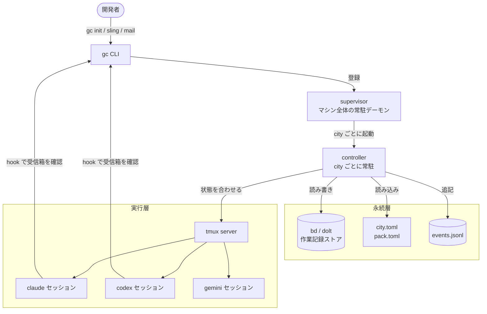
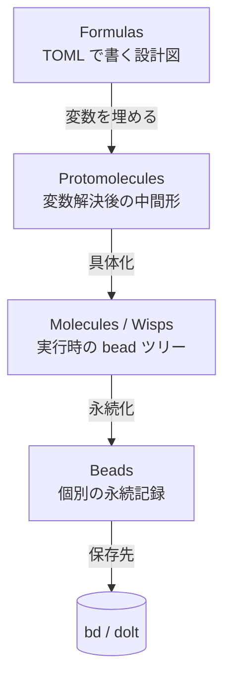
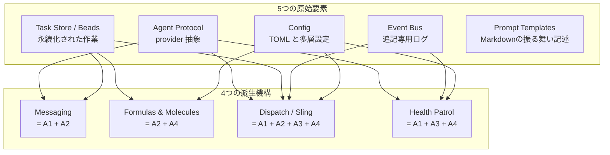

# Gas City — システム概要

**生成日:** 2026-04-30
**対象バージョン:** gascity v1.0.0+
**所要時間:** 約30分（社内勉強会想定）
**生成者:** Claude Code

---

## この30分で持ち帰る3点

1. **永続的な作業記録を中心に置く**。タスクもメッセージも実行中のセッションも、すべて同じ仕組みで永続化される。エージェントが落ちても作業は残る。
2. **役割はGoコードに書かない**。Mayor、Polecat、Coderといった役割名は設定ファイルとMarkdownのプロンプトで定義する。本体のSDKコードには役割名が一切現れない（**ZERO hardcoded roles**）。
3. **複数のAI CLIを束ねる**。Claude Code、Codex、Gemini、Cursor、Amp などを一つの作業環境にまとめ、数日〜数週間にわたって協調させる。1セッション完結型ではない使い方を狙う。

---

## 1. Gas City とは何か

Gas City は、複数のAIコーディングCLI（Claude Code、Codex、Gemini など）を一つの作業環境にまとめ、長期にわたって協調させるためのGo製SDKである。`gc` というCLIフロントエンドを入口に、`tmux`・`dolt`・`bd` といった既存ツールの上に「エージェントどうしが永続的な作業記録を介してやり取りする仕組み」を構築する。

既存のAIコーディングツールの多くは、1セッションで仕事を完結させる前提で作られている。別のエージェントへ引き継ぐには、人間が手作業で文脈を組み立て直す必要がある。Gas City は、作業の記録そのものを永続的に保存することで、エージェントが落ちても、別のエージェントに渡しても、続きを失わずに済むようにする。10分で片付く小タスクではなく、数日〜数週間にわたる開発を複数のエージェントで分担する用途を狙っている。

Gas City は、Steve Yegge の Gas Town プロジェクトから抽出されたSDKである。

---

## 2. 物理構成 — まず実体を見る

抽象的なモデル（後述するMEOW stackや原始要素）はすべて、この物理構成の上に組み立てられている。



主要な構成要素は次の5つ:

- **supervisor** — macOS の launchd または Linux の systemd に登録される、マシン全体の常駐デーモン。登録されている各 city ごとに、後述の controller プロセスを起動する。`gc service` と `gc supervisor` で操作できる。
- **controller** — 一つの city ごとに常駐するプロセス。約30秒ごとに「設定ファイルが期待する状態」と「実際に動いているプロセスの状態」を比較し、足りないセッションを立ち上げ、定期実行や条件発火のジョブ（後述の order）を起動し、エージェントの健康状態を監視する。
- **tmux** — 動作中のすべてのエージェントセッションを束ねる土台。Claude Code・Codex・Gemini などのCLIは tmux のウィンドウ内で動かされ、ターミナルからデタッチしても背後で生き続ける。
- **bd（beads）** — `dolt` という分散Gitライクな永続ストアの上に作られたCLI。すべての作業記録（後述の bead）はここに保存される。`GC_BEADS=file` を指定すれば、ファイルベースの簡易ストアに切り替えられる。
- **hook** — 各CLI固有の仕組み（Claude Codeの `settings.json` など）を介して仕込まれる、エージェントの毎ターンの差し込み点。これによりエージェントは、自分宛のメールや新しいタスクの存在に常に気付ける。

ここで、本書を通じて使う基本用語を実体として導入する:

- **bead**（永続化される作業単位） — タスク・メッセージ・セッションなど、作業に関わるあらゆる記録の最小単位。詳しくは§3。
- **provider**（AIコーディングCLIの総称） — Claude Code、Codex、Gemini、Cursor などの実体。Gas City はこれらを共通のインターフェースで扱う。
- **rig**（city に登録した外部プロジェクト） — エージェントが実際にコードを書く相手のディレクトリ。Gas City は city の中に複数の rig を登録できる。
- **city**（一つのオーケストレーション環境） — `pack.toml` と `city.toml`、状態保管用の `.gc/`、エージェント定義の `agents/` を含むディレクトリ全体。

### この章で押さえる設計上の柱: ZERO hardcoded roles

Gas City のSDK本体（Goコード）には、Mayor・Polecat・Coderなどの役割名が一切登場しない。役割は `pack.toml` と `agents/<名前>/prompt.template.md`（プロンプトのMarkdown）で定義される。SDKは「役割を実行するための土台」だけを提供し、「どんな役割を置くか」はユーザー（または利用するパック）が決める。これが Gas City が単なる Gas Town の再実装ではなく、汎用SDKとして機能する理由である。

---

## 3. 中心思想 — 永続化される作業はすべて bead

> "An agent is not a session — an agent _is_ a Bead, an identity with a singleton global address."
> — Steve Yegge, _Welcome to Gas Town_

Gas City で最も重要な発想は「永続化される作業は、種類を問わず同じ仕組み（bead）で表現する」ことである。タスクも、エージェント間メールも、走っているセッションの登録も、複数手順の実行体（後述の molecule・wisp）も、関連する bead をまとめる親（convoy）も、すべて bead として保存される。CLIコマンドはどれも、bead を作る・読む・更新する薄いラッパーに過ぎない。

bead の最小定義は単純で、ID・状態・種類（type）と、必要に応じてラベルや依存関係を持つ。`bd create` で作り、`bd ready` で着手可能なものを取り出し、`bd show` で詳細を見る。保存先は既定で dolt、設定で切り替えればファイルでもよい。

なぜ bead を中心に置くのか。**プロセスが落ちても、同じ仕事として追い続けられるからである**。tmux のセッションが死んでも、provider の CLI が落ちても、その作業を表す bead は永続層に残り続ける。複数の独立した観察者（controller、別のエージェント、人間）が、同じ永続状態を基準に判断できる。Gas City はこれを **NDI（Nondeterministic Idempotence）** と呼ぶ。直訳すれば「不確定な順序でも結果が変わらない」性質のことで、要は「誰がいつ確認しても、同じ永続状態に基づいて整合の取れた判断ができる」ということである。セッションは消えても、永続層に残った bead が真実を保つ — これが Gas City で長期協調が成立する根拠である。

ここで一つ釘を刺しておきたい。**「すべては bead」と言うとき、対象は『永続化される作業記録』に限られる**。物理構成（supervisor、controller、tmux）も、設定ファイル（`city.toml`、`pack.toml`）も、Markdownのプロンプトも bead ではない。これらは bead を扱うための土台や材料であって、bead そのものではない。混同すると Gas City の構造が見えなくなるので注意してほしい。

bead の中身（種類とラベルの分類）は§7で扱う。本章では「なぜ bead を中心に置くのか」だけを押さえれば十分である。

---

## 4. 作業を表す4層 — MEOW stack

Gas City は仕事を4層で表現する。MEOW = **Molecular Expression of Work**（分子的な作業表現）。下の層ほど永続的で具体的、上の層ほど抽象的で再利用しやすい。



各層の役割は次のとおり:

| 層 | 何か | 永続性 | 代表的な操作 |
|----|------|--------|-------------|
| **Formulas** | 複数手順の workflow を TOML で書いた設計図 | ファイルとして残る | `formulas/<name>.toml` |
| **Protomolecules** | formula の変数を実値で埋めた中間形 | 一時的（コンパイル中のみ） | `gc formula show --var name=Alice` |
| **Molecules / Wisps** | 設計図を実体化した「実行時の bead ツリー」 | molecule は永続、wisp は使い捨て | `gc formula cook` / `gc sling --formula` |
| **Beads** | 永続化される作業の最小単位 | 永続層に保存 | `bd create`、`bd show` |

- **Formulas** は `[[steps]]` を並べて手順を書き、`needs` で順序を、`[vars]` で変数を、`[steps.condition]` などで実行条件を表現するTOMLファイルである。あくまで「設計図」で、実行体ではない。
- **Protomolecules** は formula の `{{var}}` を実値に置換した、コンパイル中だけ存在する中間形である。`gc formula show feature-work --var title="ログイン"` を実行するとこの形が見られる。永続化はされない。
- **Molecules** と **Wisps** は protomolecule をさらに具体化した実行体である。違いは「永続性と用途」にある。
- **Beads** は最終的な永続化単位で、上の3層もすべて最終的にここで永続化される。bead の世界観は§3で見たとおり。

### molecule と wisp の使い分け

molecule と wisp は、混同されやすいので個別に整理する。

| 観点 | molecule | wisp |
|------|----------|------|
| 永続性 | 各手順を独立した bead として保存し、複数のエージェントで分担できる | root の bead だけを残し、各手順は本文に折り込んで一括処理する。一定時間で破棄される |
| 用途 | 長期的・複数人体制で進める workflow | 単一エージェントに一発で投げる短期 workflow |
| 後始末 | 明示的に閉じるまで残る | 時間経過で自動的に消える |
| 起動コマンド | `gc formula cook` | `gc sling --formula`、または定期ジョブ（order）からの自動発火 |

つまり、長期で複数のエージェントが触る仕事は molecule、その場限りの一発仕事は wisp、という使い分けになる。

MEOW stack の重要な性質は、**この4層がすべて、後述する3つの原始要素（設定・bead store・event bus）の組み合わせで実装できる**ことにある。役割名が Goコードに現れることもなく、すべて TOML とプロンプトで表現される。これが §5 の議論につながる。

---

## 5. 構成要素 — 5原始要素と4派生機構

Gas City は、5つの**原始要素**（これ以上分割できない構成要素）と、それらを組み合わせて作られる4つの**派生機構**（より高水準の仕組み）から成る。原始要素は「これが欠けると Gas Town を再現できない」という最小集合で、派生機構は「原始要素の合成でちゃんと作れる」高水準機能である。



### 5つの原始要素

- **Agent Protocol** — provider（Claude Code・Codex・Gemini）を共通の操作で扱うための抽象。エージェントの起動・停止・プロンプト送信・観察を、CLIの違いを意識せずに行える。識別子の付与、使い捨てワーカープール、隔離された作業領域、中断からの再開、落ちたセッションの引き継ぎなどを担当する。主に使うコマンドは `gc session new` と `gc agent`。
- **Task Store / Beads** — bead に対するCRUD（作成・読み取り・更新・削除）に加え、状態変化のフック、依存関係、ラベル、検索機能を備えた永続ストア。Gas City で永続化されるすべての作業はここに集まる。主に使うコマンドは `bd create`、`bd ready`、`bd show`、`bd dep`。
- **Event Bus** — システム内で起きるあらゆる出来事を、追記専用のログとして集めて配信する仕組み。「重要なもの（バッファあり、必ず届ける）」と「任意のもの（速度優先で届かなくてもよい）」の二層構成。後述の order の発火条件評価や、controller の状態確認にも使われる。主に使うコマンドは `gc events`、`gc event emit`。
- **Config** — TOML設定を多層的に読み解いて、Gas City の振る舞いを決める。`pack.toml`（再利用される定義）、`city.toml`（city個別の上書き）、`agent.toml`（エージェント個別の上書き）、`.gc/site.toml`（このマシン固有の上書き）の4層をマージする。主に使うコマンドは `gc config show`、`gc config explain`。
- **Prompt Templates** — エージェントの振る舞いそのもの。`agents/<名前>/prompt.template.md` に Markdown で書く。Goの `text/template` 構文を埋め込めるので、設定や bead の値を文中に展開できる。Gas City は役割を Goコードに書かないので、ここに書かれた内容こそがそのエージェントの「役割」になる。

### 4つの派生機構

- **Messaging（= Agent Protocol + Task Store）** — エージェント間メールの正体は、`type = "message"` の bead を1件作ることである。`gc mail send` は内部で `internal/mail/beadmail/` 経由で bead を作るだけ。受信側は次のターンで hook 経由で受信箱を確認し、自分宛のメッセージを context に取り込む。生きているターミナルに直接テキストを流す `gc nudge` は、Agent Protocol の prompt送信を素直に呼ぶ。主に使うコマンドは `gc mail send/inbox/read`、`gc nudge`。
- **Formulas & Molecules（= Task Store + Config）** — formula は Config が TOML から読み込み、molecule は Task Store の中で「root の bead と各手順の子 beads からなる木」として表現される。MEOW stack の中段（§4）の実装にあたる。主に使うコマンドは `gc formula list/show/cook`、`gc sling --formula`。
- **Dispatch / Sling（= Agent Protocol + Task Store + Event Bus + Config）** — 「仕事を見つける／作る → エージェントに渡す → 関連する beads をまとめる convoy を作る → イベントログに残す」という一連の合成手続き。`gc sling` がこれを駆動する。原始要素を4つ全部使う、もっとも厚みのある合成機構。
- **Health Patrol（= Agent Protocol + Event Bus + Config）** — controller が一定間隔でエージェントの生存と進捗を確認し（Agent Protocol）、Configの閾値と比べ、停滞を Event Bus に通知する。停滞が続けば再起動を試みる。主な設定キーは `daemon.patrol_interval`。

### 階層の不変条件

「下の層は上の層を呼ばない」という不変条件が CI で強制されている。たとえば Task Store（A2）の実装が Messaging（B1）を呼ぶことは禁じられている。コードを読むときも書くときも、この順序が手がかりになる。

---

## 6. 機能の段階的な有効化 — 設定で何が動くかが決まる

Gas City はすべての機能を最初から有効にしない。**設定ファイル（`pack.toml` / `city.toml`）に何を書くかに応じて、使える機能が段階的に増えていく**仕組みになっている。

これは何のためか。Gas City が提供する機能は多い（エージェント起動、メール、複数手順の workflow、定期ジョブ、健康監視……）が、最初からすべてを使う必要はない。最小構成は「エージェントを1体動かしてタスクを処理する」ことで、ここから少しずつ設定を書き足していくと、メールが使えるようになり、formula が動くようになり、定期ジョブが組めるようになる。設定の有無で機能が判別されるので、不要な機能の挙動に悩まされずに済む。

各段階は次のとおり:

| 段階 | 設定で必要なもの | できるようになること |
|------|-------|---------------------|
| 0 | 何も書かない（初期状態） | `gc init` で作った空の city を保有する |
| 1 | `[[agent]]` を1つ書く | エージェントを1体起動し、bead でタスクを管理する |
| 2 | `[task_loop]` を追加 | エージェントが自動的に bead の受信箱を確認し、続けて仕事をこなす |
| 3 | `[[agent]]` を複数書く＋`[[pool]]` を追加 | 複数のエージェントを並行起動できる。使い捨てワーカープールも作れる |
| 4 | `[mail]` を追加 | エージェント間で永続的なメッセージを送受信できる |
| 5 | `formulas/*.toml` を置く | 複数手順の workflow を定義し、molecule・wisp として実行できる |
| 6 | `[daemon.patrol]` を追加 | 健康監視が動き、停滞したエージェントを再起動する |
| 7 | `orders/*.toml` を置く | 定期実行や条件発火のジョブを仕込める |
| 8 | 上記を全部 | 完全なオーケストレーション環境（Gas Town 相当） |

たとえば段階1の最小構成は、`pack.toml` にこれだけ書けば成立する:

```toml
[pack]
name = "minimal"
schema = 2

[[agent]]
name = "worker"
prompt_template = "agents/worker/prompt.template.md"
```

ここに `[task_loop]` を足せば段階2、`[mail]` を足せば段階4と、設定を書き足すたびに使える機能が増えていく。**「最初は1体のエージェントとタスクだけで動かしてみて、必要になったらメールを足し、formula を足し、定期ジョブを足す」**という段階的な育て方ができる。これが Gas City の「設定で機能が決まる」設計モデルである。

---

## 7. bead の分類と pack 流儀

### 7.1 bead の種類とラベル

§3で見たとおり、Gas City で永続化される作業はすべて bead として表現される。だが、bead は中身によって**種類（type）**で分類されており、ユーザーが日常的に触る代表的な6種類は次のとおり:

| 種類 | 表すもの | 主な作成方法 | 親子関係・特徴 |
|------|---------|-----------|---------------|
| **task** | 仕事の単位 | `bd create`、formula の手順、dispatch | molecule や convoy の子になることが多い |
| **message** | エージェント間メール | `gc mail send` | `thread:<id>` ラベルでスレッドにまとめる |
| **session** | 動作中のtmuxセッション | `gc session new`、自動 | 識別子としても機能する |
| **molecule** | 永続的な formula 実行体 | `gc formula cook` | 各手順の bead を子に持つ |
| **wisp** | 使い捨ての formula 実行体 | `gc sling --formula`、定期ジョブ | 一定時間で自動破棄 |
| **convoy** | 関連する bead をまとめる親 | `gc convoy create`、自動 | スプリントや一連のPRをくくる |

この6種以外にも、内部用の bead 種別（`gate`、`convergence`、`agent`、`role`、`rig`、`merge-request` など）がある。これらは `bd ready` の結果から自動で除外される（ユーザーが直接着手するものではないため）。日常的には意識しなくてよい。

種類とは別に、bead には**ラベル（label）**を付けられる。`gc:session`、`thread:<id>`、`read`、`owned`、`order-tracking` などがその例である。種類は粗い分類で `bd create --type ...` で決まり、不変。ラベルは細かい意味付けで、状態が変わるたびに `bd label add` / `bd label rm` で付け外しする。両軸が必要なのは、「種類 = task」だけでは「未読のメールか」「スプリント用 convoy のメンバーか」「あるスレッドの一部か」を表現できないからである。

### 7.2 pack 流儀の選択肢 — Gas Town と Swarm

Gas City は役割を強制しないので、どんなエージェント編成にするかは pack（再利用可能な役割定義のセット。`pack.toml` と `agents/` ディレクトリの一式）の設計次第である。`examples/` 配下に2つの参考実装が置かれており、それぞれ異なる流儀を示している。

| 観点 | Gas Town pack | Swarm pack |
|------|---------------|------------|
| 構造 | 階層型（mayor が常駐窓口、polecat が使い捨てワーカー） | フラット型（rig 内では coder と committer がピアで協調） |
| city レベルの役割 | mayor、deacon、boot（すべて常駐） | mayor（必要時のみ）、deacon（常駐） |
| rig レベルの役割 | witness、refinery、polecat | coder（プール）、committer（必要時のみ） |
| 作業領域の隔離 | あり（polecat ごとに git worktree） | なし（全エージェントが同じディレクトリを共有） |
| 衝突回避 | git worktree で物理的に分ける | bead とメールによる調停のみ |
| 向く場面 | 大規模・長期・複数 rig | 小規模・短期・単一 rig |

**重要**: ここで挙げた `mayor` `polecat` `deacon` `coder` `committer` などの名前はすべて pack の慣習にすぎず、Gas City SDK 本体は一切認識していない。SDKは「役割の置き場所」だけを提供し、「どんな役割を置くか」は pack が決める（**ZERO hardcoded roles**）。同じ役割名で違う運用にしてもよいし、これらを全部捨てて自分で組んでもよい。それが TOML だけで完結するのが Gas City の最大の特徴である。

各 pack の詳細な役割設計と最小サンプルは `examples/gastown/` と `examples/swarm/` にある。

---

## 付録A. Tutorial の地図

`docs/tutorials/01-07` を順に追うと、city → rig → agent → session → mail → formula → bead → order と、概念に沿ってひととおり手を動かせる。各章で触る原始要素・派生機構を一覧化したのが次の表である。具体的な操作手順は [USE-CASES.md](./USE-CASES.md) に詳しい。

| Tutorial | 主役 | 読了後にできること | 主に触る原始要素 | 主に触る派生機構 |
|----------|------|----|----|----|
| 01. cities and rigs | city、rig | city を作って rig を登録できる | Config | — |
| 02. agents | agent、prompt | カスタムエージェントを定義できる | Agent Protocol、Prompt Templates、Config | — |
| 03. sessions | session、polecat、crew | 常駐型と使い捨て型のエージェントを使い分けられる | Agent Protocol、Task Store | — |
| 04. communication | mail、hook、sling | エージェント間でメッセージを送れる | Task Store、Agent Protocol | Messaging、Dispatch |
| 05. formulas | formula、molecule、wisp | 複数手順の workflow を書ける | Config、Task Store | Formulas & Molecules、Dispatch |
| 06. beads | bead、convoy、依存関係 | bead の依存と convoy を扱える | Task Store | — |
| 07. orders | order、trigger | 定期・条件発火のジョブを仕込める | Task Store、Event Bus、Config | Dispatch、Health Patrol |

---

## 付録B. 必要ツールと次に読むもの

### 最小要件

| 要素 | 必要バージョン | 備考 |
|------|---------------|------|
| OS | macOS / Linux / WSL2 | Windows ネイティブは非対応 |
| tmux | 任意のモダン版 | セッション管理の土台 |
| git | 任意 | rig 登録などで使用 |
| dolt | 1.86.1+ | 既定の bead ストアに必要 |
| bd | 1.0.0+ | 既定の bead ストアに必要 |
| flock | 任意 | 既定構成で必要（macOS は `brew install flock`） |
| provider CLI | 任意 | `claude` / `codex` / `gemini` などのうち少なくとも1つ |

dolt 一式を回避したい場合は、環境変数 `GC_BEADS=file` を設定するか、`city.toml` に `[beads] provider = "file"` を書けば、ファイルベースの簡易ストアに切り替わる。チュートリアルやお試しには十分実用になる。

詳細な前提と手順は [QUICKSTART.md](./QUICKSTART.md) を参照。

### 関連ドキュメント

- [QUICKSTART.md](./QUICKSTART.md) — Homebrew インストールから初回 sling まで
- [COMMANDS.md](./COMMANDS.md) — `gc` の主要コマンド一覧
- [USE-CASES.md](./USE-CASES.md) — 7つの代表シナリオを手順付きで
- [CONFIGURATION.md](./CONFIGURATION.md) — `city.toml` / `pack.toml` / `agent.toml` / 環境変数
- [TROUBLESHOOTING.md](./TROUBLESHOOTING.md) — よくある問題と `gc doctor`

公式ドキュメント（Mintlify）は、リポジトリ内の `docs/` で `./mint.sh dev` を実行するとプレビューできる。設計の深掘りには `engdocs/architecture/`（アーキテクチャ設計書）と `engdocs/contributors/`（コントリビュータ向け）が役立つ。
