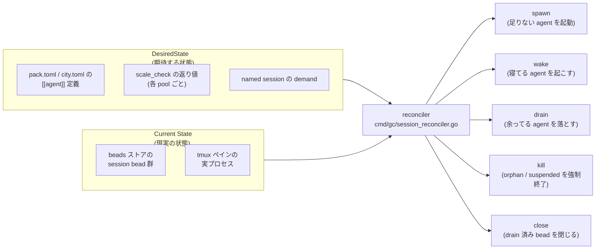
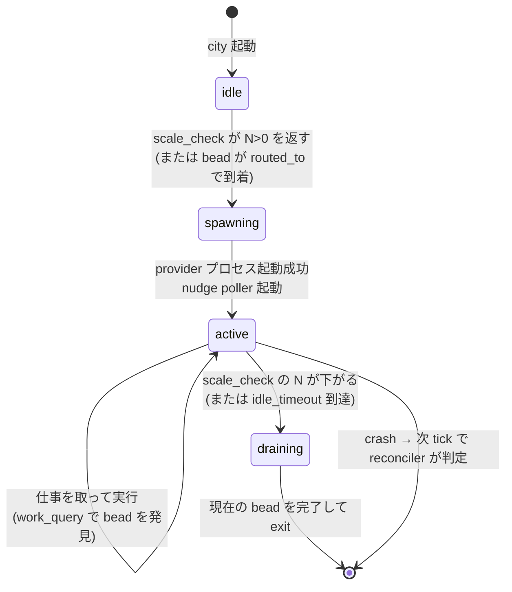
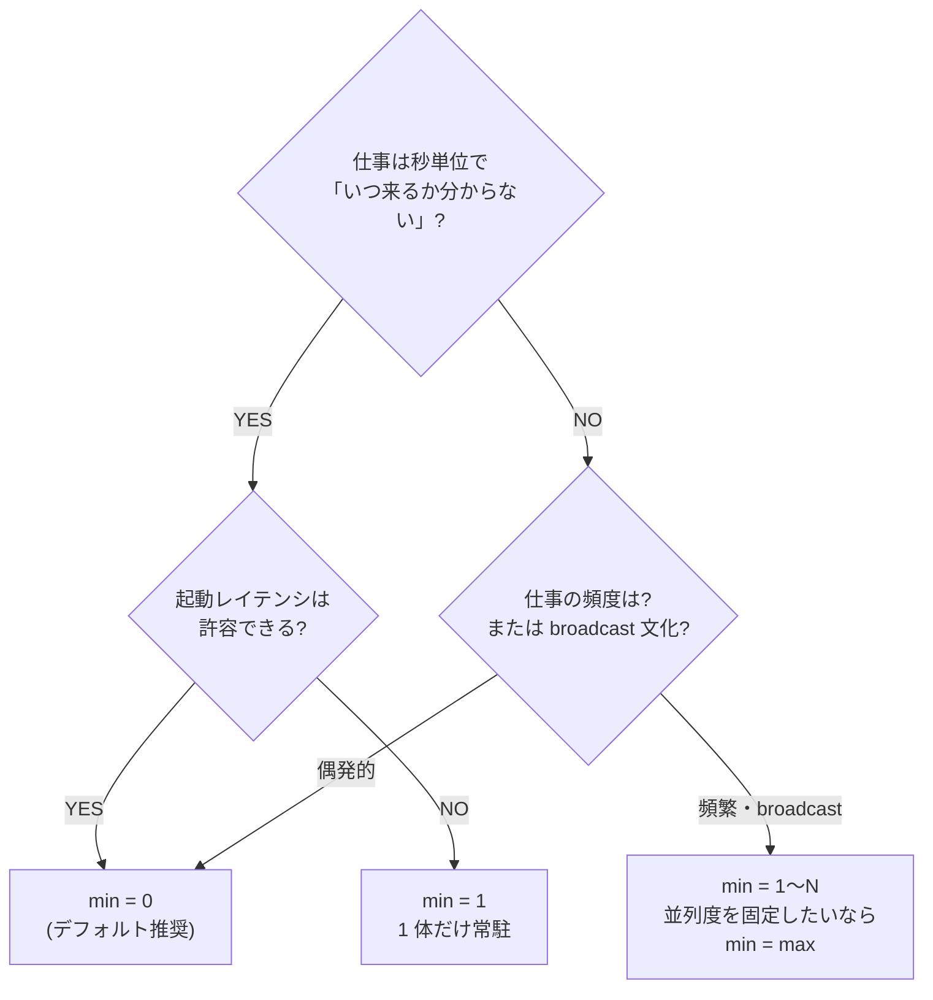
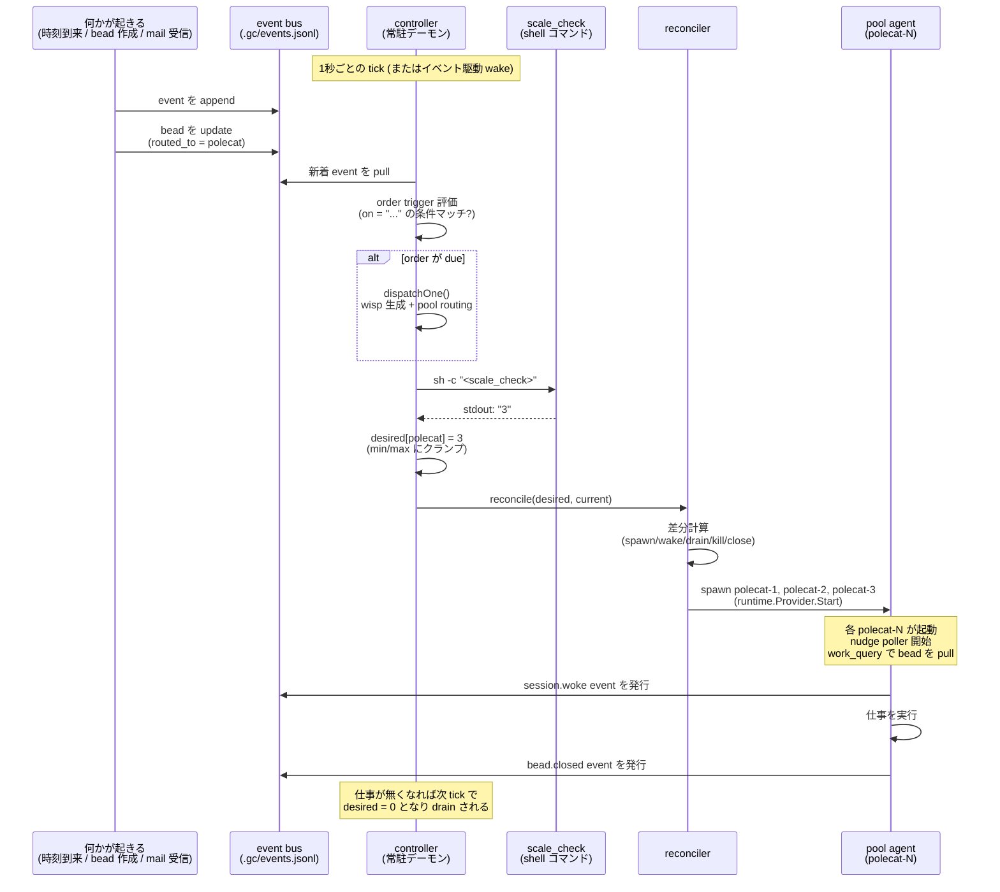

# QA: Gas City のイベント機構 — probe / pool / reconciliation の正体

このドキュメントは、Gas City (`gc`) のオーケストレーションを駆動する **イベント機構**を、初学者がつまずきやすい 3 つの用語(`probe (scale_check)` / `pool` / `reconciliation`)を起点に整理したものです。「`gc` のイベントは常時起動エージェントでしか発生しないのか?」という疑問に最終的に答えることを目的にしています。

> 調査時点: 2026-04-30 / 対象: `main` ブランチ
> 関連ドキュメント: `.history/20260429-usage/OVERVIEW.md` §5、§6 / `.history/20260429-usage/QA/MESSAGING.md` §4 / `engdocs/contributors/reconciler-debugging.md` / `engdocs/architecture/event-bus.md` / `engdocs/design/agent-pools.md`

---

## TL;DR

| 用語 | 一行で言うと |
|---|---|
| **reconciliation** | controller が約 1 秒ごとに「設定が期待する状態」と「いま動いている状態」を突き合わせ、足りない agent を spawn し、余ってる agent を drain する循環処理 |
| **pool** | 同じ役割の agent を複数並行で動かしたいときの定義 (`[agent.pool]`)。最小数 (`min`) と最大数 (`max`) と「いま何体必要か答えるコマンド (`check`)」を持つ。常駐 / on-demand のどちらにも振れる |
| **probe (`scale_check`)** | pool が「いま何体必要か」を決めるために実行する shell コマンド。**stdout に整数 1 行を出力する**。controller がそれを `[min, max]` にクランプして desired state に反映 |
| **event bus** | システム内で起きた事実 (44 種類) の追記専用ログ。**pull 型**が基本で、event そのものは agent 起動の trigger ではなく観測記録 |

そして本書のコア結論:

> **「event 駆動で agent が起きる」は controller を介した間接駆動である**。常時起動の user-facing エージェント (mayor 等) は不要。controller プロセスだけが必須で、controller が reconciliation を回し、その中で event の影響(order trigger 評価・bead routing 状況)を取り込んで agent を spawn / drain する。

---

## 1. つまずきやすい 3 用語の正体

### 1.1 reconciliation とは

**「設定が期待する状態」と「いま動いている状態」を比較し、差分を埋めるためのアクションを取る循環処理**のことです。

Kubernetes の controller pattern や Terraform の plan/apply と同じ考え方です:

| ツール | desired (期待) | current (現実) | 差分を埋めるアクション |
|---|---|---|---|
| Kubernetes ReplicaSet | 「Pod を 3 個動かしたい」 | 実際に動いている Pod 一覧 | Pod を作成 / 削除 |
| Terraform | `.tf` ファイルが宣言する infra | クラウド側の実状態 | リソースを create / update / destroy |
| **Gas City controller** | **`pack.toml` + `scale_check` の結果が期待する agent 一覧** | **bead store に保存された session bead 群 + 実際の tmux ペイン** | **agent session を spawn / wake / drain / close / kill** |

Gas City での実装は `cmd/gc/session_reconciler.go:264` の `reconcileSessionBeadsTraced()` が中心で、デフォルト 1 秒間隔の tick (`cmd/gc/city_runtime.go:503-535`) で繰り返されます。詳細は §2。

### 1.2 pool とは

**同じ役割の agent を弾力的に 0〜N 体動かしたい**ときに使う、`[[agent]]` の中の `[agent.pool]` サブテーブルです。**`[[pool]]` という独立セクションではありません**。

```toml
[[agent]]
name = "polecat"
prompt_template = "agents/polecat/prompt.template.md"

[agent.pool]
min = 0          # 最小数。0 なら不要時は何も動かない
max = 5          # 最大数。1 を超えると polecat-1, polecat-2, ... と命名
check = "bd ready --metadata-field gc.routed_to=polecat --unassigned --json | jq length"
```

**pool agent は常駐するのか?**

→ **`min` の値しだい**:

| `min` | 挙動 |
|---|---|
| `0` | 常駐なし。仕事が来た瞬間に spawn し、終われば自然に exit |
| `1` 以上 | その数までは常駐。超過分は需要に応じて spawn |
| `min == max` の固定 | 常時 `max` 体が動き続ける |

詳細は §3。

### 1.3 probe (`scale_check`) とは

**pool が「いま自分は何体必要か」を controller に答えるための shell コマンド**です。controller がこの shell を `sh -c` で起動し、**stdout に書かれた整数 1 行**を読み取って desired state に反映します。

```toml
[agent.pool]
check = "bd ready --metadata-field gc.routed_to=polecat --unassigned --json | jq length"
#       ↑ controller が sh -c でこれを実行 → stdout に "3" → 「3 体必要」
```

返り値は `[min, max]` にクランプされます。`check` を省略すると、内部でデフォルトの「自分宛にルーティングされた未着手 bead を数える」shell が自動生成されます (`internal/config/config.go:1925-1929`)。詳細は §4。

---

## 2. Controller の reconciliation ループ

### 2.1 比較する 2 つの状態



`buildDesiredStateWithSessionBeads()` (`cmd/gc/build_desired_state.go:182`) が DesiredState を構築し、`reconcileSessionBeadsTraced()` (`cmd/gc/session_reconciler.go:264`) が現実と突き合わせます。

### 2.2 5 つのアクション

| アクション | 意味 | 発動条件 |
|---|---|---|
| **spawn** | 新しい session bead を作って provider プロセス起動 | desired にあって bead が無い |
| **wake** | 既存 bead に対応する provider が眠っているのを起こす | desired にあって bead はあるが asleep |
| **drain** | provider に Ctrl-C を送って graceful shutdown | desired から外れたが provider は生きている |
| **kill** | provider プロセスを強制終了 | orphan / suspended のドレインで必要なとき |
| **close** | bead に終了マークを付けて削除 | drain ack 済み or 仕事が無い |

これらは `session_reconciler.go:1041-1144` の `executePlannedStartsTraced()` 系で実行されます。`runtime.Provider.Start()` が最終的に tmux 上で provider プロセスを spawn します (`internal/session/chat.go:361`)。

### 2.3 3 つのフェーズ

reconciliation は毎 tick で次の 3 段を順に走ります:

```
Phase 0: timer heal      期限切れの遷移タイマーをリセット
                         重複 named session を整理
                         (session_reconciler.go:296-315)
                              │
                              ▼
Phase 1: forward pass    desired state に従ってトポロジカル順で各セッション処理
                         spawn / wake / drain の候補をリスト化
                         (session_reconciler.go:329-1138)
                              │
                              ▼
Phase 2: drain progress  進行中の drain を一歩進める
                         idle probe 管理
                         (session_reconciler.go:1146-1151)
```

### 2.4 trigger は時間と event の混合

reconciler は次の条件のいずれかで起動します (`cmd/gc/city_runtime.go:503-535`):

| trigger | 内容 |
|---|---|
| **patrol tick** | デフォルト 1 秒ごと (`patrol_interval`) |
| **poke** | 外部から `pokeCh` に通知が来たとき (即時) |
| **control socket command** | `gc reload` / `gc converge` などの CLI 命令 |
| **config reload** | `pack.toml` / `city.toml` 変更検知 |
| **crash adoption** | beads にあるが provider プロセスが消えてる session を発見したとき |

つまり「定期的にチェック」と「必要なときに即座に起動」の両方で動きます。

---

## 3. Pool の正体 — 弾性ワーカーの居場所

### 3.1 TOML 構文 (`[agent.pool]` サブテーブル)

```toml
[[agent]]
name = "polecat"
prompt_template = "agents/polecat/prompt.template.md"
work_query = "bd ready --metadata-field gc.routed_to=polecat"

[agent.pool]
min = 0
max = 5
check = "bd ready --metadata-field gc.routed_to=polecat --unassigned --json | jq length"
```

`[[pool]]` という独立セクションは存在しないので注意。pool は **agent の属性**です(`internal/config/config.go:290-320`)。

### 3.2 min / max とライフサイクル



`min=0, max=5` の polecat なら、需要が無いときは 0 体、5 件の仕事が来れば 5 体まで並列で動き、終われば自然に消えます。

### 3.3 min を 1 以上にするユースケース

`examples/` 配下の pack を全件確認すると、`min ≥ 1` を設定しているのは **swarm pack の coder だけ**です。それ以外(gastown polecat、gastown dog、swarm dog、lifecycle polecat、hyperscale worker)はすべて `min = 0` の純オンデマンド運用になっています。つまり「pool = 常駐ゼロ」が標準であり、`min` を上げるのは明確な理由があるときに限られます。

> **TOML の実フィールド名について**: 本書では `[agent.pool]` 内の `min` / `max` という設計ドキュメント (`engdocs/design/agent-pools.md`) の表記で説明していますが、実装済みの `examples/` の `agent.toml` では agent のトップレベルに `min_active_sessions` / `max_active_sessions` と書きます。意味は同じです。
>
> ```toml
> # 実際の examples/swarm/packs/swarm/agents/coder/agent.toml
> scope = "rig"
> nudge = "Run gc bd ready --unassigned, check mail, then claim and work on a task."
> idle_timeout = "2h"
> min_active_sessions = 1
> max_active_sessions = 5
> ```

#### ① コールドスタートのレイテンシを避ける

provider プロセス起動 (Claude Code が立ち上がる)・prompt のレンダリング・nudge poller goroutine の起動を合計すると数秒〜十数秒かかります。`min = 0` だと仕事が来てからこの起動時間が体感に響きます。**`min = 1` にしておけば、最初の仕事が来た瞬間に既に動いている agent が即 claim できる**ので、レスポンスが大きく改善します。

#### ② provider 側の prompt cache を温存する

Anthropic の prompt cache は **5 分 TTL**。仕事がスパースに(例: 10 分おきに 1 件)来るワークロードで `min = 0` だと、毎回 cold start で cache miss が発生し、毎回フルプロンプトの料金がかかります。**`min = 1` にすると agent プロセスが生き続けるので、5 分以内に次の仕事が来れば cache hit**。コストとレイテンシの両方を稼げます。

#### ③ GUPP 原則の保証 — 「届いた仕事はすぐ走る」

緊急 alert 系の formula(例: `mol-dog-doctor.toml` の dolt サーバ異常検知 → ESCALATION)が cron で発火したとき、`min = 0` だと「agent が起動するまで」の数秒〜十数秒の空白が発生します。**ミリ秒〜秒単位の遅延が許容できないロール**では `min = 1` で常時待機させる必要があります。

#### ④ 並列度を固定して保証する (`min == max`)

```toml
min_active_sessions = 3
max_active_sessions = 3
```

これで **常時きっちり 3 体**が動き続けます。テスト・デモ・ベンチマークで「並列度を決定論的にしたい」場合や、外部 API のレートリミットに合わせて「同時実行は必ず N 並列」と固定したい場合に使います。scale_check による弾力性が不要なケース。

#### ⑤ broadcast 文化の pack で「常時 listening」を保証する

`examples/swarm/packs/swarm/agents/coder/agent.toml` がまさにこのケースです。swarm pack はフラット型・broadcast 文化(MESSAGING.md §5.3)で、coder どうしが `Claiming:` `Done with:` `Conflict in:` を `--all` で投げ合います。**誰かが常に listening していないと broadcast が機能しない**ため、coder は `min_active_sessions = 1` で「最低 1 人は起きている」ことを保証しています。

階層型の Gas Town pack の polecat には逆にこの要請がありません(escalation を受ける mayor が常駐 named session として別途存在するため)。だから polecat は `min = 0` で良い。

#### min を上げるコストとトレードオフ

| 観点 | 影響 |
|---|---|
| API トークン消費 | agent が idle でも provider セッションは生きているので、SessionStart や定期 hook で僅かに消費する |
| メモリ / tmux ペイン | 1 ペイン分常時占有。20 体常駐させるとそれなりのリソース |
| `idle_timeout` との関係 | `min ≥ 1` の最低数までは idle_timeout に達しても drain されない(min が hard floor になる) |
| reconciliation の動作 | min が高いと「需要 0 でも min まで戻す」spawn が走り、log が増える |

#### 判断フロー



「とりあえず動かしてみて、レイテンシや cache miss が問題になったら min を上げる」が実践的なアプローチです。最初から `min ≥ 1` にする必要があるのは broadcast pack の coder のような **常時 listening が役割の本質に組み込まれているケース**だけです。

### 3.4 複数インスタンスの命名規則

`max > 1` なら controller が自動で接尾辞を付けます:

```
polecat-1, polecat-2, polecat-3, polecat-4, polecat-5
```

全インスタンスは **同じ prompt template・同じ work_query** を共有します。役割分担はなく、bead が `bd ready` で見える状態であれば、どの polecat-N が拾っても良い設計です(自然なロードバランシング)。

### 3.5 Named Session vs Pool Agent

| 観点 | Named Session | Pool Agent |
|---|---|---|
| 用途 | 単一インスタンスの常駐 (mayor, deacon) | 弾性ワーカー (polecat, coder) |
| TOML | `[[agent]]` のみ (pool 設定なし) または `[[named_session]]` | `[[agent]] + [agent.pool]` |
| 同名インスタンス数 | 1 | `min`〜`max` (動的) |
| 命名 | `mayor` (単数) | `polecat-1`, `polecat-2`, ... |
| 常駐できる? | YES (デフォルト) | YES (`min ≥ 1` のとき) |
| on-demand 可? | YES (`mode = "on_demand"`) | YES (`min = 0` のとき) |

「常駐 vs オンデマンド」は agent の種類ではなく、**設定値の選択**です。

### 3.6 pool は「キュー」を持っているか?

**持っていません**。Gas City で「待ち行列」に相当するのは **bead store そのもの**です:

```
bead を作る人 (人間 / agent / formula / order)
        │
        ▼
bead に Metadata.gc.routed_to = "polecat" を貼る
        │
        ▼
bead store に永続化  ← これが「キュー」の実体
        │
        ▼
polecat-N が work_query で発見して claim
```

pool 側にメモリ上のキューがあるわけではなく、**永続層の bead 群を pool が pull する**形です。これが「pool は in-memory queue を持たない」設計の意味で、NDI(Nondeterministic Idempotence)の実装上の根拠になっています。

---

## 4. probe (`scale_check`) — pool に何体必要かを答える仕組み

### 4.1 scale_check は shell コマンド + stdout 整数

`scale_check` は **任意の shell コマンド**で、controller が `sh -c` で実行します(`cmd/gc/pool.go:85` `shellScaleCheck()`)。**返り値は stdout に書かれた整数 1 行**で、これを `strconv.Atoi()` でパースして desired count に使います(`cmd/gc/pool.go:161-174` `parseScaleCheckCount()`)。

controller が毎 tick で行う処理を擬似コードで書くと:

```text
// 毎 tick (デフォルト 1 秒) に controller が実行
for each pool in cityConfig.pools:
    output = run_shell(pool.scale_check)        // sh -c で起動し stdout を取得
    n = parse_int(trim(output))
    desired = clamp(n, pool.min, pool.max)
    desiredState[pool.name] = desired
```

実行例:

```bash
$ sh -c 'bd ready --metadata-field gc.routed_to=polecat --unassigned --json | jq length'
3
$ echo $?
0
```

→ controller は「polecat は 3 体必要」と解釈し、`min=0, max=5` の範囲に既に収まっているので desired を `polecat: 3` にする。

### 4.2 デフォルトの scale_check (自動生成)

`check` を書かない場合、Gas City は次のような shell を内部生成します(`internal/config/config.go:1925-1929`):

```bash
ready=$(bd ready --metadata-field gc.routed_to=<agent-name> --unassigned --json | jq 'length')
molecules=$(bd list --metadata-field gc.routed_to=<agent-name> --status=open --type=molecule --no-assignee --json | jq 'length')
echo "$(( ${ready:-0} + ${molecules:-0} ))" || echo 0
```

つまり「自分宛にルーティングされた未着手 bead と未割り当ての molecule の数」を出力します。多くの場合、これだけで十分動きます。

### 4.3 失敗時の挙動

| 失敗ケース | 挙動 |
|---|---|
| stdout が空 | `min_active_sessions` (新規需要モードなら 0) を採用 |
| stdout が整数でない | 同上 |
| stdout が負数 | 同上 |
| 180 秒タイムアウト | エラーとして同上 |

stderr にエラーが記録されますが、controller 自体は停止しません(`cmd/gc/pool.go:120-159`)。**probe の失敗は city 全体を落とさない**設計です。

### 4.4 実行頻度・実行コンテキスト

- 実行主体: controller プロセス内の `evaluatePendingPools()` goroutine (`cmd/gc/build_desired_state.go:59-130`)
- 頻度: 毎 reconciliation tick (デフォルト 1 秒)
- 並列度: pool ごとに並列実行(セマフォで上限制御)
- working dir: pool の `work_dir`
- 環境変数: controller の query prefix を継承

---

## 5. event bus — 観測ログとしての役割

### 5.1 KnownEventTypes は 44 種、カテゴリで整理

`internal/events/events.go:71-88` に定数で定義された全 event 種別を、カテゴリ別に整理:

| カテゴリ | 主な event | 主な発行者 |
|---|---|---|
| **Session lifecycle** | `session.woke` `session.stopped` `session.crashed` `session.draining` `session.idle_killed` `session.suspended` `session.quarantined` `session.updated` | supervisor |
| **Bead operations** | `bead.created` `bead.closed` `bead.updated` | controller |
| **Mail** | `mail.sent` `mail.read` `mail.archived` `mail.replied` `mail.deleted` 等 | API / hook |
| **Convoy / Order** | `convoy.created` `convoy.closed` `order.fired` `order.completed` `order.failed` | controller |
| **Controller** | `controller.started` `controller.stopped` | CLI |
| **City** | `city.created` `city.ready` `city.suspended` `city.resumed` 等 | supervisor |
| **Provider / Worker** | `provider.swapped` `worker.operation` | controller / worker |
| **External messaging** | `extmsg.bound` `extmsg.inbound` `extmsg.outbound` 等 | API |

### 5.2 ほぼ全部 pull 型 (push は SSE のみ)

| 消費者 | 取得方式 | 用途 |
|---|---|---|
| controller (order trigger 評価) | **pull** (`Provider.Watch()` / `Provider.List()`) | order trigger 条件 (`on = "<event-type>"`) を毎 tick で確認 |
| supervisor multiplexer | **pull** | 複数 city の event を統合 |
| CLI ユーザー (`gc events`) | **pull** | 過去 event の検索 / デバッグ |
| `gc events --follow` | **push (SSE)** | リアルタイムテイル |
| ダッシュボード | **push (SSE)** | `GET /v0/events/stream` で配信 (heartbeat 15 秒) |
| 外部スクリプト | **pull** (fork/exec) | カスタム event sink |

「push (SSE)」は internal でも pull した結果を SSE プロトコルでクライアントへ流しているだけで、event bus 内部のセマンティクスは pull 型に統一されています。

### 5.3 event は agent 起動の trigger ではなく観測記録

ここが最も誤解しやすい点です:

```
誤解:  event 発火 → agent 起動 (push 型のメッセージング)
正解:  controller が tick で event を pull → order trigger 評価 → 必要なら wisp 生成
       → routed_to で pool に配る → 次 tick の reconciliation で pool agent spawn
```

つまり event 自体は「ただの観測ログ」で、それを **controller が pull して reconciliation サイクルに織り込む**ことで agent 起動に繋がります。push 型ではないので、event を発行しても誰も購読していなければ何も起きません(逆に言えば後から購読しても過去の event を遡れる)。

詳しい流れは §6 で図解します。

### 5.4 ユーザーが `gc events` で見る使い方

```bash
gc events                              # 全 event (JSON Lines)
gc events --type bead.created          # 種別フィルタ
gc events --since 1h                   # 過去 1 時間
gc events --payload-match actor=human  # payload フィルタ
gc events --follow                     # リアルタイム tail (SSE)
gc events --watch --type order.fired   # 最初の match を待つ (デフォ 30s)
gc events --seq                        # 現在の event head 位置
```

調査・デバッグ用途。`.gc/events.jsonl` ファイルが実体で、`cat` してもいいですが、`gc events` の方がフィルタしやすいです(`cmd/gc/cmd_events.go`)。

---

## 6. 全体像 — 「event 駆動でエージェントが起きる」の正確な姿

§1〜§5 を統合すると、agent 起動の「自律フロー」は次のようになります:



ここから分かる重要な点:

1. **event bus 自体は trigger ではない**。push されない。controller が pull しないと何も起きない
2. **controller プロセスだけが「常駐必須」**。mayor のような user-facing 常駐 agent は pack 設計の選択であって、event 機構の前提ではない
3. **agent 起動は reconciliation の出力**。event はその入力の一部に過ぎない
4. **pool agent は「待機中」を必要としない**。`min=0` でも、仕事が来れば controller が起こしてくれる

つまり「**event 駆動でエージェントが起きる**」は嘘ではないが、間に **controller の reconciliation という意思決定者**が必ず挟まる、というのが正確な姿です。

---

## 7. 「常時起動」が必須なのは何か

| 主体 | 常駐必須? | 理由 |
|---|---|---|
| supervisor (launchd / systemd) | ✓ 必須 | マシン全体で 1 個。各 city の controller を起動する |
| **controller (city ごと 1 個)** | ✓ 必須 | reconciliation の主体。event を pull し agent を spawn する **唯一のプロセス** |
| named session agent (mayor / deacon) | △ pack 設計次第 | 多くの pack で常駐させているが、SDK としては必須でない |
| pool agent (polecat / coder) | ✗ 不要 | `min = 0` なら需要発生時のみ spawn |

「`gc` のイベントは常時起動エージェントでしか発生しないのか?」への最終回答:

> **No**。常時起動が必須なのは controller プロセスだけで、controller は reconciliation を通じて、停止中の agent を on-demand で起こす経路を持っています。具体的には、order の cron / cooldown / event trigger が controller の tick で評価され、wisp 生成 → pool routing → 次 tick の reconciliation で pool agent spawn、という連鎖が成立します。mayor のような常時起動 user-facing エージェントが存在しなくても、この連鎖は完結します。

これが AGENTS.md にある **SDK self-sufficiency** (「すべての SDK インフラ操作は controller だけで機能する。SDK 操作が特定のユーザー設定エージェント役割を必要としてはならない」) の実装上の根拠です。

---

## 付録: 主要参照ファイル

| ファイル | 役割 |
|---|---|
| `cmd/gc/city_runtime.go:503-535` | controller の patrol ループ (1 秒 tick) |
| `cmd/gc/build_desired_state.go:182-250` | DesiredState 構築 (config + scale_check の結果) |
| `cmd/gc/build_desired_state.go:59-130` | `evaluatePendingPools()` (pool ごとに probe 並列実行) |
| `cmd/gc/pool.go:85-87` | `shellScaleCheck()` (probe を `sh -c` で起動) |
| `cmd/gc/pool.go:161-174` | `parseScaleCheckCount()` (stdout を整数にパース) |
| `cmd/gc/session_reconciler.go:264-1154` | 3 フェーズ reconciliation 本体 |
| `cmd/gc/session_lifecycle_parallel.go:1358-1483` | spawn 候補の並列実行 |
| `internal/session/chat.go:361` | 最終的な provider プロセス spawn 地点 |
| `internal/orders/order.go:27-28` | order trigger 5 種定義 |
| `internal/orders/triggers.go:175-196` | event 種の order trigger 評価 (`checkEvent`) |
| `internal/orders/order_dispatch.go:340-373` | order 発火 → wisp 生成 → pool routing |
| `internal/events/events.go:71-88` | KnownEventTypes (44 種) |
| `internal/events/multiplexer.go` | 複数 city の event 統合 |
| `internal/config/config.go:290-320` | Pool / Agent 構造体 |
| `internal/config/config.go:1925-1929` | デフォルト scale_check の自動生成 |
| `engdocs/architecture/event-bus.md` | event bus アーキテクチャ仕様 |
| `engdocs/design/agent-pools.md` | pool 設計ドキュメント |
| `engdocs/contributors/reconciler-debugging.md` | reconciler デバッグ手法 |
