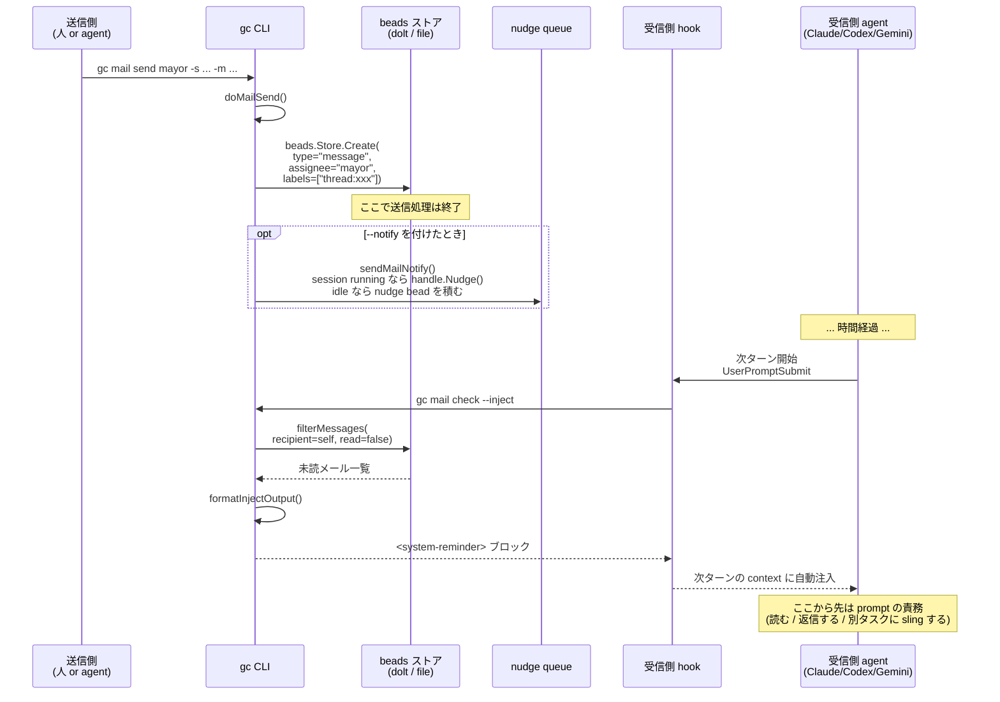
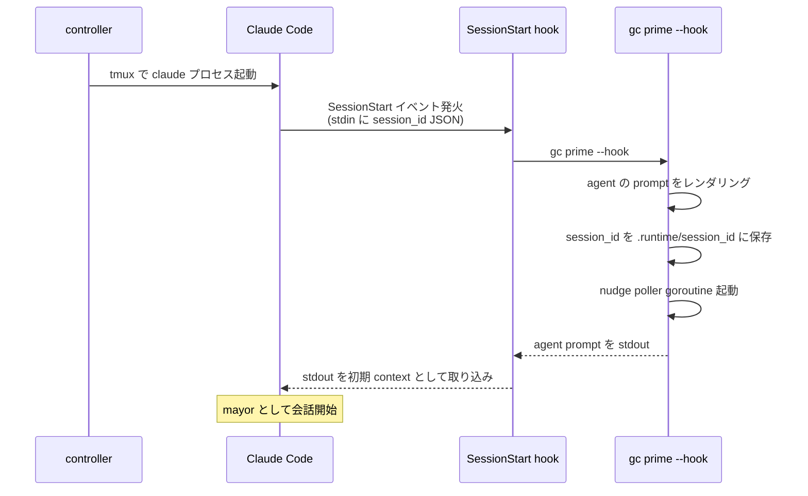
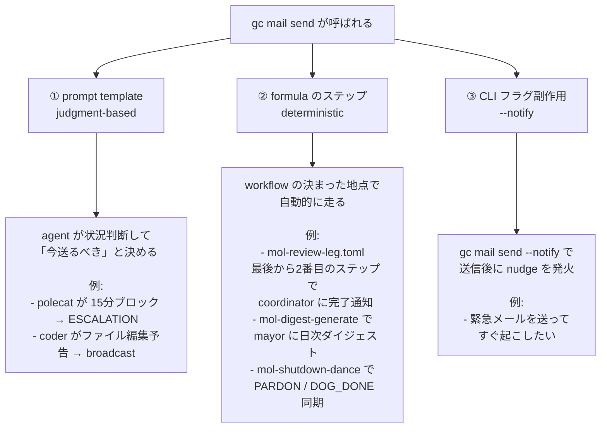

# QA: Gas City のエージェント間メッセージングの実体

このドキュメントは、Gas City (`gc`) における「エージェント間メッセージング」が **何で・どう実装され・どんなときに使われるか** を、実装コードと pack 例から整理したものです。OVERVIEW.md §5 の「Messaging（= Agent Protocol + Task Store + Prompt Templates）」を、コードに降りて具体化することを目的としています。

> 調査時点: 2026-04-30 / 対象: `main` ブランチ
> 関連ドキュメント: `.history/20260429-usage/OVERVIEW.md` §5、`docs/tutorials/04-communication.md`

---

## TL;DR

| 観点 | 結論 |
|---|---|
| メールの正体 | `Type="message"` の bead を 1 件 `Create` するだけ。専用データ型は存在しない |
| 送信処理の本体 | `internal/mail/beadmail/beadmail.go` の `beads.Store.Create()` 1 回 |
| 受信の仕組み | エージェント次ターンの hook で `gc mail check --inject` が走り、`<system-reminder>` で context に注入 |
| mail と nudge の関係 | mail = 永続的な通信文 / nudge = 起床トリガー。nudge も最終的には bead に落ちる |
| 何を送るかの判断主体 | **prompt template が主役**（Go コードはゼロ件、formula は補助的に固定通知のみ） |
| pack 設計の影響 | Gas Town pack（階層型・escalation 文化）と Swarm pack（フラット型・broadcast 文化）で文化が反転する |
| 共通慣習 | subject の prefix（`ESCALATION:` / `HELP:` / `BLOCKED:` / `HANDOFF:` / `Claiming:` 等）が事実上のプロトコル |

「メッセージング」は新しい仕組みを足したものではなく、**bead の CRUD + hook 注入 + prompt 指示を組み合わせた派生機構**です。

---

## 1. メール bead の正体

### 1.1 `Create` 1 回で完結する

`internal/mail/beadmail/beadmail.go:59-67` で組み立てられる bead はこの形:

| 要素 | 値 | 用途 |
|---|---|---|
| `Type` | `"message"` | task / session / convoy と区別する唯一の鍵 |
| `Title` | subject | 件名 |
| `Description` | body | 本文 |
| `Assignee` | `to` | 受信者(= 受信箱クエリの主キー) |
| `From` | sender | 送信者 |
| `Status` | `"open"` → `"closed"` (archive) | アーカイブ管理 |
| `Labels` | `thread:<6byte-hex>` | スレッド束ね。返信時に継承 |
| `Labels` | `read` | 既読 (これが**無い**のが未読の定義) |
| `Labels` | `reply-to:<orig-id>` | 返信のとき元メール ID を貼る |
| `Labels` | `cc:<addr>`, `priority:N` | CC・優先度 |
| `Metadata` | `mail.from_session_id` / `mail.to_session_id` | 安定したセッション ID(表示名と分離) |
| `Metadata` | `mail.from_display` / `mail.to_display` | 人間に見せる表示名 |

スレッド ID は `beadmail.go:584` で `fmt.Sprintf("thread-%x", rand.Read(6byte))`。`gc mail reply` はこの `thread:` ラベルを継承して `reply-to:` を追加するだけ。

### 1.2 メールという独立データ型は存在しない

`bd ready` で一覧する仕組み・`bd label` でフィルタする仕組み・`bd update` で状態を変える仕組みを、**ラベル運用だけで再利用**しています。

- 受信箱 = `Assignee=self AND label!=read` のクエリ
- 既読化 = `bd update --label-add read`
- アーカイブ = `bd update --status closed`
- スレッド = `label="thread:<id>"` の同値類

これが「Messaging は派生機構」と呼ばれるコード上の根拠です。

---

## 2. 送信から受信までの流れ



**送信側は「届いたかどうか」を気にしない**設計になっており、永続層に bead が乗ったら仕事は終わりです。受信側はいつでも何度でも `Assignee=self` を引けばよく、これが NDI（Nondeterministic Idempotence）の効き所です。

---

## 3. mail と nudge は別物

両者は混同されやすいですが、目的が異なります。

| 観点 | `gc mail` | `gc nudge` |
|---|---|---|
| 役割 | **永続的な通信文** | **エージェントの起床トリガー** |
| 永続性 | bead (`type=message`)、明示削除まで残る | nudge queue (TTL 24h) + optional な追跡 bead |
| 送信先の状態を気にするか | 一切気にしない(寝てても死んでてもいい) | 状態で配信モードを切り替える |
| 配信モード | (なし、置くだけ) | `immediate` / `wait-idle` / `queue` の 3 層 |
| 受信側に届く経路 | 次ターンの hook で `gc mail check --inject` | `gc nudge drain --inject`、または ACP transport で tmux に直接入力 |
| 中身 | subject + body + thread | 短いメッセージ or 単なる「起きろ」 |
| 連携 | `gc mail send --notify` で送信後に自動 nudge | 単独で叩くこともできる |

`gc nudge` の三層（`internal/nudge/` 配下）:

1. **immediate** — Worker handle の `Nudge()` を直接呼ぶ。最も「ターミナルに直接テキストを流す」に近い
2. **wait-idle** — エージェントが idle になるのを待ってから immediate に降りる
3. **queue** — `type="chore"`, `label="gc:nudge"` の bead として永続キューに積む

つまり nudge も**究極的には bead に落ちる**(queue モード時)。ライブセッションへの即時送信のときだけ Agent Protocol の prompt 送信を直接叩きます。

---

## 4. Hook の正体

### 4.1 hook とは何か

hook は **provider 側のイベント(セッション開始・ユーザー入力・終了など)に反応して `gc` コマンドを差し込む仕組み**です。Claude Code の場合は `~/.claude/settings.json` の `hooks` セクションに登録され、controller が agent を起動する前に `internal/hooks/config/claude.json` の内容を配布しておきます。

メッセージングがエージェントに「届く」のは、ここで仕込まれた hook が `<system-reminder>` ブロックを stdout に出力し、provider がそれを次ターンの context に取り込むためです。

### 4.2 Claude Code 用 hook の一覧

`internal/hooks/config/claude.json` に書かれている定義を、**メッセージングとの関係**で分類すると次のとおり。

| Hook | 実行コマンド | 役目 | メッセージングと直接関係 |
|---|---|---|---|
| `SessionStart` (matcher: `startup`) | `gc prime --hook` | agent の prompt 送出 + session 登録 | △ 下準備のみ |
| `UserPromptSubmit` | `gc nudge drain --inject` | nudge queue を `<system-reminder>` で注入 | ◎ 直接 |
| `UserPromptSubmit` | `gc mail check --inject` | 未読メールを `<system-reminder>` で注入 | ◎ 直接 |
| `PreCompact` | `gc handoff "context cycle"` | コンテキスト圧縮前の状態保全 | × |
| `Stop` | `gc hook --inject` | 終了時の最終チェック | × |

**メールやエージェント間通信を context に注入する本体は `UserPromptSubmit` の 2 つだけ**で、それ以外の hook はメッセージングそのものには関与しません。次の 4.3 と 4.4 でそれぞれの中身を見ます。

### 4.3 `SessionStart` → `gc prime --hook` (下準備)

`gc prime` の本来の用途は **agent の prompt template を stdout に出すだけ**のコマンドです:

```sh
$ gc prime mayor
You are the mayor of this Gas Town city.
...
```

人間が手で agent を起こすときは `claude "$(gc prime mayor)"` のように使います。Claude Code を controller 経由で自動起動するときは、provider 側の SessionStart hook が `gc prime --hook` を呼び、その stdout が **session の最初の context として取り込まれる仕組み**になっています。



`--hook` フラグが素の `gc prime` に追加するのは **本質的に 2 点だけ**:

| 追加される動作 | 実装 | なぜここで必要か |
|---|---|---|
| ① stdin の JSON から session_id を読み、`.runtime/session_id` に永続化 | `cmd_prime.go:473` `persistPrimeHookSessionID()` | これがないと gc 側が「いま動いている Claude セッションの ID」を知らず、後で `gc mail send mayor ...` が来ても controller がどの tmux ペインを起こせばよいか解決できない |
| ② このセッション宛の nudge poller goroutine を起動 | `cmd_prime.go:262` `maybeStartNudgePoller()` | これがないと idle 中の Claude に対する `gc nudge mayor "wake up"` が届かない。SessionStart の瞬間に poller を仕込むことで、以後このセッションは nudge を受け取れる体になる |

**メールの内容を context に注入するのは `gc prime --hook` の仕事ではありません**。それは 4.4 の役目です。`gc prime --hook` は「このセッションを gc の管理下に登録する」起動時の後始末を、prompt 送出のついでにやっているだけです。

(他にビーコン文字列の前置・重複起動の抑制・provider session key の紐付けなどの細かい調整も入りますが、設計上の本質は上記 2 点です。)

### 4.4 `UserPromptSubmit` → `gc mail check --inject` / `gc nudge drain --inject` (本体)

エージェントが次ターンに入るたびに **必ず** 2 本の hook が走ります:

1. **`gc nudge drain --inject`** — nudge queue (`type=chore, label=gc:nudge` の bead) を引いて、`<system-reminder>` ブロックで stdout に流す
2. **`gc mail check --inject`** — 自分宛の未読メール (`type=message, assignee=self, label!=read`) を引いて、同様に `<system-reminder>` で流す

provider はこの stdout を次ターンの context に自動的に織り込みます。エージェントは「メールが届いた」と Go コードで通知されるのではなく、**ターンの先頭でいつのまにか context に未読が乗っている**という形で気づきます。これが OVERVIEW.md §3 で言う「次のターンで hook 経由で受信箱を確認」の実装です。

### 4.5 provider 抽象は配信フォーマットだけ

provider 別の差異は `internal/hooks/hook_output.go:18-30` の `writeProviderHookContextForEvent()` 一箇所で吸収されます:

| Provider | 出力形式 |
|---|---|
| Claude Code | `<system-reminder>` ブロックを stdout にそのまま |
| Codex | `{"hookSpecificOutput": {"hookEventName": "UserPromptSubmit", "additionalContext": ...}}` JSON |
| Gemini | 別スキーマの JSON |

サポート provider は `["claude", "codex", "gemini", "opencode", "copilot", "cursor", "pi", "omp"]` (`internal/hooks/hooks.go:29`)。**provider 抽象が引き受けているのは「どう書き出すか」だけ**で、「何を / いつ / 誰に届けるか」は全部 bead クエリの話に落ちています。

### 4.6 GUPP — 「届いた仕事を実行する」判断は prompt に書く

hook が context に未読を流したあと、エージェントが**それを読んで実際に行動する**判断は Go コードには書かれていません。`examples/gastown/packs/gastown/agents/polecat/prompt.template.md:86` のような prompt template に英文で書かれます:

```text
The Universal Propulsion Principle: If your hook/work query finds work, YOU RUN IT.
```

これが ZFC (Zero Framework Cognition) の現れです。Go の責務は **「届ける」までで終わり**、「届いたものをどう扱うか」はプロンプト=モデルの判断に委ねます。

---

## 5. エージェント間メッセージングのユースケース

エージェント間メッセージングの形は **pack の役割設計に強く依存**します。`examples/` にある二つの pack で文化が反転していました。

### 5.1 二つの pack で正反対の文化

```mermaid
graph TB
    subgraph GT["Gas Town pack (階層型・escalation 文化)"]
        direction TB
        gt_mayor[mayor]
        gt_witness[witness]
        gt_deacon[deacon]
        gt_polecat[polecat]
        gt_refinery[refinery]
        gt_polecat -- "ESCALATION / HELP / BLOCKED" --> gt_witness
        gt_witness -- "ESCALATION [HIGH]" --> gt_mayor
        gt_polecat -- "BLOCKED: Need coordination" --> gt_mayor
        gt_refinery -- "ESCALATION [CRITICAL]" --> gt_mayor
        gt_deacon -- "ESCALATION" --> gt_mayor
    end

    subgraph SW["Swarm pack (フラット型・broadcast 文化)"]
        direction TB
        sw_mayor[mayor]
        sw_committer[committer]
        sw_coder1[coder]
        sw_coder2[coder]
        sw_all((--all<br/>broadcast))
        sw_coder1 -- "Claiming / Done / Working on" --> sw_all
        sw_coder2 -- "Claiming / Done / Working on" --> sw_all
        sw_coder1 <-- "I also need ... can we split?<br/>I'm backing off" --> sw_coder2
        sw_committer -- "Committed / Bug spotted / Conflict" --> sw_all
        sw_mayor -- "New tasks filed" --> sw_all
    end
```

- **Gas Town pack**: bottom-up の通知が主流。mail はほぼ一方向(返信スレッドはほぼ使わない)
- **Swarm pack**: 全員 broadcast が主流。peer-to-peer の直接交渉も発生する

### 5.2 Gas Town pack の具体例

引用元はすべて `examples/gastown/packs/gastown/agents/<role>/prompt.template.md`。

| 送信者 → 受信者 | いつ送るか | subject 例 |
|---|---|---|
| polecat → witness | 実装中に 15 分以上ブロック / テスト失敗 / 認証情報不足 | `ESCALATION: Brief description [HIGH]` |
| polecat → witness | より軽い質問(解決可能だが助けが欲しい) | `HELP: Blocked on X` |
| polecat → mayor | 別 rig との依存・戦略判断が必要 | `BLOCKED: Need coordination` |
| polecat → 自分自身 | コンテキスト枯渇 / セッション終了前 | `HANDOFF: <topic>` (Issue / Status / Next) |
| witness → mayor | 孤立した bead を回復 / refinery キュー停滞 | `ESCALATION: ... [HIGH]` |
| witness → refinery | リファイナリー状態確認(軽い問い合わせ) | (任意) |
| refinery → mayor | マージ失敗 / dolt サーバー到達不可 | `ESCALATION: Dolt server unreachable [CRITICAL]` |
| deacon → mayor | 複数 rig に影響する問題を検知 | `ESCALATION: Brief description [HIGH]` |

### 5.3 Swarm pack の具体例

引用元はすべて `examples/swarm/packs/swarm/agents/<role>/prompt.template.md`。

| 送信者 → 受信者 | いつ送るか | subject 例 |
|---|---|---|
| coder → --all | ある bead を取りに行くとき(重複作業の防止) | `Claiming <id>: <title>` |
| coder → --all | これからどのファイルを編集するかの予告 | `Working on: src/auth.go, src/auth_test.go` |
| coder → 別 coder | 編集対象が被ったときの直接交渉 | `I also need src/auth.go — can we split?` |
| coder → 別 coder | 衝突を発見して譲るとき | `Conflict in src/auth.go — I'm backing off` |
| coder → --all | 取ったタスクを諦めて再公開するとき | `Releasing <id>: <reason>` |
| coder → --all | タスク完了報告 | `Done with <id>: <summary>` |
| coder → 自分自身 | コンテキスト枯渇前の引き継ぎ | `HANDOFF: Working on <id>. Check auth.go line 145.` |
| committer → --all | コミット完了の報告 | `Committed: Fix token refresh (gc-42), ...` |
| committer → --all | コミット中にバグ発見(committer は直さず coder に投げる) | `Bug spotted in src/auth.go:45 — nil pointer ...` |
| committer → --all | マージ衝突を見つけたとき | `Merge conflict in src/auth.go — coders please resolve` |
| mayor → --all | 新しいタスクを bead に書き込んだ告知 | `New tasks filed — check gc bd ready` |
| mayor → 個別 agent | 優先度の急変を伝える | `Priority shift: focus on auth` |
| deacon → mayor | 健康監視で stall を検知して再起動するとき | `Agent coder-2 stalled — restarting` |
| deacon → --all | メンテのため rig agents を再起動する予告 | `Maintenance: restarting rig agents` |

### 5.4 共通する subject prefix 規約

両 pack を横断して、subject の先頭に意味的な prefix を載せる慣習があります:

| prefix | 意味 | 主な使い手 |
|---|---|---|
| `ESCALATION:` | 上位の判断・介入が必要 | Gas Town 全般 |
| `HELP:` | 解決可能だが助けが欲しい | polecat |
| `BLOCKED:` | クロス rig 依存で進めない | polecat |
| `HANDOFF:` | コンテキスト枯渇の引き継ぎ | 両 pack |
| `Claiming:` / `Done with:` / `Releasing:` | bead 状態遷移の宣言 | swarm coder |
| `Conflict in:` / `Bug spotted in:` | 衝突・バグ告発 | swarm coder/committer |
| `Maintenance:` | 計画停止予告 | swarm deacon |
| `[HIGH]` / `[CRITICAL]` | 末尾の重大度サフィックス | escalation 全般 |

これは Go コードで強制されているわけではなく、prompt template に書かれた**社会的慣習**です。ZFC の例で、識別子のパターンマッチで Go が動くわけではなく、上位エージェントの prompt が「`ESCALATION:` で始まる subject は最優先で読め」と指示する形で機能しています。

### 5.5 文化が反転する理由

衝突回避のメカニズムをどこに置くかの選択に帰着します:

| Gas Town pack | Swarm pack |
|---|---|
| git worktree で物理的に分離 | 全員が同じ作業ディレクトリ |
| ↓ | ↓ |
| コード衝突は発生しない | コード衝突を bead と mail で調停 |
| ↓ | ↓ |
| mail は「困ったときの SOS」だけ | mail は「常時の現在地共有」になる |
| ↓ | ↓ |
| 低頻度・上向き・escalation | 高頻度・全員・broadcast |

つまりメールの使われ方は orchestration の設計から自動的に決まります。Gas City SDK 自体は「どう使うか」を決めない(ZERO hardcoded roles)ので、pack を設計する人がこの非対称性を意図的に選びます。

---

## 6. メール発火の 3 経路

「エージェント間メッセージングは全部 prompt template で指示するのか?」への答えは **No**。3 つの発火経路があり、それぞれ責務が分かれています。



Go コード側(sling dispatch、health patrol、order trigger)は **メール送信を自分から呼びません**。メールを発火させるのはあくまで①と②、③は副次的な nudge トリガーです。

### 6.1 prompt と formula の使い分け

| 観点 | ① prompt template | ② formula のステップ |
|---|---|---|
| 性格 | 状況判断を伴う | 決まった地点で必ず走る |
| 何が決めるか | エージェントの読み | workflow の構造 |
| 例 | 「困ったら mayor にエスカレーション」 | 「review 完了したら coordinator に通知」 |
| メリット | モデルが賢くなるほど判断が良くなる(Bitter Lesson) | 抜け漏れがない(誰がいつ送るか確定) |
| デメリット | 文化として定着させる必要がある | 状況に応じた粒度の調整がしにくい |
| ZFC との関係 | ◎ 判断は prompt に置く正統 | △ 判断を含まない通知ならOK |
| 典型 prefix | `ESCALATION:` `HELP:` `BLOCKED:` `Claiming:` `Done with:` | `IDEA_REVIEW ... complete` `PARDON` `DOG_DONE` |

判断基準は ZFC(Zero Framework Cognition):

- 「いつ送るか」が**状況依存** → prompt template に書く
- 「いつ送るか」が**workflow の構造で決まる** → formula のステップに書く

### 6.2 formula 経由の自動メール例

人もエージェントも明示的に「メール送って」と書かなくても、**formula のステップとして自動で送られる**メールがあります。

| 出所 | 内容 | typical subject |
|---|---|---|
| `mol-polecat-base.toml` | polecat 起動時のサポート要請テンプレート | `HELP: Unclear requirements` / `HELP: Stuck on implementation` |
| `mol-dog-doctor.toml` | dolt サーバー異常検知 | `ESCALATION: Dolt server unreachable [CRITICAL]` |
| `mol-review-leg.toml` | レビュー段階終了通知 | `IDEA_REVIEW $REVIEW_ID $PHASE $LEG complete` |
| `mol-digest-generate.toml` | 日次ダイジェスト → mayor 配信 | `Daily digest: ...` |
| `mol-shutdown-dance.toml` | シャットダウン段取りの状態同期 | `PARDON` / `DOG_DONE` |

これらは概ね formula の**最後から二番目のステップ**に置かれていて、データが確定してから coordinator や mayor に通知します。受信者は bead の `Metadata.coordinator` から動的に解決され、ハードコードされていません。

### 6.3 実際の比率

| 経路 | 確認できた使用例の数 | 主な用途 |
|---|---|---|
| ① prompt template | 多い(gastown 8 パターン + swarm 14 パターン以上) | escalation / handoff / broadcast / 衝突調整 |
| ② formula のステップ | 少ない(5 本程度) | completion notification / digest / shutdown 段取り |
| ③ `--notify` フラグ | 数値化困難(CLI 引数の使い方) | 緊急メールの即時起動 |

主流は①の prompt template で、②の formula は「workflow の構造として固定すべき通知」を担う補助的な役割です。エージェント間の自発的な対話の大半は prompt が指示しています。

### 6.4 なぜこの分離になっているか

Gas City の設計思想(`AGENTS.md` の「No decision logic in Go」「Bitter Lesson」「ZFC」)から自然に導かれます:

- **Go コードに置くと**: 判断ロジックがハードコードされ、モデルが賢くなっても改善しない。役割名が Go に出ると ZERO hardcoded roles 違反
- **formula に置くと**: workflow の地点として固定される。`if` は書けないので、判断は分岐 formula を別に作る形で表現するしかない
- **prompt に置くと**: モデルの判断力に乗る。pack ごとに文化を変えられる。役割名は prompt 内に閉じる

結果として、`gc mail send` の呼び出し主体は「Go コード = ゼロ件」「formula = 通知パイプ」「prompt = 主役」という非対称な分布になります。これが Gas City で「メッセージングは派生機構(B1 = A1 + A2 + A5)」と呼ばれていることのコード上の裏付けで、**A5(Prompt Templates)が含まれているのは飾りではなく、エージェント間メッセージングの判断ロジック本体がここに住むため**です。

---

## 7. 使われていないパターン(注目に値する)

調査して**見つからなかった**もの:

| パターン | 状態 | 理由 |
|---|---|---|
| `gc mail reply` を prompt が指示する例 | 見つからず | 機能としてはあるが、返答が必要なら相手は別の作業として `gc sling` で投げ返す |
| `wait_for_reply` 系の同期パターン | 設計から除外 | メールは完全に非同期通知 |
| gate / order の trigger としてのメール bead | 設計から除外 | 機械的な発火条件は event bus が担当(役割分離) |
| convoy 単位の進捗ブロードキャスト | 見つからず | convoy auto-close は event として記録されるのみ |

これらは「実装が無い」のではなく「使うべきでない」とされています。理由は ZFC(Go に判断ロジックを置かない)と Bitter Lesson(モデルが賢くなれば prompt で十分)に直結します。

---

## 8. 自分で pack を組むときの実用判断

実用上の含意として、新規 pack 設計時の判断基準は:

- **rig 隔離あり / 長期 / 大規模** → Gas Town 流。escalation prefix で重大度を表現し、上位 1 体に集約する
- **rig 隔離なし / 短期 / 小規模** → Swarm 流。`--all` を躊躇わず使い、claim / release / done のライフサイクルを broadcast で見える化する

`gc mail send` の使い分けで悩むことは実はあまり無く、悩むべきは **どの subject prefix 規約を pack 全体で採用するか** です。これが決まれば prompt template の書き方も自然に決まります。

---

## 付録: 主要参照ファイル

| ファイル | 役割 |
|---|---|
| `internal/mail/mail.go` | Provider インターフェース定義(Send/Inbox/Reply/Thread/Archive) |
| `internal/mail/beadmail/beadmail.go` | beads.Store ベースのデフォルト実装(596 行) |
| `internal/mail/exec/` | 外部スクリプト実行による拡張実装 |
| `internal/hooks/config/claude.json` | Claude Code 用 hook 定義 |
| `internal/hooks/hook_output.go` | provider 別の hook 出力フォーマット吸収 |
| `internal/nudge/` | nudge の三層配信(immediate / wait-idle / queue) |
| `cmd/gc/cmd_mail.go` | `gc mail send/inbox/read/reply/check/archive` の cobra 定義 |
| `cmd/gc/nudge.go` | `gc nudge` の cobra 定義 |
| `examples/gastown/packs/gastown/agents/<role>/prompt.template.md` | Gas Town pack の役割別 prompt(escalation 文化の具体記述) |
| `examples/swarm/packs/swarm/agents/<role>/prompt.template.md` | Swarm pack の役割別 prompt(broadcast 文化の具体記述) |
| `examples/*/packs/*/formulas/mol-*.toml` | formula 経由の自動メール定義 |
| `docs/tutorials/04-communication.md` | チュートリアル(エンドツーエンドの使用例) |
