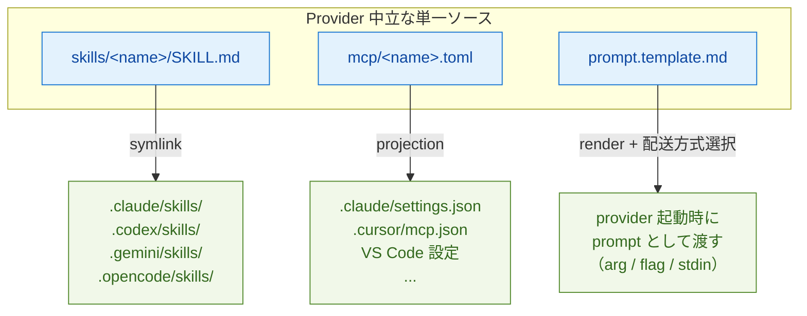
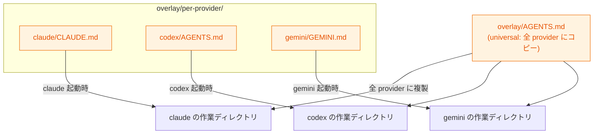

# QA: gc は provider の差異をどう抽象化しているか

このドキュメントは、Gas City (`gc`) が複数の AI CLI provider（Claude Code / Codex / Gemini / Cursor / Copilot / Amp / Auggie / Opencode / Kiro / Pi / OMP）の差異をどのように抽象化しているかを、実装ベースで整理したものです。

> 調査時点: 2026-05-13 / 対象: `main` ブランチ
> 関連ドキュメント: `.history/20260429-docs/packv2/doc-agent-v2.md`、parity audit doc `engdocs/archive/analysis/non-claude-provider-parity-audit.md`

---

## TL;DR

gc は **3 種類の抽象化を実装済み**、**1 種類は未実装** という非対称な状態です。2026-05-13 時点では、Resume 挙動と Hook 接続まわりで non-Claude provider の取りこぼしが整理され、parity audit (`#672`) の Gap 1 / 3 / 4 がほぼクローズされています。

| カテゴリ | 抽象化されているか | 仕組み |
|---|---|---|
| Skills（再利用可能な手順書） | ✅ 実装済み | `skills/<name>/SKILL.md` を provider ごとの sink にシンボリックリンク |
| MCP サーバー | ✅ 実装済み | `mcp/<name>.toml` を起動時に provider 設定に projection |
| Resume 挙動（`--resume` 系フラグ） | ✅ 2026-05-13 で整理済み | provider profile に `ResumeFlag` / `ResumeStyle` を持たせて session reconciler が共通経路で扱う（#1997） |
| Hook 接続（PreCompact 等） | ⚠️ **wired/unwired** で分類 | claude / codex / gemini / cursor / copilot が wired、amp / auggie は CLI 側に hook はあるが gc 未接続 = unwired (#2011) |
| Overlay ファイル（`CLAUDE.md` / `AGENTS.md` 等） | ⚠️ ルーティングのみ | `overlay/per-provider/<provider>/` で配り分け（並べて置く方式） |
| **Instructions / rule の本文** | ❌ **未実装** | 1 ソース → 複数 provider への自動生成は無い |

「**provider が違っても同じ skill / MCP / 設定 / resume / hook 配線を共有できる**」抽象化は進んでいる一方、「**instructions の本文を 1 つにまとめる**」抽象化は無い、というのが現状です。

---

## 1. agents as directories（前提となる構造）

抽象化の土台として、**agent 定義はディレクトリ規約**になっています。

```
agents/<name>/
├── prompt.md           # 必須（または prompt.template.md）
├── agent.toml          # オプション
├── namepool.txt        # オプション
├── overlay/            # agent 固有 overlay
├── skills/             # agent 固有 skills
├── mcp/                # agent 固有 MCP
└── template-fragments/ # agent 固有 fragments
```

- 実装: `internal/config/agent_discovery.go` の `DiscoverPackAgents()`
- city 全体の同名ディレクトリ（`skills/`, `mcp/`, `overlay/`, `template-fragments/`）と組み合わせて使う
- 優先度: system 暗黙 → pack → city（後勝ち）

> 「agents as directories」のコア提案は実装済み。ただし `[[agent]]` レガシーテーブルは互換のため併存、`[[rigs.overrides]]` → `[[rigs.patches]]` の改名は未完了。

---

## 2. provider 差異の抽象化レイヤー（実装済み）

### 2.1 InstructionsFile（ファイル名の解決）

provider ごとに「どのファイルを instructions として読みに行くか」を切り替える層。

- 実装: `internal/config/provider.go` の `InstructionsFile` フィールド
- デフォルト: `internal/worker/builtin/profiles.go`（11 provider 分の built-in profile を `builtinProviderSpecs` で定義）

| Provider | InstructionsFile |
|---|---|
| claude | `CLAUDE.md` |
| codex / gemini / kiro / cursor / copilot / amp / opencode / auggie / pi / omp | `AGENTS.md` |

`kiro` は kiro-cli を `chat --no-interactive --agent gascity --trust-all-tools` で起動する provider として 2026 年に追加された（`profiles.go:269-280`）。SupportsACP true、ACPArgs に `acp --agent gascity` を取る形になっている。

**重要**: これは「ファイル名解決」だけで、**本文を統一する仕組みではない**。

### 2.2 Overlay の `per-provider/` ルーティング

agent 起動前に作業ディレクトリへ materialize される overlay ファイルを provider ごとに配り分ける仕組み。

```
overlay/
├── AGENTS.md                        # universal（全 provider にコピー）
└── per-provider/
    ├── claude/
    │   ├── CLAUDE.md
    │   └── .claude/settings.json
    └── codex/
        └── AGENTS.md
```

- 実装: `internal/runtime/runtime.go`, `internal/hooks/hooks.go`, `internal/tmux/adapter.go`
- レイヤリング順序（後勝ち）:
  1. city `overlay/`（universal）
  2. city `overlay/per-provider/<provider>/`
  3. agent `agents/<name>/overlay/`（universal）
  4. agent `agents/<name>/overlay/per-provider/<provider>/`

**重要**: これは「**並べて置く**」方式。`CLAUDE.md` と `AGENTS.md` を別々に書く必要があり、1 ソースから派生はしない。

### 2.3 Skills の per-vendor sink

provider 中立な `SKILL.md` を、各 provider が期待するディレクトリにシンボリックリンクする仕組み。

- 実装: `internal/materialize/skills.go` の `vendorSinks`

```go
var vendorSinks = map[string]string{
    "claude":   ".claude/skills",
    "codex":    ".codex/skills",
    "gemini":   ".gemini/skills",
    "opencode": ".opencode/skills",
}
```

- ソース: `skills/<name>/SKILL.md`（[Agent Skills](https://agentskills.io) 標準準拠）
- 起動時に各 provider の sink へ symlink
- city 全体 + agent 固有 + bootstrap pack の skills を統合

### 2.4 MCP サーバーの TOML 抽象

`mcp/<name>.toml`（provider 中立）を起動時に各 provider の設定形式に projection。

- 実装: `internal/materialize/mcp.go`, `internal/materialize/mcp_runtime.go`
- 抽象 → 具象の projection:
  - Claude Code → `.claude/settings.json` の `mcpServers`
  - Cursor → `.cursor/mcp.json`
  - VS Code/Copilot → VS Code 設定
- `gc mcp list --agent <name>` / `--session <id>` で確認可能（bare 形式は v0.15.0 でエラーに）

### 2.5 Prompt template

provider 非依存の `prompt.template.md` を、各 provider の起動方式（CLI 引数 / フラグ / stdin）に合わせて配送。

- 実装: `cmd/gc/prompt.go`, `engdocs/architecture/prompt-templates.md`
- `prompt_mode` 設定で provider ごとの起動時注入方法を切り替え
- template 自体は provider 共通
- 2026-05-13 で `{{ .ProviderKey }}` / `{{ .ProviderDisplayName }}` / `templateFirst` helper が追加された（#2026）。「この provider 用の文だけ差し込む」を template 側で表現できるので、本来 §3 で「未実装」と書いていた **本文の provider 差** の一部はテンプレートヘルパで吸収可能になっている。

### 2.6 Resume の挙動（ResumeFlag / ResumeStyle、2026-05-13 / #1997）

session reconciler の `resolveResumeCommand` は、provider profile に詰まった **`ResumeFlag`（フラグ名）** と **`ResumeStyle`（`flag` か `subcommand`）** を見て、再開コマンドを組み立てます。`ResumeFlag` が空のときは session-id を捨てて fresh start に降格する設計です。

```
ResumeStyle = "flag"        → <command> <ResumeFlag> <session-id> ...     例: claude --resume abc123
ResumeStyle = "subcommand"  → <command> <ResumeFlag> <session-id> ...     例: amp threads continue abc123
```

2026-04-30 時点では cursor / copilot / amp / auggie の 4 つで `ResumeFlag` が空のまま放置されており、restart のたびに silent に fresh start に落ちて履歴が捨てられていました。これが parity audit `#672` の Gap 1 として PR #1997 で塞がれました。

2026-05-13 時点の値（`internal/worker/builtin/profiles.go`）:

| Provider | ResumeFlag | ResumeStyle | 備考 |
|---|---|---|---|
| claude | `--resume` | flag | 既存 |
| codex | `resume` | subcommand | 既存 |
| gemini | `--resume` | flag | 既存 |
| kiro | （未設定） | （未設定） | 再開挙動は要追跡 |
| cursor | `--resume` | flag | **#1997 で追加** |
| copilot | `--resume` | flag | **#1997 で追加** |
| amp | `threads continue` | subcommand | **#1997 で追加** |
| opencode | `--session` | flag | 既存 |
| auggie | `--resume` | flag | **#1997 で追加** |
| pi | （未設定） | （未設定） | resume CLI shape が公式リファレンス未掲載のため意図的に空 |
| omp | （未設定） | （未設定） | 同上 |

運用上の意味:

- **non-Claude を long-running session で使うなら 2026-05-13 以降の `gc` バイナリを使う**こと。それ以前は `gc reload` のたびに履歴が消えている可能性がある。
- pi / omp はまだ resume が効かない。これらを mayor 候補にすると履歴ロストが続く点に注意。
- session lifecycle 側の対応（#2035, "retry fresh start when resume_flag is empty"）と合わせ、`ResumeFlag` 空でも stale key 検出時に fresh start で healthy になる、というところまで詰められている（QA/SESSION-PROVIDER.md §5.5.6 A 参照）。

### 2.7 Hook 接続の分類（2026-05-13 / #2011 / #2009 / #2043）

`internal/hooks/hooks.go` は provider を 3 状態で分類します:

| 分類 | 意味 | 該当 provider |
|---|---|---|
| **wired** | gc が overlay で hook 設定ファイルを materialize する。`SessionStart` / `UserPromptSubmit` / `Stop` / `PreCompact` などが配線される | claude / codex / gemini / kiro / cursor / copilot / opencode / pi / omp |
| **unwired** | provider の CLI 自身は hook を expose しているが、gc 側でまだ wire していない。CLI の hook 機構はあるので将来 wire 可能 | amp / auggie |
| **hookless**（過去の分類） | CLI 側にも hook 機構がない | 2026-05-13 時点では該当なし |

`unwired` の実体は `internal/hooks/hooks.go:54` の `unwiredHookProviders = []string{"amp", "auggie"}`。

amp の hook 配線が無い理由は、Amp の plugin system が `session.start` / `tool.call` を expose しているがフォーマットが gascity の overlay モデルと噛み合わない（`profiles.go:316-323`）。auggie は `~/.augment/settings.json` という **USER-global** な場所で hook 設定を管理しており、per-rig overlay が直接 inject できない（`profiles.go:350-359`）。両方とも CLI 機能としては hook を持っているので、設計上は wire 可能で、Gap 4 の継続課題として `gastownhall/gascity#672` に紐づいています。

**重要な誤解**: `unwired` でも **nudges は wire 不要で動きます**。supervisor-hosted nudge dispatcher (`cmd/gc/nudge_dispatcher.go`) と legacy poller (`cmd/gc/cmd_nudge.go`) が `worker.Handle` 経由でキューを drain するので、provider hook の有無に関係なく mail / nudge は配送される。

#### 2.7.1 PreCompact hook の現状（#2009）

長い session が context compaction を踏むタイミングを捕捉するための hook。compaction を踏む直前に `gc handoff --auto "context cycle"` を呼ぶ overlay が配られます。

2026-05-13 時点で PreCompact が wired な provider:

| Provider | PreCompact wired? | 経路 |
|---|---|---|
| claude | ✅ | `.claude/settings.json` |
| codex | ✅ | `~/.codex/hooks.json`（PR #1811 で追加済み） |
| copilot | ✅ | `.github/hooks/gascity.json`（**PR #2009 で追加**） |
| cursor | ✅ | `.cursor/hooks.json` |
| gemini | ✅ | `.gemini/hooks.json` |
| amp / auggie | ❌（unwired） | 上記 §2.7 の通り |
| pi / omp | ❌ | hook の expose 自体は SupportsHooks=true だが PreCompact 用 wire は未配備 |

これで copilot を mayor 級の長対話に使っても、compaction 境界で履歴が静かに失われる事態を回避できる。

#### 2.7.2 Claude Code の awaySummary（#2043）

Claude Code の default settings (`internal/hooks/config/claude.json` 相当) に **`awaySummaryEnabled: false`** が入った（PR #2043, 2026-05-13）。

なぜ: claude が自動生成する "away summary"（席を外している間の要約）が chain agent（自律実行する claude 同士の接続構成）で stall を起こす事例があり、その元を断つため。

副作用: 人間が attach して長時間離席する個人用 claude では away summary が要望どおりに出てくれなくなる。明示的に欲しい場合は `.claude/settings.json` で local override する。

---

## 3. 抽象化されていない領域

### 3.1 Instructions / rule の本文の単一ソース化（未実装）

「`CLAUDE.md` と `AGENTS.md` の本文を 1 つに書いて、両方を自動生成」という仕組みは **無い**。

- gc は **読みに行くファイル名を切り替える** だけで、**本文を生成しない**
- `overlay/per-provider/` は「並べて置く」方式
- ワークアラウンドとして、`engdocs/archive/analysis/non-claude-provider-parity-audit.md` で「rig セットアップ時に `AGENTS.md → CLAUDE.md` を symlink する」という手動手段が言及されている（自動化されていない）

### 3.2 pack レベルの共通 instructions コンパイラ（未実装）

「pack で 1 ソースを書けば全 provider 向けに変換」という concept は無い。

### 3.3 後のスライス（doc-agent-v2.md でも明記）

- `gc skill promote`（rig → city/agent への昇格）
- imported pack の skills カタログ
- MCP のプロバイダ設定への自動 projection（中立 TOML モデルの先）

---

## 4. 全体像

### 抽象化されている経路（単一ソース → provider 別 sink）



### 抽象化されていない経路（provider ごとに別ファイル）



> universal な `overlay/AGENTS.md` は全 provider にコピーされるが、`CLAUDE.md` のような **provider 固有の名前を要求するファイルは依然として個別に書く必要がある**（同じ内容を二重に書く形になる）。

---

## 5. 結論

- **「同じ skill / MCP / 設定 / resume / hook 配線を複数 provider で使い回す」抽象化は実装済み**で、これが gc の主要な provider 抽象戦略
- 2026-05-13 時点で **non-Claude 4 種（cursor / copilot / amp / auggie）の resume 配線**（#1997）と **copilot の PreCompact hook**（#2009）が揃い、parity audit `#672` の Gap 1 と Gap 3 はクローズ。Gap 4（amp / auggie の hook 配線そのもの）は `unwired` として現状を正しく分類している（#2011）。
- **「instructions の本文を 1 ソース化する」抽象化は未実装**。本文は依然として provider ごとに別ファイル。ただし prompt template 側に `.ProviderKey` / `.ProviderDisplayName` / `templateFirst` ヘルパ（#2026）が入ったので、テンプレートで provider 差を圧縮する余地は広がった。
- ZFC（Zero Framework Cognition）原則により、Go コード側で provider 固有の judgment を持たない設計。差異は config（`profiles.go` のフィールド / `vendorSinks` の map / `unwiredHookProviders` の slice / projection ロジック）に局所化されている。

> rule や instructions の本文を統一したい場合は、現状ユーザー側で工夫（symlink、外部ジェネレータ、`templateFirst` helper の活用）が必要。これは将来の拡張余地として認識されている領域。

---

## 参考: 主な実装ファイル

- `internal/config/agent_discovery.go` — agents/ ディレクトリ規約のスキャン
- `internal/config/provider.go` — provider 設定（`InstructionsFile` 等）
- `internal/worker/builtin/profiles.go` — provider ごとのデフォルト（11 provider 分の `builtinProviderSpecs`、`ResumeFlag` / `ResumeStyle` / `SupportsHooks` / `SupportsACP` ほか）
- `internal/runtime/runtime.go`, `internal/hooks/hooks.go` — overlay の per-provider ルーティング、`unwiredHookProviders` の分類、copilot 用 PreCompact hook の adder
- `internal/materialize/skills.go` — skills の per-vendor sink
- `internal/materialize/mcp.go`, `mcp_runtime.go` — MCP TOML projection
- `internal/bootstrap/packs/core/overlay/per-provider/copilot/.github/hooks/gascity.json` — copilot 用 PreCompact 設定（#2009）
- `cmd/gc/prompt.go` — prompt template の render、`.ProviderKey` / `templateFirst` helper（#2026）
- `cmd/gc/cmd_skill.go`, `cmd/gc/cmd_mcp.go` — `gc skill list` / `gc mcp list`
- `engdocs/archive/analysis/non-claude-provider-parity-audit.md` — provider parity の現状監査（`gastownhall/gascity#672`）
