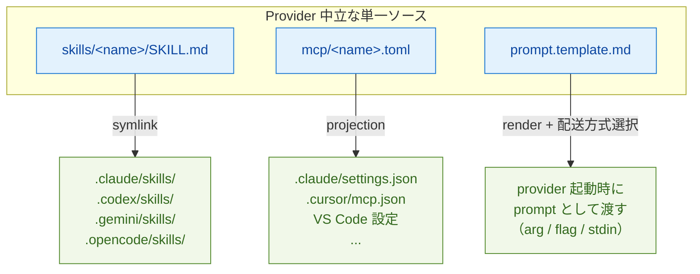
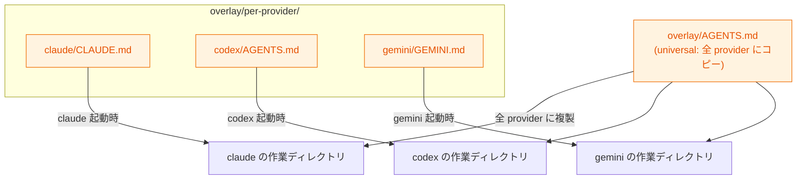

# QA: gc は provider の差異をどう抽象化しているか

このドキュメントは、Gas City (`gc`) が複数の AI CLI provider（Claude Code / Codex / Gemini / Cursor / Copilot 等）の差異をどのように抽象化しているかを、実装ベースで整理したものです。

> 調査時点: 2026-04-30 / 対象: `main` ブランチ
> 関連ドキュメント: `.history/20260429-docs/packv2/doc-agent-v2.md`

---

## TL;DR

gc は **3 種類の抽象化を実装済み**、**1 種類は未実装** という非対称な状態です。

| カテゴリ | 抽象化されているか | 仕組み |
|---|---|---|
| Skills（再利用可能な手順書） | ✅ 実装済み | `skills/<name>/SKILL.md` を provider ごとの sink にシンボリックリンク |
| MCP サーバー | ✅ 実装済み | `mcp/<name>.toml` を起動時に provider 設定に projection |
| Overlay ファイル（`CLAUDE.md` / `AGENTS.md` 等） | ⚠️ ルーティングのみ | `overlay/per-provider/<provider>/` で配り分け（並べて置く方式） |
| **Instructions / rule の本文** | ❌ **未実装** | 1 ソース → 複数 provider への自動生成は無い |

「**provider が違っても同じ skill / MCP / 設定を共有できる**」抽象化は進んでいる一方、「**instructions の本文を 1 つにまとめる**」抽象化は無い、というのが現状です。

---

## 1. agents as directories（前提となる構造）

抽象化の土台として、**agent 定義はディレクトリ規約**になっています。

```
agents/<name>/
├── prompt.md           # 必須（または prompt.template.md）
├── agent.toml          # オプション
├── namepool.txt        # オプション
├── overlay/            # agent 固有 overlay
├── skills/             # agent 固有 skills
├── mcp/                # agent 固有 MCP
└── template-fragments/ # agent 固有 fragments
```

- 実装: `internal/config/agent_discovery.go` の `DiscoverPackAgents()`
- city 全体の同名ディレクトリ（`skills/`, `mcp/`, `overlay/`, `template-fragments/`）と組み合わせて使う
- 優先度: system 暗黙 → pack → city（後勝ち）

> 「agents as directories」のコア提案は実装済み。ただし `[[agent]]` レガシーテーブルは互換のため併存、`[[rigs.overrides]]` → `[[rigs.patches]]` の改名は未完了。

---

## 2. provider 差異の抽象化レイヤー（実装済み）

### 2.1 InstructionsFile（ファイル名の解決）

provider ごとに「どのファイルを instructions として読みに行くか」を切り替える層。

- 実装: `internal/config/provider.go` の `InstructionsFile` フィールド
- デフォルト: `internal/worker/builtin/profiles.go`

| Provider | InstructionsFile |
|---|---|
| claude | `CLAUDE.md` |
| codex / gemini / cursor / copilot / amp / opencode / auggie / pi / omp | `AGENTS.md` |

**重要**: これは「ファイル名解決」だけで、**本文を統一する仕組みではない**。

### 2.2 Overlay の `per-provider/` ルーティング

agent 起動前に作業ディレクトリへ materialize される overlay ファイルを provider ごとに配り分ける仕組み。

```
overlay/
├── AGENTS.md                        # universal（全 provider にコピー）
└── per-provider/
    ├── claude/
    │   ├── CLAUDE.md
    │   └── .claude/settings.json
    └── codex/
        └── AGENTS.md
```

- 実装: `internal/runtime/runtime.go`, `internal/hooks/hooks.go`, `internal/tmux/adapter.go`
- レイヤリング順序（後勝ち）:
  1. city `overlay/`（universal）
  2. city `overlay/per-provider/<provider>/`
  3. agent `agents/<name>/overlay/`（universal）
  4. agent `agents/<name>/overlay/per-provider/<provider>/`

**重要**: これは「**並べて置く**」方式。`CLAUDE.md` と `AGENTS.md` を別々に書く必要があり、1 ソースから派生はしない。

### 2.3 Skills の per-vendor sink

provider 中立な `SKILL.md` を、各 provider が期待するディレクトリにシンボリックリンクする仕組み。

- 実装: `internal/materialize/skills.go` の `vendorSinks`

```go
var vendorSinks = map[string]string{
    "claude":   ".claude/skills",
    "codex":    ".codex/skills",
    "gemini":   ".gemini/skills",
    "opencode": ".opencode/skills",
}
```

- ソース: `skills/<name>/SKILL.md`（[Agent Skills](https://agentskills.io) 標準準拠）
- 起動時に各 provider の sink へ symlink
- city 全体 + agent 固有 + bootstrap pack の skills を統合

### 2.4 MCP サーバーの TOML 抽象

`mcp/<name>.toml`（provider 中立）を起動時に各 provider の設定形式に projection。

- 実装: `internal/materialize/mcp.go`, `internal/materialize/mcp_runtime.go`
- 抽象 → 具象の projection:
  - Claude Code → `.claude/settings.json` の `mcpServers`
  - Cursor → `.cursor/mcp.json`
  - VS Code/Copilot → VS Code 設定
- `gc mcp list --agent <name>` / `--session <id>` で確認可能（bare 形式は v0.15.0 でエラーに）

### 2.5 Prompt template

provider 非依存の `prompt.template.md` を、各 provider の起動方式（CLI 引数 / フラグ / stdin）に合わせて配送。

- 実装: `cmd/gc/prompt.go`, `engdocs/architecture/prompt-templates.md`
- `prompt_mode` 設定で provider ごとの起動時注入方法を切り替え
- template 自体は provider 共通

---

## 3. 抽象化されていない領域

### 3.1 Instructions / rule の本文の単一ソース化（未実装）

「`CLAUDE.md` と `AGENTS.md` の本文を 1 つに書いて、両方を自動生成」という仕組みは **無い**。

- gc は **読みに行くファイル名を切り替える** だけで、**本文を生成しない**
- `overlay/per-provider/` は「並べて置く」方式
- ワークアラウンドとして、`engdocs/archive/analysis/non-claude-provider-parity-audit.md` で「rig セットアップ時に `AGENTS.md → CLAUDE.md` を symlink する」という手動手段が言及されている（自動化されていない）

### 3.2 pack レベルの共通 instructions コンパイラ（未実装）

「pack で 1 ソースを書けば全 provider 向けに変換」という concept は無い。

### 3.3 後のスライス（doc-agent-v2.md でも明記）

- `gc skill promote`（rig → city/agent への昇格）
- imported pack の skills カタログ
- MCP のプロバイダ設定への自動 projection（中立 TOML モデルの先）

---

## 4. 全体像

### 抽象化されている経路（単一ソース → provider 別 sink）



### 抽象化されていない経路（provider ごとに別ファイル）



> universal な `overlay/AGENTS.md` は全 provider にコピーされるが、`CLAUDE.md` のような **provider 固有の名前を要求するファイルは依然として個別に書く必要がある**（同じ内容を二重に書く形になる）。

---

## 5. 結論

- **「同じ skill / MCP / 設定を複数 provider で使い回す」抽象化は実装済み**で、これが gc の主要な provider 抽象戦略
- **「instructions の本文を 1 ソース化する」抽象化は未実装**。本文は依然として provider ごとに別ファイル
- ZFC（Zero Framework Cognition）原則により、Go コード側で provider 固有の judgment を持たない設計。差異は config（`provider.go` の filename / `vendorSinks` の map / projection ロジック）に局所化されている

> rule や instructions の本文を統一したい場合は、現状ユーザー側で工夫（symlink、外部ジェネレータ等）が必要。これは将来の拡張余地として認識されている領域。

---

## 参考: 主な実装ファイル

- `internal/config/agent_discovery.go` — agents/ ディレクトリ規約のスキャン
- `internal/config/provider.go` — provider 設定（`InstructionsFile` 等）
- `internal/worker/builtin/profiles.go` — provider ごとのデフォルト
- `internal/runtime/runtime.go`, `internal/hooks/hooks.go` — overlay の per-provider ルーティング
- `internal/materialize/skills.go` — skills の per-vendor sink
- `internal/materialize/mcp.go`, `mcp_runtime.go` — MCP TOML projection
- `cmd/gc/prompt.go` — prompt template の render
- `cmd/gc/cmd_skill.go`, `cmd/gc/cmd_mcp.go` — `gc skill list` / `gc mcp list`
- `engdocs/archive/analysis/non-claude-provider-parity-audit.md` — provider parity の現状監査
