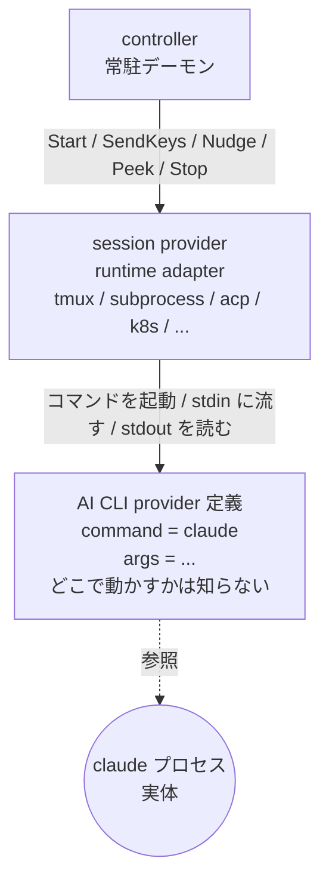
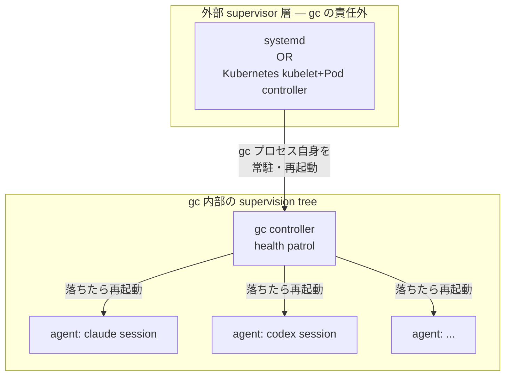
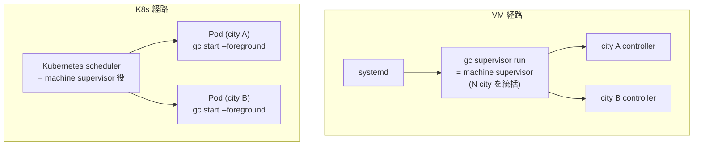
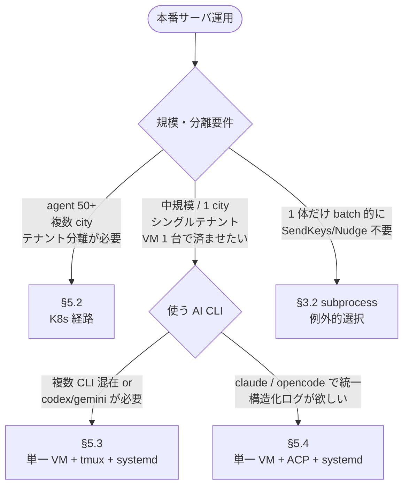
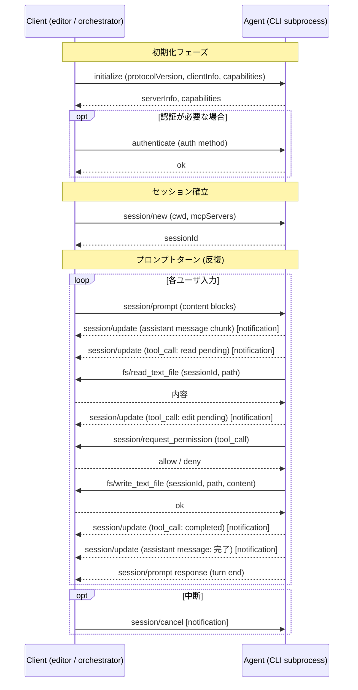
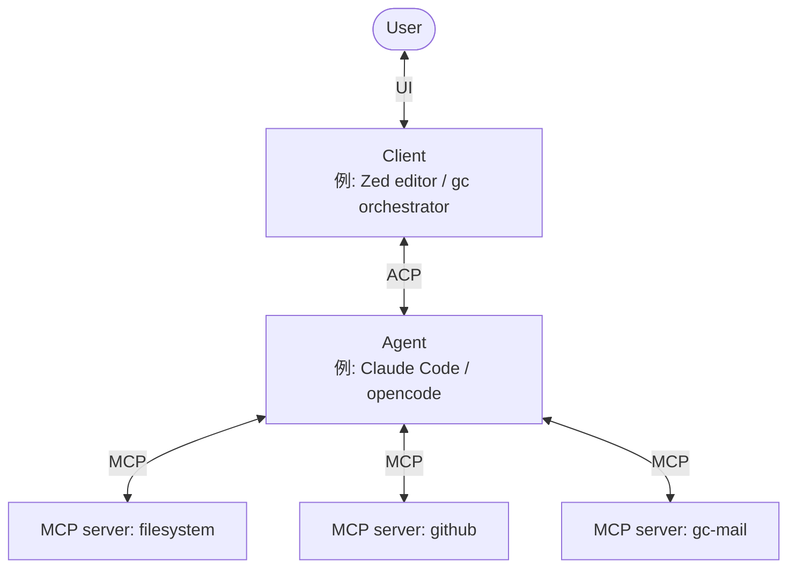

# QA: session provider とは何か / 本番サーバへのデプロイ

このドキュメントは、Gas City (`gc`) が controller と AI CLI のやりとりをどう抽象化しているか (= session provider 層) と、その抽象を踏まえて本番サーバ (EC2 等) でどう運用するかを、実装ベースで整理したものです。

> 調査時点: 2026-04-30 / 対象: `main` ブランチ HEAD
> 関連実装: `internal/runtime/`, `contrib/k8s/`, `cmd/gc/cmd_supervisor.go`, `cmd/gc/providers.go`
> 関連ドキュメント: `engdocs/design/machine-wide-supervisor-v0.md`, `engdocs/design/api-ops-design.md`

---

## TL;DR

- **session provider** (§1) = controller ⇄ AI CLI プロセス間の transport を抽象化したもの。`Start` / `SendKeys` / `Nudge` / `Peek` / `Stop` の 5 操作だけが controller から見える境界。
- **AI CLI provider** (`[providers.claude]` で定義する claude / codex / gemini 等) と **session provider** (`[session] provider = "tmux"`) は **直交した 2 軸**。同じ claude を tmux でも k8s でも動かせる。
- 実装は 7 種類: **tmux** (default) / **subprocess** / **acp** / **k8s** / **exec:\<script\>** / **hybrid** / **auto** (内部 wrapper) と、テスト用の **fake** / **fail** (§3)。
- **外部 supervisor** (§4) = OS / クラスタ ⇄ gc プロセスの lifecycle を抽象化したもの。systemd と K8s が代表的な具象。session provider (§1) との **2 軸の組み合わせ**としてデプロイを設計する。
- 本番運用は 3 経路 (§5):
  - **§5.2 K8s 経路** — `contrib/k8s/` がフル整備、`gc-controller-k8s deploy` で完結。50+ agent / 複数 city / テナント分離向け。
  - **§5.3 単一 VM + tmux + systemd 経路** — 全 AI CLI 対応のデフォルト経路。`gc supervisor install` で systemd unit が自動生成。
  - **§5.4 単一 VM + ACP + systemd 経路** — claude / opencode 統一なら構造化対話で server らしい構造。tmux と systemd unit は共有。
- どの経路も **API 認証は未実装**。外部公開すると read-only に自動降格 (`internal/api/middleware.go:130-155`)。前段プロキシ + IdP は自前で塞ぐ前提。
- **観測と介入** (§5.5): tmux/k8s は `gc attach` で TTY 介入可能、ACP は TTY 不可だが events stream + nudge / mail / interrupt の組み合わせで代替。
- **ACP プロトコル仕様**そのものは付録 A に独立解説。

---

## 1. session provider とは何か

### 抽象化の対象

controller (常駐デーモン) は、各 agent (= AI CLI プロセス) に対して次の 5 操作だけを行う:

| 操作 | 何をするか |
|---|---|
| `Start` | プロセスを起動して、初回プロンプトを渡せる状態にする |
| `SendKeys` / `Nudge` | 動作中のプロセスにテキストを流し込む |
| `Peek` | プロセスの出力をスナップショットとして読む |
| `Stop` | プロセスを終了させる |
| `IsRunning` / `IsAttached` | 生存確認 |

これらの contract は `internal/runtime/runtime.go:106` の `Provider` interface に定義されています。`controller` 本体 (`cmd/gc/controller.go`、`internal/sling/`、`internal/health/`) はこの interface しか触りません。



session provider が「抽象化の境界」で、その上 (controller 側) は AI CLI の差異を、その下 (AICLI 側) は実行基盤の差異を吸収します。

### 用語の落とし穴: 「provider」が 2 つある

| 用語 | TOML での書き場所 | 何を指すか | 例 |
|---|---|---|---|
| **provider** (AI CLI 種別) | `[providers.claude]` / `agent.provider = "claude"` | 起動するバイナリと引数の定義 | `claude` / `codex` / `gemini` |
| **session provider** (実行基盤) | `[session] provider = "tmux"` | そのバイナリをどう動かすかの transport | `tmux` / `subprocess` / `acp` / `k8s` |

この分離があるから、**新しい AI CLI** が出てきたら provider 定義を 1 個足すだけで全 session provider で動き、**新しい実行基盤** を足したいなら session provider を 1 個実装するだけで全 AI CLI がその上で動きます。

---

## 2. session provider 一覧

`cmd/gc/providers.go:118-148` の `newSessionProviderByName` が dispatch します:

| provider | 分類 | 概要 | 実装パス |
|---|---|---|---|
| `tmux` (default) | user 選択 | tmux pane で AI CLI を動かす | `internal/runtime/tmux/` |
| `subprocess` | user 選択 | detached 子プロセス (一方向) | `internal/runtime/subprocess/` |
| `acp` | user 選択 | stdio 上の JSON-RPC 2.0 (Agent Client Protocol) | `internal/runtime/acp/` |
| `k8s` | user 選択 | client-go で Pod 起動 (内部は tmux) | `internal/runtime/k8s/` |
| `exec:<script>` | user 選択 | スクリプトに丸投げ | `internal/runtime/exec/` |
| `hybrid` | user 選択 | tmux / k8s を name で振り分け | `internal/runtime/hybrid/` |
| `auto` | 自動挟み込み | tmux + acp 混在の自動 demux | `internal/runtime/auto/` |
| `fake` / `fail` | テスト専用 | in-memory モック | `internal/runtime/fake.go` |

直交軸として整理 (対話モデル × 実行ロケーション):

| 対話モデル | ローカル単独 | クラスタ単独 | 混在 |
|---|---|---|---|
| TTY あり | `tmux` | `k8s` | `hybrid` |
| TTY なし | `subprocess` | — | — |
| 構造化 (JSON-RPC) | `acp` | — | `auto` (tmux+acp) |
| 完全委譲 | `exec:<script>` | — | — |

---

## 3. 各 session provider の実装詳細

### 3.1 `tmux` (default)

ローカル開発機・単一 VM の標準。tmux server を controller の手足として使う。

- **Start**: `tmux -L <socket> new-session -d -s <name>` で detached 起動 (`internal/runtime/tmux/tmux.go:212`, adapter.go:644)
- **Socket isolation**: `-L <city-name>` で per-city tmux server を分けて、別 city と干渉しない (tmux.go:52-55)
- **SendKeys**: `-l` フラグでリテラル送信 → 別途 `Enter` 送信 (tmux.go:984, 991-992)。`SendKeysDebounced(ms)` で集約あり (tmux.go:982)
- **Peek**: `tmux capture-pane -p -t <session> -S -<N>` で末尾 N 行 (tmux.go:1970)。全 scrollback は `-S -` (tmux.go:1976)
- **Stop**: `has-session -t <name>` で生存確認 → instance token で ownership 検証 → `kill-session` (adapter.go:609, 157-174)
- **Session 名の制約**: `^[a-zA-Z0-9_-]+$` (tmux.go:113)
- **検死**: `has-session` の戻り値で判定。escape の二重押下、入力モードの抜け出し等 tmux 固有の癖は内部で吸収 (tmux.go:1305, 1405)

人間が `gc attach` で覗ける唯一の provider。本番でも attach 不要で動くが、tmux server の管理 (再起動時の session 復元) はユーザ責任。

### 3.2 `subprocess`

TTY を持たないバッチ的な「一方向」エージェント向け。

- **Start**: `exec.Command("sh", "-c", command)` + `Setpgid: true` でプロセスグループ化 (`internal/runtime/subprocess/subprocess.go:113-114`)
- **stdout/stderr**: `/dev/null` に捨てる fire-and-forget (subprocess.go:123-129)
- **SendKeys / Nudge**: **no-op** で `nil` を返す (subprocess.go:255, 261) — 設計上、対話 channel が無い
- **Peek**: 空文字列 (subprocess.go:272) — scrollback buffer を持たない
- **状態保管**: `providerStateDir/s<hash>.sock` + `s<hash>.name` で他プロセスから session を検出 (subprocess.go:405-422)
- **Cross-process 監視**: Unix socket リスナーで stop / interrupt / ping / pid を受ける (subprocess.go:426-480)

**想定ユースケース**: 起動時の initial prompt + bead 経由のメール通信 (hook で受信箱を見る) で完結する一方向ワークロード。formula の動的注入や `gc nudge` を使う用途には**不向き**。

### 3.3 `acp` (Agent Client Protocol)

stdio 上に JSON-RPC 2.0 で構造化対話する provider。**ACP プロトコルそのものの仕様は本文書末尾の [付録 A](#付録-a-acp-プロトコル仕様) を参照**。ここでは gc 側の実装挙動だけ記述する。

- **Handshake (3 段)**:
  1. `initialize` request — `protoVersion`, `clientInfo` を送る (`internal/runtime/acp/acp.go:314`)
  2. `initialized` notification (acp.go:333)
  3. `session/new` request — `workDir`, `mcpServers` を送って `sessionID` を受け取る (acp.go:338)
- **Nudge**: `session/prompt` リクエストに `ContentBlock` を `{type:"text",text:"..."}` 形式でマップ (`protocol.go:253-267`)
- **Pending 追跡**: `setActivePrompt(id)` で busy 状態と prompt id を記録 (acp.go:499)
- **waitIdle**: agent が idle になるまで待機 (default 60s、`nudgeBusyTimeout`、acp.go:483)
- **Peek**: `session/update` notification の output buffer 末尾 N 行 (default 1000 行、acp.go:54, 571-580)
- **対応 CLI**: provider profile の `supports_acp` フラグで判定 (`internal/config/provider.go:84`)

**TTY 不要** で**構造化された応答**が取れるのが強み。permission warning や trust dialog を手動で dismiss する処理が要らない。

### 3.4 `k8s`

K8s クラスタで agent を Pod として隔離して動かす。

- **Pod 作成**: client-go の `Pods(ns).Create()` で発行、image は `GC_K8S_IMAGE` 環境変数または TOML で指定 (`internal/runtime/k8s/provider.go:121`)
- **Label 規約**: `gc-session=<SanitizeLabel(name)>` で Pod を識別 (provider.go:129, 277)
- **Pod 内 entrypoint**: workspace init → pre_start → **`tmux new-session`** → `sleep infinity` (`pod.go:193-199`)
- **通信**: `remotecommand.NewSPDYExecutor` で SPDY stream を確立 → Pod 内の `tmux send-keys` を exec (provider.go:294-295, `exec.go:77-91`)
- **観測**: 同様に Pod 内 `tmux capture-pane` を exec
- **既存 Pod 検出**: `listPods("gc-session=<label>")` で idempotent Start (provider.go:129-150)
- **Default リソース**: CPU 500m/2、Mem 1Gi/4Gi (`gc-session-k8s:30-34`)
- **Stop**: `Pods(ns).Delete()` (provider.go:273)

**重要**: Pod 内も結局 tmux を使っています。**k8s provider の本質は「tmux 機能を Pod 単位で隔離して、cluster 上に展開する」ラッパー**と見るのが正確。

### 3.5 `exec:<script>`

ユーザが任意の transport を持ち込むための脱出ハッチ。

- **Subcommand 契約**: `start` / `stop` / `interrupt` / `nudge` / `capture` / `watch-startup` の 6 種 (`internal/runtime/exec/exec.go:116-128, 365-411, 427`)
- **入出力**: stdin = JSON config / content、stdout = trimmed result、stderr = エラーメッセージ (exec.go:81-104)
- **Exit code**: `0` = 成功 / `1` = エラー / **`2` = unsupported** (forward-compat、exec.go:89-92)
- **`watch-startup`**: 起動時の dialog stream を `{"content":"..."}` JSON 行で出す → Go 側で permission warning 等を dismiss (exec.go:185, 219)

要件さえ満たせば、ssh 越しに別マシンで動かす、Docker container で動かす、独自スケジューラに乗せる、何でもできる。

### 3.6 `hybrid`

tmux と k8s の混在運用。移行期や開発機 ↔ 本番の往復で使う。

- **ルーティング**: `isRemote(name)` 関数で local (tmux) / remote (k8s) を選択 (`internal/runtime/hybrid/hybrid.go:29-38`)
- **predicate 構築**: env `GC_HYBRID_REMOTE_MATCH` または TOML `[session].remote_match` の substring 一致
- **ListRunning**: 両 backend を集約、片方失敗時は partial-list error を返す (hybrid.go:157-162)
- **Capabilities**: 両方の AND (積集合) — 弱い方に揃う (hybrid.go:192-199)

### 3.7 `auto` (内部 wrapper)

ユーザが直接選ぶものではなく、city 全体は非 ACP だが一部 agent が `session = "acp"` を要求するときに `cmd/gc/providers.go:201-213` で**自動的に挟み込まれる** demux 層。

- **routing**: `RouteACP(name)` で登録された session 名は ACP backend へ、それ以外は default backend へ (`internal/runtime/auto/auto.go:47, 61-69`)
- **全操作**: `route(name).<op>` の薄い委譲

```go
func (p *Provider) route(name string) runtime.Provider {
    if p.routes[name] {
        return p.acpSP
    }
    return p.defaultSP
}
```

「city は tmux だけど、この 1 体だけ ACP で動かしたい」という部分例外を成立させるための仕組み。

### 3.8 `fake` / `fail`

テスト専用 (`internal/runtime/fake.go`)。本番では使わない。`fake` は全操作が成功、`fail` は全操作がエラー。

---

## 4. 外部 supervisor とは何か

本書では §1 で **session provider** を「controller ⇄ AI CLI プロセスの transport を抽象化したもの」と定義しました。これと対称的に、本章では **gc プロセス自身のライフサイクル**を抽象化する層 — 本書で「**外部 supervisor**」と呼ぶ — を整理します。systemd と Kubernetes はこの抽象の異なる具象実装です。

この抽象を独立章として置く理由:

- **2 つの直交軸**: session provider = controller の内側、外部 supervisor = gc プロセスの外側。両者は組み合わせ可能 (任意の session provider × 任意の外部 supervisor)
- 読者が **systemd / K8s / launchd を「同じ役割の異なる具象」**として捉えられる
- §5 (本番サーバへのデプロイ) で K8s 経路と単一 VM 経路を語るときの**理論的下敷き**になる

### 4.1 抽象化の対象 — gc プロセス自身を誰が監視するか

gc は内部に Erlang/OTP 風の supervision tree を持っています (`engdocs/design/machine-wide-supervisor-v0.md`)。controller が health patrol で agent (= AI CLI process) の生死を監視し、落ちたら再起動する — これは gc 自身が責任を持つ supervision です。

しかし**この tree の頂点 (= gc プロセス自身) を誰が監視するかは、gc の責任ではありません**。OS あるいはクラスタ側の責任で、その層が「**外部 supervisor**」です。Erlang/OTP の用語で言えば "Application Controller" 相当 — application (= gc プロセス) の lifecycle を制御するレイヤ。

| 抽象 | 対象 | 抽象化されているもの | 本書の章 |
|---|---|---|---|
| session provider | controller ⇄ AI CLI | transport (Start / SendKeys / Nudge / Peek / Stop) | §1, §3 |
| **外部 supervisor** | **OS or クラスタ ⇄ gc プロセス** | **lifecycle (起動 / 再起動 / 停止 / env 注入 / log)** | **§4** |

### 4.2 外部 supervisor の責任 (8 軸)

抽象的に、外部 supervisor が満たすべき責任は次の 8 つです:

| # | 責任 | 抽象的な要求 |
|---|---|---|
| 1 | lifecycle initiation | OS / cluster boot 時に gc を立ち上げる |
| 2 | crash recovery | gc が落ちたら時間差を置いて再起動 |
| 3 | graceful termination | shutdown 時に SIGTERM、cleanup を待つ |
| 4 | configuration injection | env vars / 認証情報 / 設定ファイルパスを注入 |
| 5 | log capture | stdout / stderr の保存と検索 |
| 6 | identity | プロセスのユーザ / 権限境界 |
| 7 | resource limits | CPU / Memory 上限 (cgroup / namespace) |
| 8 | persistent state | `.gc/` / `.beads/dolt/` の保管場所 |

これらは抽象的な要求であり、systemd / K8s / launchd / docker-compose / nomad など、どの具象実装も同じ役割を果たします。

#### gc 側が外部 supervisor に提示する contract

逆方向に、gc 側は外部 supervisor に対して次の振る舞いを保証します:

- `gc supervisor run` (VM) または `gc start --foreground /city` (K8s) は **SIGTERM を受けるまで blocking で常駐**
- 異常終了時は **exit code != 0** を返す (再起動シグナル)
- structured log を **stdout / stderr** に出す
- HTTP API 経由で health / readiness を外部から確認できる (具体的な probe 設定は §5.2 参照)

### 4.3 具象マッピング (systemd / K8s)

8 軸の責任が、systemd と K8s でどう具体化されているかの対応表:

| 責任 | systemd の具象 | K8s の具象 |
|---|---|---|
| lifecycle initiation | `WantedBy=default.target` + `systemctl --user enable` | Pod scheduler / kubelet が image pull → コンテナ起動 |
| crash recovery | `Restart=always` / `RestartSec=5s` (`cmd_supervisor_lifecycle.go:555-573`) | `restartPolicy: Always / OnFailure / Never` (現状 contrib/k8s は `Never`、§4.6 参照) |
| graceful termination | `systemctl stop` → SIGTERM → `TimeoutStopSec` | `kubectl delete pod` / preStop hook / `terminationGracePeriodSeconds` |
| configuration injection | `Environment=` / `EnvironmentFile=` (`supervisorServiceExtraEnv()` で `ANTHROPIC_*` / `OPENAI_*` / `CLAUDE_CODE_OAUTH_TOKEN` 等を注入) | `env` / `envFrom` / Secret volume mount (例: `claude-credentials` Secret を read-only volume) |
| log capture | journald (`journalctl --user -u gascity-supervisor`) | `kubectl logs` / 集約ログ (Loki / CloudWatch) |
| identity | (user systemd は呼び出しユーザ権限、root systemd なら `User=` / `Group=`) | `runAsUser` / `SecurityContext` / `ServiceAccount` (`gc-controller`) |
| resource limits | `CPUQuota=` / `MemoryHigh=` (任意) | `resources.requests` / `resources.limits` (default 500m/2 CPU、1Gi/4Gi mem) |
| persistent state | host filesystem の `~/.gc/` / city directory | PVC / volumeMount (例: dolt は StatefulSet + 20Gi PVC、`contrib/k8s/dolt-statefulset.yaml`) |

> **脚注: macOS launchd**
> 同じ抽象は launchd でも満たされます (`~/Library/LaunchAgents/com.gascity.supervisor.plist` の `RunAtLoad=true` + `KeepAlive.Crashed=true`、`cmd_supervisor_lifecycle.go:511-553`)。本章は server 文脈なので主表からは外していますが、抽象の対称性は同じです。

### 4.4 supervisor 階層 — gc 内部と外部の関係

外部 supervisor と gc 内部の supervision tree は、ちょうど **gc プロセスを境界**として接続します:



- **gc プロセスから内側** (controller → agents): **gc が責任を持つ supervision**。health patrol、bead store、session provider 経由のライフサイクル管理がここ
- **gc プロセスから外側** (誰が gc を立ち上げるか / 再起動するか): **外部 supervisor の責任**。systemd / K8s / launchd 等

この境界が明確なので、外部 supervisor を入れ替えても gc の内部実装は変わらず、gc の内部実装を変えても外部 supervisor の選択は影響を受けません (= 直交)。

### 4.5 VM と K8s で外部 supervisor が巻き取る範囲の差

抽象としての役割は同じですが、**外部 supervisor が gc のどの抽象レベルを巻き取るか**は VM と K8s で異なります:

- **VM 経路**: 外部 supervisor (systemd) → `gc supervisor run` = **machine supervisor** (1 process が N city を統括) → city controllers → agents
- **K8s 経路**: 外部 supervisor (K8s) → `gc start --foreground /city` per Pod = **city supervisor** (1 city = 1 Pod) → agents

K8s では **gc の machine supervisor 層を K8s 自身が吸収**しています。1 city = 1 Pod という設計選択により、複数 city の統括は K8s scheduler の役割になり、gc 側に machine 層は要らなくなる。



つまり「systemd は city より上の machine 層を gc に任せる」「K8s は city 単位で巻き取り、machine 層は K8s 自身」という階層分担の差。これを理解すると、**1 city しか動かさない場合は K8s と VM はほぼ同等の構造**になり、**N city 統括が要る場合は VM の machine supervisor が固有の価値**を持つ、と整理できます。

### 4.6 落とし穴と契約

#### contrib/k8s/ の controller pod は実は crash recovery が効かない

repo 同梱の `contrib/session-scripts/gc-controller-k8s:262-273` は controller pod を:

```yaml
kind: Pod
restartPolicy: Never
```

として作ります。**これは demo / minimal な構成**であり、**本番運用としては責任 #2 (crash recovery) を満たしていません**。production hardening 時には:

- `kind: Deployment` 化 + `replicas: 1` + `livenessProbe` / `readinessProbe` 設定 (具体 YAML は §5.2 「本番 hardening」参照)
- もしくは Pod のまま `restartPolicy: OnFailure / Always` に変更

#### 結びの宣言 (理論的整合性)

session provider が **controller ⇄ AI CLI** の transport を抽象化するのと対称的に、外部 supervisor は **OS/クラスタ ⇄ gc プロセス** の lifecycle を抽象化します。前者を切り替えると **agent の動かし方** (tmux / acp / k8s pod / ...) が変わり、後者を切り替えると **gc の常駐方法** (systemd / K8s / launchd / ...) が変わる。両者は直交した 2 軸として組み合わせ可能で、本書 §5 のデプロイ経路はこの 2 軸の組み合わせの典型例です。

---

## 5. 本番サーバへのデプロイ

### 5.1 全体方針

AI CLI は CLI として動かす設計なので、**本番サーバに必要なもの** は:

1. `gc` バイナリ
2. AI CLI バイナリ (`claude` / `codex` / `gemini` のいずれか)
3. その認証情報 (`CLAUDE_CODE_OAUTH_TOKEN` 等)
4. tmux または kubectl (どちらの session provider を使うか次第)

**API は認証なし**。外部公開すると read-only に強制降格します (`internal/api/middleware.go:130-155`)。脅威モデルは **single-user, local-machine** が前提と明記されている (`engdocs/design/api-ops-design.md:1182`) ので、外部からのアクセスは前段プロキシ + IdP で塞ぐのがユーザ責任です。

repo がフルにレシピを揃えているのは **K8s 経路のみ**。単一 VM 経路は `gc supervisor install` で controller の常駐は実現できますが、**前段プロキシ・dolt sql-server の常駐・バックアップ手順は repo に無い** ので自前で組む必要があります。

---

### 5.2 推奨経路 1: K8s デプロイ

`session provider = "k8s"` + `contrib/k8s/` をベースに使う、本格運用向け経路。

#### 前提

- EKS / GKE / k3s on EC2 等の任意の K8s クラスタ
- `kubectl` の現在の context が対象クラスタを指している
- container registry に push できる (private でも public でも可)

#### ビルド (3 イメージ)

`Makefile` のターゲットで順に作成:

| target | 作るもの | 内容 |
|---|---|---|
| `make docker-base` | `gc-agent-base:latest` | Ubuntu 24.04 + Dolt 1.86.6 + Claude Code 2.1.123 (`Dockerfile.base:11`) |
| `make docker-agent` | `gc-agent:latest` | gc / bd / br CLI + exec protocol scripts、entrypoint `/bin/bash` (`Dockerfile.agent:19`) |
| `make docker-controller` | `gc-controller:latest` | kubectl v1.36.0 + helper script、entrypoint `gc init && gc start --foreground /city` (`Dockerfile.controller:15, 49-57`) |

city 専用イメージを焼く場合は:

```bash
gc build-image <city> --tag registry/gc-agent:latest --push
```

`cmd/gc/cmd_build_image.go:24-143`。`prebaked = true` を city.toml で指定すると init container を省略でき、agent 起動が **30-60s → 数秒** に短縮されます。

#### マニフェスト適用

```bash
kubectl apply -f contrib/k8s/namespace.yaml          # gc namespace
kubectl apply -f contrib/k8s/dolt-statefulset.yaml   # Dolt 1.86.6, PVC 20Gi, max_connections=500
kubectl apply -f contrib/k8s/dolt-service.yaml       # dolt.gc.svc.cluster.local:3307
kubectl apply -f contrib/k8s/mcp-mail-deployment.yaml
kubectl apply -f contrib/k8s/mcp-mail-service.yaml   # mcp-mail.gc.svc.cluster.local:8765
kubectl apply -f contrib/k8s/controller-rbac.yaml    # ServiceAccount + Role (pods/exec/log/configmaps)
kubectl apply -f contrib/k8s/event-cleanup-cronjob.yaml
```

#### Controller デプロイ

`contrib/session-scripts/gc-controller-k8s deploy <city-path>` の中身 (gc-controller-k8s:226-387):

1. claude 認証同期 — `~/.claude/` を K8s Secret `claude-credentials` に同期 (line 75-102)
2. 既存 controller pod 削除 (line 243)
3. Pod manifest 適用 (kind: `Pod`、`restartPolicy: Never`、SA `gc-controller`、CPU 100m/500m、Mem 256Mi/512Mi、line 247-331)
4. Pod が Running になるまで待機 (60s)
5. `kubectl cp` で city directory を Pod に流し込む
6. `.gc-init-done` sentinel ファイルを待機
7. `.gc-start` sentinel を touch して controller 起動を発火
8. 起動ログ確認 → `gc beads init` 実行

#### city.toml サンプル (`contrib/k8s/example-city.toml`)

```toml
[workspace]
name = "my-k8s-city"
provider = "claude"
isolation = "none"

[session]
provider = "k8s"

[session.k8s]
namespace = "gc"
# image = "gc-agent:latest"        # GC_K8S_IMAGE 優先
# cpu_request = "500m"
# mem_request = "1Gi"
# cpu_limit = "2"
# mem_limit = "4Gi"
# prebaked = true                  # init container を省略

[mail]
provider = "exec:gc-mail-mcp-agent-mail"

# [daemon]
# patrol_interval = "30s"           # 50+ agents なら増加推奨
```

#### スケール / 監視

- **50 agents 以上**: `[daemon] patrol_interval = "30s"` を増やす (`example-city.toml:50-53`)
- **Pod クラッシュ**: `restartPolicy: Never` のため自動再起動はせず、controller の health patrol が tmux 生存を確認して Pod 削除 → 再作成 (`gc-session-k8s:608-625, 167-183`)

#### 認証情報の注入

- **AI CLI 認証**: K8s Secret `claude-credentials` を read-only volume として mount → entrypoint で `CLAUDE_CONFIG_DIR=/home/gcagent/.claude` にコピー (`gc-session-k8s:215`)
- **Dolt 接続**: `dolt.gc.svc.cluster.local:3307`、`root@%` 無パスワード (cluster 内通信前提)

#### 本番 hardening (Deployment 化と health probe)

`contrib/k8s/` 同梱の deploy script (`gc-controller-k8s deploy`) は **demo / minimal 構成**で、controller pod を `kind: Pod` + `restartPolicy: Never` で作ります (§4.6 の落とし穴参照)。**本番運用では crash recovery が機能しない**ため、次の差し替えが必要です:

##### 1. controller を Deployment 化

singleton 前提なので `replicas: 1` + `strategy: Recreate` (rolling update せず古い pod を kill してから新規作成。並走による city 状態の競合を避ける):

```yaml
apiVersion: apps/v1
kind: Deployment
metadata:
  name: gc-controller
  namespace: gc
spec:
  replicas: 1
  strategy:
    type: Recreate
  selector:
    matchLabels:
      app: gc-controller
  template:
    metadata:
      labels:
        app: gc-controller
    spec:
      serviceAccountName: gc-controller
      containers:
        - name: controller
          image: registry/gc-controller:latest
          ports:
            - containerPort: 7860
              name: api
          livenessProbe:
            httpGet:
              path: /health
              port: 7860
            initialDelaySeconds: 30      # 起動完了まで猶予 (city init + dolt connect)
            periodSeconds: 10
            timeoutSeconds: 3
            failureThreshold: 3          # flaky 誤判定を避ける
          readinessProbe:
            httpGet:
              path: /v0/readiness
              port: 7860
            initialDelaySeconds: 5
            periodSeconds: 5
            failureThreshold: 2
          resources:
            requests:
              cpu: 100m
              memory: 256Mi
            limits:
              cpu: 500m
              memory: 512Mi
```

##### 2. city.toml で API を非 localhost にバインド + 明示的に mutation を許可

K8s livenessProbe は kubelet から Pod IP に対する HTTP 接続なので、gc は `0.0.0.0` で bind する必要があります。**ただし gc は非 localhost bind を検出すると自動的に read-only モードに降格**します (`cmd/gc/controller.go:1153-1157`):

```go
nonLocal := bind != "127.0.0.1" && bind != "localhost" && bind != "::1"
readOnly := nonLocal && !cfg.API.AllowMutations
```

probe を成立させつつ dashboard / agent からの mutation も通すには、`[api] allow_mutations = true` で auto-降格を明示的に override します (`internal/config/config.go:1137-1140`):

```toml
[api]
bind = "0.0.0.0"
port = 7860
allow_mutations = true     # ← 重要: K8s 内の信頼境界では明示的に mutation を許可
```

これは「**K8s NetworkPolicy / Service レイヤで外部からのアクセスを制御している**」という前提に依拠した設定で、Pod レベルでは外部公開せずクラスタ内ネットワークでのみ叩かれることが必要。

##### 3. NetworkPolicy で controller pod へのアクセス元を絞る

`allow_mutations = true` で API 側の auto-降格を切ったので、ネットワーク層での絞り込みが必要:

```yaml
apiVersion: networking.k8s.io/v1
kind: NetworkPolicy
metadata:
  name: gc-controller-ingress
  namespace: gc
spec:
  podSelector:
    matchLabels:
      app: gc-controller
  policyTypes:
    - Ingress
  ingress:
    - from:
        - podSelector:
            matchLabels:
              gc-session: ""    # 同一 namespace の agent pod
        - namespaceSelector:
            matchLabels:
              kubernetes.io/metadata.name: gc
      ports:
        - protocol: TCP
          port: 7860
```

(kubelet からの livenessProbe / readinessProbe は NetworkPolicy で deny されないので別途許可不要 — ノードホスト発信トラフィックは bypass される。)

##### 4. (任意) 外部公開する場合は Ingress + IdP

dashboard を社内ネットワークから見たい場合は、NetworkPolicy の代わりに Ingress + OAuth2-proxy / Cloudflare Tunnel 等の認証プロキシを前段に置く。**gc 自身は API 認証を持たない**ので、ここを自前で塞ぐ必要があります。

##### 5. 適用

```bash
kubectl apply -f gc-controller-deployment.yaml
kubectl apply -f gc-controller-networkpolicy.yaml
```

`gc-controller-k8s deploy` の流れ (kubectl cp で city directory を流し込む手順) は基本同じだが、ターゲットが Pod ではなく Deployment 配下の pod になる点だけ注意。デプロイスクリプトを書き換えるか、city directory を ConfigMap / PVC で渡す形にするのが本番化の方向性。

---

### 5.3 推奨経路 2: 単一 VM + tmux + systemd

`session provider = "tmux"` (default) + `gc supervisor install` で systemd unit を生成する経路。中規模・自前運用向け。

#### なぜ tmux を推す (subprocess ではなく)

| | tmux | subprocess |
|---|---|---|
| SendKeys / Nudge | ◯ 完全動作 | ✗ no-op (`subprocess.go:255, 261`) |
| formula の動的注入 | ◯ | ✗ |
| mail 通知 (`gc nudge`) | ◯ | ✗ |
| headless サーバ | ◯ DISPLAY 不要 | ◯ |
| `gc supervisor install` の前提 | ◯ デフォルト | (動かなくはないが想定外) |

subprocess は **対話 channel が無い** ことが致命的。multi-agent でメール通信や formula を使うなら tmux を選ぶべきです。

#### 前提

- Ubuntu 24.04 等の Linux サーバ (EC2 t3.xlarge + 50GB EBS あたり)
- `gc` / `claude` (or `codex` / `gemini`) / `tmux` / `dolt` / `bd` / `flock` がインストール済み
- city directory が `/srv/gc/<cityname>` 等に配置済み
- AI CLI 認証は環境変数経由 (`CLAUDE_CODE_OAUTH_TOKEN` 等) で非対話的に注入可能

#### 手順

```bash
# 1. city を register
cd /srv/gc/my-city
gc register
# → ~/.gc/cities.toml にエントリ追加

# 2. systemd unit 生成 + 登録
gc supervisor install
# → ~/.local/share/systemd/user/gascity-supervisor.service を生成
#   ExecStart={gc_path} supervisor run, Restart=always, RestartSec=5s
#   cmd/gc/cmd_supervisor_lifecycle.go:555-573

# 3. 起動
systemctl --user enable --now gascity-supervisor.service

# 4. 状態確認
gc supervisor status
gc supervisor logs    # → ~/.gc/supervisor.log
```

#### Service ファイル仕様

**Linux** (`~/.local/share/systemd/user/gascity-supervisor.service`)

```ini
[Service]
Type=simple
ExecStart={{.GCPath}} supervisor run
Restart=always
RestartSec=5s
```

(`cmd/gc/cmd_supervisor_lifecycle.go:555-573`)

**macOS** (`~/Library/LaunchAgents/com.gascity.supervisor.plist`)

```xml
<key>Label</key>            <string>com.gascity.supervisor</string>
<key>ProgramArguments</key> <array>...gc..., supervisor, run</array>
<key>RunAtLoad</key>        <true/>
<key>KeepAlive</key>        <dict><key>Crashed</key><true/></dict>
```

(cmd_supervisor_lifecycle.go:511-553)

#### 認証情報の永続化

`gc supervisor install` は `supervisorServiceExtraEnv()` で次の env var prefix を service file に書き込みます (cmd_supervisor_lifecycle.go:511-553):

- `ANTHROPIC_*`
- `GOOGLE_*`
- `OPENAI_*`
- `CLAUDE_CODE_OAUTH_TOKEN`

つまり `install` 実行前に該当 env を export しておけば、systemd 起動後もそのまま引き継がれます。**`claude login` のような対話的 login はサーバでは使えない** ので、token 系で仕込んでください。

#### city.toml サンプル

```toml
[workspace]
name = "my-vm-city"
provider = "claude"
session_template = "{{.City}}-{{.Agent}}"

# [session] provider = ""        # ← 省略でデフォルトの tmux

[session]
socket = "my-vm-city"            # per-city tmux server isolation

[api]
bind = "127.0.0.1"               # 外部公開 NG (read-only に降格)
port = 7860

[daemon]
patrol_interval = "30s"
```

#### 外部からのアクセス

- API は `127.0.0.1` バインド固定推奨。外部公開すると read-only 強制 (`internal/api/middleware.go:130-155`)
- ダッシュボード閲覧は **SSH ポートフォワーディング** が公式想定:
  ```bash
  ssh -L 7860:localhost:7860 ec2-host
  ```
- 複数人で使うなら nginx + Basic 認証 / OAuth2-proxy / Cloudflare Tunnel 等を前段に置く。**repo に公式テンプレートは無い** ので自前で組む。

#### dolt の常駐

- city directory の `.beads/dolt/` を embedded mode で使うのが既定
- 大規模化したら別途 `dolt sql-server` を systemd で立てる必要があるが、**repo に手順は無い**
- `GC_BEADS=file` は単一書き込み前提なので本番では非推奨 (並行性なし)

---

### 5.4 推奨経路 3: 単一 VM + ACP + systemd

`session provider = "acp"` + `gc supervisor install` で systemd 化する経路。**claude (or opencode) で全エージェントを統一するなら、tmux より「サーバらしい」選択肢**になる。

#### なぜ ACP を選ぶか

§5.3 の tmux と同じ単一 VM トポロジだが、controller ⇄ agent 間の transport が tmux 擬似 TTY ではなく **stdio 上の JSON-RPC 2.0** に変わる。これにより:

| 観点 | tmux | acp |
|---|---|---|
| TTY 要否 | 擬似 TTY を立てる | **不要** (純粋 stdio) |
| 出力観測 | 画面 capture (テキスト dump) | **構造化 JSON** (`session/update` notification) |
| 対話 dialog の処理 | gc 側で正規表現マッチして dismiss | **CLI 側が ACP で完結**、gc は介入不要 |
| 起動時の readiness 検出 | `ready_prompt_prefix` の出現待ち | **handshake 完了で確定** |
| 人間が `gc attach` | ◯ tmux クライアントで覗ける | ✗ 端末がない (auto.go:189) |
| ログ集約 (Loki / CloudWatch 等) | 画面ダンプを投げる | 構造化 JSON で自然に流せる |
| 対応 CLI | 全部 (claude / codex / gemini / cursor / copilot / amp) | **claude と opencode のみ** (`SupportsACP: true` 宣言: profiles.go:98, 305) |

server で「観測性」と「dialog 処理の正しさ」を取りたいなら ACP のほうが筋が良い。代償は対応 CLI の狭さ。

#### 前提

- §5.3 と全く同じ — Linux サーバ、`gc` / `claude` (or `opencode`) / `dolt` / `bd` インストール済み
- AI CLI 認証は環境変数経由で非対話的に注入可能 (`CLAUDE_CODE_OAUTH_TOKEN` 等)
- **tmux は不要** (ACP は subprocess + stdio のみ使う)

#### 手順

§5.3 と完全に同じ。違いは **city.toml の `[session]` セクションだけ** で、`gc supervisor install` が生成する systemd unit は session provider に依存しないため変更不要。

```bash
cd /srv/gc/my-city
gc register
gc supervisor install
systemctl --user enable --now gascity-supervisor.service
```

#### city.toml サンプル

```toml
[workspace]
name = "my-acp-city"
provider = "claude"             # ACP 対応 CLI を選ぶ (claude / opencode)
session_template = "{{.City}}-{{.Agent}}"

[session]
provider = "acp"                # ← tmux ではなく acp を指定

[session.acp]
handshake_timeout    = "30s"    # default 30s。重い CLI 起動なら 60s 等に伸ばす
nudge_busy_timeout   = "60s"    # default 60s。長 prompt の応答待ち
output_buffer_lines  = 1000     # default 1000 行。観測量を増やすなら拡大

[api]
bind = "127.0.0.1"
port = 7860

[daemon]
patrol_interval = "30s"
```

ACP 固有の調整パラメータは 3 つだけ (`internal/config/config.go:959-1003`):

| キー | 意味 | default |
|---|---|---|
| `handshake_timeout` | `initialize` → `initialized` → `session/new` の handshake 完了までの待ち | 30s |
| `nudge_busy_timeout` | `session/prompt` 後に agent が idle に戻るまでの待ち | 60s |
| `output_buffer_lines` | `session/update` notification を保持する ring buffer 行数 (`Peek` の対象範囲) | 1000 |

#### 留意点 (ACP 特有)

##### A. permission flow の auto-allow

ACP では agent が副作用ある tool call (file edit / shell exec 等) を実行する前に `session/request_permission` を投げる仕様 (付録 A.5 参照)。**人間がいない server では client (gc) が自動承認しないと agent がブロックする**。

claude の場合は `--dangerously-skip-permissions` (= `permission_mode = "unrestricted"`) を指定して agent 側で permission flow をスキップさせるのが実用的:

```toml
[providers.claude]
# claude built-in profile が自動で適用するので city.toml では通常不要
# permission_mode = "unrestricted"  ← これが暗黙 default
```

`internal/worker/builtin/profiles.go:90-91` の `OptionDefaults` で `permission_mode = "unrestricted"` が default として効いているので、明示指定は通常不要。

##### B. session/load による再開

ACP の `session/load` capability に対応している CLI なら、controller 再起動時に既存 session を再 attach できる。tmux 経路では tmux server 自体が session を保持するが、ACP 経路では **CLI 側に session 永続化の責任が移る**。claude / opencode はこれをサポートしているが、controller 落ちた時の挙動は別途確認推奨。

##### C. attach できない

ACP には端末という概念が無いので `gc attach` で人間が覗くことはできない (`internal/runtime/auto/auto.go:189` で明示的にエラー)。**運用上は session/update の構造化ログを `gc events` で観測する**運用に切り替える必要がある。

##### D. claude / opencode 以外を混ぜたくなったら

city 内で 1 体だけ codex / gemini を使いたい場合、その agent に `session = "tmux"` (または逆に city 全体は tmux で、ACP 化したい agent だけ `session = "acp"`) と書けば、§3.7 の `auto` provider が裏で挟まり混在運用ができる。

#### 認証情報の注入

§5.3 と同じ — `gc supervisor install` が `supervisorServiceExtraEnv()` で systemd unit に書き込む (`cmd_supervisor_lifecycle.go:511-553`)。ACP モードでも CLI のログイン状態は同じなので追加作業なし。

#### dolt / 外部公開

§5.3 と同じ。session provider の選択は API binding や dolt 構成に影響しない。

---

### 5.5 観測と介入 (provider 別の運用ループ)

本番運用に入った後、人間が agent に「乗り込む / 観察する / 中断する」をどう実現するかは session provider で大きく異なります。**特に ACP は TTY を持たないため、tmux/k8s と運用ループそのものが変わる**点に注意が必要です。

#### 5.5.1 「アタッチ」という言葉の整理

「session にアタッチして介入する」は意味が二通りあるので分解します:

| 解釈 | tmux | k8s | acp |
|---|---|---|---|
| **A. TTY (端末) で人間が agent に乗り込む** (`gc attach`) | ◯ tmux client が直接接続 | ◯ `kubectl exec -it <pod> -- tmux attach` (provider.go:328-348) | **✗ 不可** (auto.go:189: `"agent uses ACP transport (no terminal to attach to)"`) |
| **B. 観測しつつ介入する operational な行為** (見て・話して・中断) | ◯ attach 一発で完結 | ◯ attach 一発で完結 | ◯ events stream + `gc nudge` の二段操作で同等 |

ACP の「不可」は **TTY という concept そのものが ACP プロトコルに存在しない**から構造上作れないだけで、機能的な目的 (人間の観察・介入) は別経路で達成できます。

#### 5.5.2 各 provider での介入経路マトリクス

| やりたいこと | tmux 経路 | k8s 経路 | ACP 経路 |
|---|---|---|---|
| TTY 対話で乗り込む | `gc attach <name>` | `gc attach <name>` (kubectl 経由) | ✗ 不可 |
| 過去出力を読む | `gc agent peek <name>` (capture-pane) | `gc agent peek <name>` (Pod 内 capture-pane) | `gc agent peek <name>` (`session/update` の output buffer 1000 行) |
| ライブ観測 (terminal) | `gc events stream --follow` or attach 中の画面 | 同左 | `gc events stream --follow` (構造化 JSON が直接流れる) |
| ライブ観測 (UI) | dashboard | dashboard | dashboard (構造化 update の SSE で精度高) |
| 即時に prompt 注入 | `gc nudge <name> "msg"` (`tmux send-keys`) | 同左 | `gc nudge <name> "msg"` (`session/prompt` JSON-RPC) |
| 非同期介入 (キュー経由) | `gc mail send --to <agent>` | 同左 | 同左 |
| 進行中ターンを中断 | `gc agent interrupt <name>` (Ctrl-C 相当) | 同左 | `gc agent interrupt <name>` (`session/cancel` notification) |
| 緊急停止 | `gc agent stop <name>` | `gc agent stop <name>` (Pod 削除) | `gc agent stop <name>` (stdin close → プロセス終了) |
| 完全リセット | `gc session reset <name>` | 同左 (Pod 再作成) | 同左 (再 handshake) |

#### 5.5.3 ACP での「TTY 介入が欲しい部分」だけ tmux に逃がす混在運用

city 全体は ACP にして観測性を取りつつ、**人間が頻繁に attach したい役割だけ tmux に逃がす**ことができます。`auto` provider (§3.7) が裏で per-session に振り分けてくれるので、city.toml の `[session]` 設定だけで実現できます:

```toml
[workspace]
name = "my-acp-city"
provider = "claude"

[session]
provider = "acp"           # ← city 全体は ACP

[[agent]]
name = "polecat-1"
provider = "claude"        # ← ACP で動く (TTY 介入は不要、自律実行)

[[agent]]
name = "polecat-2"
provider = "claude"        # ← ACP

[[agent]]
name = "mayor"
provider = "claude"
session = "tmux"           # ← この子だけ tmux で動かす (人間が頻繁に attach する)
```

この場合 gc は内部で `auto.Provider` を構築し、`mayor` への操作は tmux backend、`polecat-*` への操作は ACP backend にルーティングします (`cmd/gc/providers.go:201-213`)。

「**常時人間が監督したい役割**」と「**自律実行で十分な役割**」を **session provider 単位で分離**できるのが Gas City の混在運用の強み。

#### 5.5.4 ACP 運用ループの実体

ACP では tmux のような「画面に張り付く」運用ループが使えないので、人間の介入スタイル自体を切り替える必要があります:

```
tmux/k8s の運用ループ
-----------------------------
  人間: gc attach mayor
  人間: (画面を見ながらタイプして対話)
  人間: Ctrl-C で中断、Ctrl-D で離脱

ACP の運用ループ
-----------------------------
  Terminal A: gc events stream --filter session.update --follow
              (構造化 update を tail し続ける)
  Browser   : dashboard でグラフィカルに観測
  Terminal B: 必要なときだけ gc nudge mayor "..."
              (自分の発言を inject)
              gc agent interrupt mayor
              (中断したいとき)
```

「観測する terminal」と「発言する terminal」が分かれる**chat-ops 的なスタイル**になります。tmux の即時性に慣れていると最初は違和感がありますが、観測の質 (構造化 JSON で grep / フィルタ可能) は ACP のほうが上なので、慣れれば本番監視には向いた形です。

#### 5.5.5 dashboard / API 経由の介入

どの provider でも、dashboard と HTTP API は共通の介入面を提供します:

| 操作 | API endpoint |
|---|---|
| session 一覧 | `GET /v0/city/{c}/sessions` |
| session output stream (SSE) | `GET /v0/city/{c}/sessions/{s}/output/stream` |
| nudge | `POST /v0/city/{c}/sessions/{s}/nudge` |
| interrupt | `POST /v0/city/{c}/sessions/{s}/interrupt` |
| stop | `POST /v0/city/{c}/sessions/{s}/stop` |
| events live | `GET /v0/events/stream` (SSE) |

dashboard はこれらをラップした SPA。**ACP 環境では tmux attach が無いぶん、dashboard が運用の主戦場**になる、と理解しておくと使い勝手の設計判断がしやすいです。

---

### 5.6 何を選ぶか



選択軸:

| 判断 | 経路 |
|---|---|
| 50+ agent / 複数 city / テナント分離 | §5.2 K8s |
| 1 VM / 複数 AI CLI 混在 / 全機能セット | §5.3 tmux |
| 1 VM / claude (or opencode) で統一 / 観測性重視 | §5.4 ACP |
| 1 体・一方向 batch | §3.2 subprocess (例外) |

共通の留意点:

- **どちらも認証は前段で塞ぐ** (nginx + IdP / Cloudflare Tunnel / SSH ポートフォワード)
- **どちらも AI CLI 認証情報を非対話的にサーバに仕込む** (K8s Secret or systemd Environment)
- **dolt のバックアップ戦略** は repo に無い — `dolt push` でリモート Dolt repo に同期する等、自前で設計する

---

## 6. まとめ

- **session provider** (§1) = controller ⇄ AI CLI の transport 抽象。`internal/runtime/` 配下に 7 種の実装。
- 「どの AI CLI を動かすか」(provider) と「どこでどう動かすか」(session provider) は直交。
- **外部 supervisor** (§4) = OS / クラスタ ⇄ gc プロセスの lifecycle 抽象。systemd / K8s / launchd が同じ役割の異なる具象。session provider (§1) との 2 軸の組み合わせとしてデプロイを設計する。
- **本番運用は 3 経路** (§5):
  - **§5.2 K8s** — `contrib/k8s/` がフル整備、`gc-controller-k8s deploy` で完結。50+ agent / 複数 city / テナント分離向け
  - **§5.3 単一 VM + tmux + systemd** — 全 AI CLI 対応のデフォルト経路。`gc supervisor install` で systemd unit が自動生成
  - **§5.4 単一 VM + ACP + systemd** — claude / opencode 統一なら構造化対話で server らしい構造。tmux と systemd unit は共有
- **共通の壁**: API 認証なし、外部公開時 read-only 降格、dolt sql-server / 前段プロキシは自前。
- **観測と介入** (§5.5): tmux/k8s は `gc attach` で TTY 介入可能、ACP は TTY 不可だが events stream + nudge / mail / interrupt の組み合わせで同等の介入ができる。`auto` provider で部分的に tmux に逃がす混在運用も可能。
- **ACP 仕様そのもの**は本書末尾の付録 A に独立解説。

repo の姿勢としては「ローカル開発機 (個人 laptop) ↔ K8s クラスタ」の二極を主軸に整備していて、**間にある単一 VM + 非 K8s 運用は "可能だが自前組み立て"** というポジションです。EC2 1 台で動かす場合は基本機能 (`gc supervisor install` まで) は repo が用意するが、production hardening (認証、監視、バックアップ) はユーザに委ねられます。session provider の選び方も、tmux / acp / subprocess の使い分けは利用するエージェント編成と運用要件次第で、唯一解はありません。

---

## 付録 A. ACP プロトコル仕様

ここまでは gc 内部での ACP 実装挙動と、それを使った本番デプロイ手順を扱いました。本付録では **ACP プロトコルそのもの** (gc 文脈を離れた業界標準としての ACP) を整理します。

### A.1 概要

| 項目 | 内容 |
|---|---|
| 正式名称 | **A**gent **C**lient **P**rotocol |
| 策定者 | Zed Industries |
| 公開 | 2025 年 |
| ライセンス | Apache 2.0 (オープン仕様) |
| 公式仕様 | [agentclientprotocol.com](https://agentclientprotocol.com/) |
| リファレンス実装 | [github.com/zed-industries/agent-client-protocol](https://github.com/zed-industries/agent-client-protocol) (TypeScript / Python / Rust / Java / Kotlin) |
| 位置づけ | **コーディングエージェント版の LSP** — エディタや orchestrator と AI agent との通信を標準化 |
| transport | **JSON-RPC 2.0 over stdio** (subprocess として agent を起動、stdin/stdout でやり取り) |

LSP が「エディタ ⇄ 言語サーバ」を標準化したことでエディタと言語の組み合わせが N×M から N+M に減ったのと同じように、ACP は「クライアント ⇄ AI エージェント」を標準化することでクライアント (エディタ・orchestrator) とエージェント (claude / codex / gemini 等) の組み合わせ爆発を抑える。

### A.2 ライフサイクル



ポイント:

- **`session/update` は notification** (response 不要)。agent が逐次的に進捗を流す
- **`fs/*` と `session/request_permission` は逆方向** (Agent → Client) — agent が client にリクエストを投げる
- **`session/cancel` も notification** — fire-and-forget で中断要求

### A.3 JSON-RPC メソッド一覧

| メソッド | 方向 | request/notification | 役割 |
|---|---|---|---|
| `initialize` | C → A | request | プロトコルバージョン交渉、capability 交換 |
| `authenticate` | C → A | request | 必要なら認証 (auth method 提示) |
| `session/new` | C → A | request | 新規セッション作成、cwd / mcpServers を渡す → `sessionId` を受け取る |
| `session/load` | C → A | request | 既存 session の復元 (`loadSession` capability 必要) |
| `session/prompt` | C → A | request | ユーザプロンプト送信、content block 配列 |
| `session/cancel` | C → A | **notification** | 進行中ターンの中断 |
| `session/update` | A → C | **notification** | アシスタント応答 chunk / tool_call / plan を逐次通知 |
| `session/request_permission` | A → C | request | tool call 実行前のユーザ承認要求 |
| `fs/read_text_file` | A → C | request | ファイル読み込み (Client 経由) |
| `fs/write_text_file` | A → C | request | ファイル書き込み (Client 経由) |

### A.4 ContentBlock — 5 種類

prompt と response の両方で使われるコンテンツ最小単位。MCP の content type 表現を**極力再利用**している。

| type | 必須フィールド | 必要 capability | 用途 |
|---|---|---|---|
| `text` | `text` | (常に対応必須) | 普通のテキスト |
| `image` | `data` (base64), `mimeType` | `promptCapabilities.image` | 画像 |
| `audio` | `data` (base64), `mimeType` | `promptCapabilities.audio` | 音声 |
| `resource` | `resource` (`{uri, mimeType, text or blob}`) | `promptCapabilities.embeddedContext` | 埋め込みリソース (ファイル本文インライン) |
| `resource_link` | `uri`, `name` | (常に対応) | リソースへの参照リンク (本文は agent が `fs/read` で取得) |

JSON 例:

```json
{ "type": "text", "text": "Refactor the login flow" }
```

```json
{
  "type": "resource_link",
  "uri": "file:///home/user/auth.go",
  "name": "auth.go",
  "mimeType": "text/x-go"
}
```

### A.5 Tool Calls — 9 種類の `kind`

agent が「外部行動を取りたい」と client に伝える仕組み。`session/update` notification の中に乗ってくる。

| kind | 意味 | permission の典型 |
|---|---|---|
| `read` | ファイル / データ読み取り | 通常 auto-allow |
| `edit` | ファイル / コンテンツ編集 | 承認必須 (副作用あり) |
| `delete` | 削除 | 承認必須 |
| `move` | 移動 / リネーム | 承認必須 |
| `search` | 検索 | auto-allow |
| `execute` | コマンド / コード実行 | 承認必須 |
| `think` | 内部推論 / planning | 副作用なし (auto-allow) |
| `fetch` | 外部 HTTP データ取得 | ポリシー次第 |
| `other` | デフォルト (上記に当てはまらない) | ポリシー次第 |

tool call の構造:

```json
{
  "toolCallId": "call_abc123",
  "title": "Read auth.go",
  "kind": "read",
  "status": "pending",
  "content": [],
  "locations": [{ "path": "/home/user/auth.go", "line": 42 }]
}
```

副作用がある操作 (edit / delete / execute / fetch) は、実行前に `session/request_permission` で client にユーザ承認を求める。**これが gc の本番自律実行で auto-allow を使う論点 (§5.4)** につながる。

### A.6 File system 操作が「逆方向」な理由

ACP では `fs/read_text_file` / `fs/write_text_file` が **Agent → Client** 方向のリクエストになっている。普通に考えれば agent が直接 disk を触ればいいが、これにはエディタ視点の理由がある:

| 理由 | 内容 |
|---|---|
| 未保存バッファアクセス | エディタで編集中の未保存変更にも agent がアクセスできる (disk には無い情報) |
| 変更追跡 | client がすべての agent ファイル変更をログ・監視できる |
| 権限境界 | agent の disk アクセス権限を client が一元管理できる |
| サンドボックス | agent をコンテナ化しても editor 経由で host fs に接触可能 |

server orchestrator (gc) の文脈では未保存バッファは存在しないので、この設計のメリットは薄れる。実際、gc では `fs/*` メソッドは agent が呼んでくることはあっても、agent は通常 built-in tools (Bash / Edit) で直接 disk を触るので**ほぼ呼ばれない**。

### A.7 Capability negotiation

`initialize` の時点で client と agent が互いの能力を宣言する:

| Capability | 提供者 | 意味 |
|---|---|---|
| `loadSession` | Agent | `session/load` 対応 (会話再開可能) |
| `promptCapabilities.image` | Agent | prompt に image content を入れられる |
| `promptCapabilities.audio` | Agent | prompt に audio content を入れられる |
| `promptCapabilities.embeddedContext` | Agent | prompt に resource type を入れられる |
| `fs` | Client | client が `fs/read_text_file` / `fs/write_text_file` を提供できる |

互換のない組み合わせは事前に検出され、fallback できる。

### A.8 ACP vs MCP — 混同注意

実装が似ていて (どちらも JSON-RPC over stdio)、layer 上関連するが、役割が違う:

| | **ACP** (Agent Client Protocol) | **MCP** (Model Context Protocol) |
|---|---|---|
| 策定者 | Zed | Anthropic |
| 役割 | **Editor / Orchestrator (Client) ⇄ Agent** | **Agent ⇄ External tools / resources** |
| アナロジー | LSP for AI agents | "USB" for AI tools |
| transport | JSON-RPC 2.0 over stdio | JSON-RPC 2.0 over stdio (or HTTP/SSE) |
| ContentBlock | MCP の表現を**極力再利用** | source of truth |
| 階層関係 | 上位 (ユーザに近い) | 下位 (世界に近い) |
| ACP との接点 | `session/new` の `mcpServers` パラメータで MCP server 設定を agent に渡せる | ACP の上位から渡されて agent 内で使われる |

レイヤとして見ると:



ACP と MCP は競合ではなく、**直交した補完関係**。

### A.9 採用状況 (2026 年 4 月時点)

**Agent 側 (ACP を喋るバイナリ)**:

| Agent | 提供元 | gc から見える対応状況 |
|---|---|---|
| Claude Code | Anthropic | ✅ `SupportsACP: true` (`profiles.go:98`) |
| opencode | sst | ✅ `SupportsACP: true` (`profiles.go:305`)、`acp` サブコマンドで起動 |
| Codex | OpenAI | ACP 対応中 (gc の built-in profile では未宣言) |
| Gemini CLI | Google | ACP 対応中 (同上) |

**Client 側**:

- Zed editor (リファレンス実装)
- marimo (Python notebook)
- Eclipse IDE (prototype)
- **Gas City (`gc`)** — orchestrator 文脈の最初期事例の一つ

**2026/01**: ACP Registry が公開、agent が一度登録すれば全 ACP 対応 client から見える仕組みに。

### A.10 gc から見た ACP

gc は ACP の **Client 側**として振る舞う。`internal/runtime/acp/` が client SDK のような実装になっており、agent (claude / opencode) を subprocess で起動して JSON-RPC 越しに会話する。

| ACP メソッド | gc 実装での扱い |
|---|---|
| `initialize` | 起動時 handshake、`acp.go:314`、protocol version `1` |
| `initialized` | notification 送信、`acp.go:333` |
| `session/new` | gc の mail MCP server 設定 (`mcpServers`) を渡す、`acp.go:338` |
| `session/prompt` | gc の `Nudge` API が `ContentBlock` をマップして送信、`protocol.go:253-272` |
| `session/update` | output buffer (default 1000 行) に貯めて、`Peek` で参照、`acp.go:571-580` |
| `session/cancel` | `Interrupt` API から発行 |
| `session/request_permission` | gc 側で auto-allow する設計 (server 文脈、§5.4 留意点 A) |
| `fs/*` | 呼ばれることはあるが、agent が built-in tools を優先するため通常使われない |

ACP は「**editor のために設計されたが、client neutrality があるので orchestrator にも転用できる**」プロトコルで、gc はその client neutrality に乗っている。プロトコル本体 (initialize / session/new / session/prompt / session/update) は editor 用途と orchestrator 用途で同じだが、**permission flow と fs 操作の意味付けは context によって変わる**ことを念頭に置いて運用するのが正しい理解。

### 参考リンク

- [Agent Client Protocol 公式仕様](https://agentclientprotocol.com/)
- [zed-industries/agent-client-protocol (GitHub)](https://github.com/zed-industries/agent-client-protocol)
- [The ACP Registry](https://zed.dev/blog/acp-registry)
- [Zed の発表記事](https://zed.dev/acp)
- [opencode の ACP サポート](https://opencode.ai/docs/acp/)
