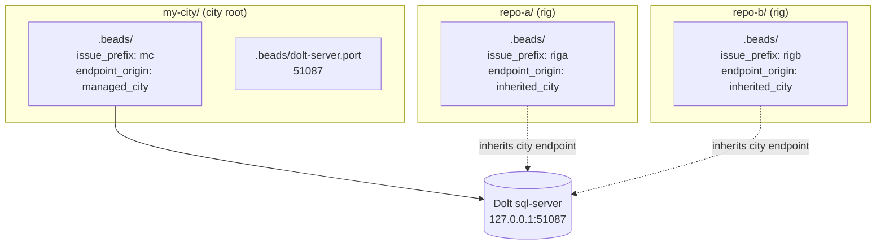
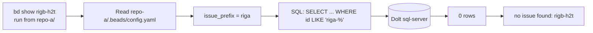

A Gas City workspace can hold beads in several places at once — at the city
root and inside every rig. From the outside that looks like several separate
databases. Underneath it is the opposite: one shared Dolt server, with each
scope's beads tagged by an `issue_prefix` that the `bd` CLI uses as a hard
query filter.

This page explains that topology so the on-disk layout, the contents of each
`.beads/` directory, and the output of `bd list` from different working
directories all line up with one mental model.

## The shape of a city

When you run `gc init`, Gas City lays down a city root with a `.beads/`
directory inside it. When you run `gc rig add <path>`, the target directory
gets its own `.beads/` directory too. So a two-rig city looks like this on
disk:

```
my-city/
├── .beads/
│   ├── config.yaml         # issue_prefix: mc · gc.endpoint_origin: managed_city
│   └── dolt-server.port    # e.g. 51087
└── city.toml

repo-a/                     # added with: gc rig add ../repo-a
└── .beads/
    └── config.yaml         # issue_prefix: riga · gc.endpoint_origin: inherited_city

repo-b/                     # added with: gc rig add ../repo-b
└── .beads/
    └── config.yaml         # issue_prefix: rigb · gc.endpoint_origin: inherited_city
```

There is **one** Dolt server process for the whole city. The city's
`.beads/dolt-server.port` records the port it listens on. Every rig's
`.beads/config.yaml` declares `gc.endpoint_origin: inherited_city`, which means
"use whatever endpoint the city is using." Rigs do not run their own Dolt.



`gc.endpoint_origin` is the canonical key that records who owns the endpoint
declaration. The four legal values are documented in
`internal/beads/contract/files.go`; for a default `gc init` city you will only
ever see two of them:

| Value | Meaning |
|---|---|
| `managed_city` | This city runs its own local Dolt; the port lives in `.beads/dolt-server.port`. |
| `inherited_city` | This rig has no endpoint of its own; resolve through the city. |

The two remaining values, `city_canonical` and `explicit`, are for cities and
rigs that point at an external Dolt server. See the [Beads Dolt Contract
design note](https://github.com/gastownhall/gascity/blob/main/engdocs/design/beads-dolt-contract-redesign.md)
for the full matrix.

## One server, many logical scopes

Even though all three `.beads/` directories resolve to the same Dolt server,
the beads they hold are not interchangeable. Each scope has its own
`issue_prefix` in `.beads/config.yaml`, and `bd` uses that prefix as a hard
filter on every read and write.

This is the part that surprises people: it is not a federated view across
separate databases, and it is not isolated databases either. It is one shared
store with **prefix scoping enforced at the `bd` query layer**.

### A worked example

Start from an empty city and two empty repos, with the rigs added in suspended
state so we can poke at the files without the controller running:

```shell
$ gc init my-city
$ cd my-city
$ gc rig add ../repo-a --start-suspended
$ gc rig add ../repo-b --start-suspended
```

Now create one bead from each rig directory:

```shell
$ cd ../repo-a && bd create "work in repo-a"
created riga-gne

$ cd ../repo-b && bd create "work in repo-b"
created rigb-h2t
```

The two beads live on the same Dolt server, physically next to each other.
But from `repo-a`, `bd` only sees its own:

```shell
$ cd repo-a
$ bd list
○ riga-gne ● P2 work in repo-a

$ bd show rigb-h2t
no issue found: rigb-h2t
```

From the city root, `bd list` shows only the city's own prefix (`mc-*`),
**not** a federated view across rigs:

```shell
$ cd ../my-city
$ bd list
(only mc-* beads — nothing from riga or rigb)
```

### Why `bd show rigb-h2t` from `repo-a` fails

The row is right there on the server. But `bd` reads `.beads/config.yaml` in
its working directory, sees `issue_prefix: riga`, and constrains every query
to that prefix. The `rigb-h2t` row exists; it just is not in this scope's
namespace, so `bd` reports it as not found.



This is intentional. It keeps rig namespaces independent — agents working in
`repo-a` cannot accidentally claim or close `repo-b`'s beads — without the
overhead of running a second Dolt server per rig.

## `gc bd` is just routing sugar

The `gc bd --rig <name> ...` command is a small wrapper that changes directory
into the named rig and runs `bd` there. It does not add a federation layer or
do any cross-rig joining. The implementation
([`cmd/gc/cmd_bd.go`](https://github.com/gastownhall/gascity/blob/main/cmd/gc/cmd_bd.go))
resolves the rig path, sets `cmd.Dir = target.ScopeRoot`, and exec's `bd` with
your arguments. Anything `bd` cannot do from inside the rig, `gc bd` cannot
do either.

If you want a true cross-rig view, query Dolt directly using the port from
`my-city/.beads/dolt-server.port`. The `bd` CLI is intentionally not the tool
for that — its job is to enforce per-scope namespacing.

## Going further

- [`bd` CLI](https://github.com/gastownhall/beads) — upstream documentation for
  `bd create`, `bd list`, `bd ready`, and the rest of the surface `gc bd`
  forwards to.
- [Tutorial 06: Beads](/tutorials/06-beads) — the user-model walkthrough of
  beads as Gas City's universal work primitive.
- [Reference: Config](/reference/config) — every config key, including
  `rig.dolt_port` for advanced topologies.
- [Beads Dolt Contract Redesign](https://github.com/gastownhall/gascity/blob/main/engdocs/design/beads-dolt-contract-redesign.md)
  — the full contributor-side design doc covering all four endpoint origins,
  validation rules, and migration history.
